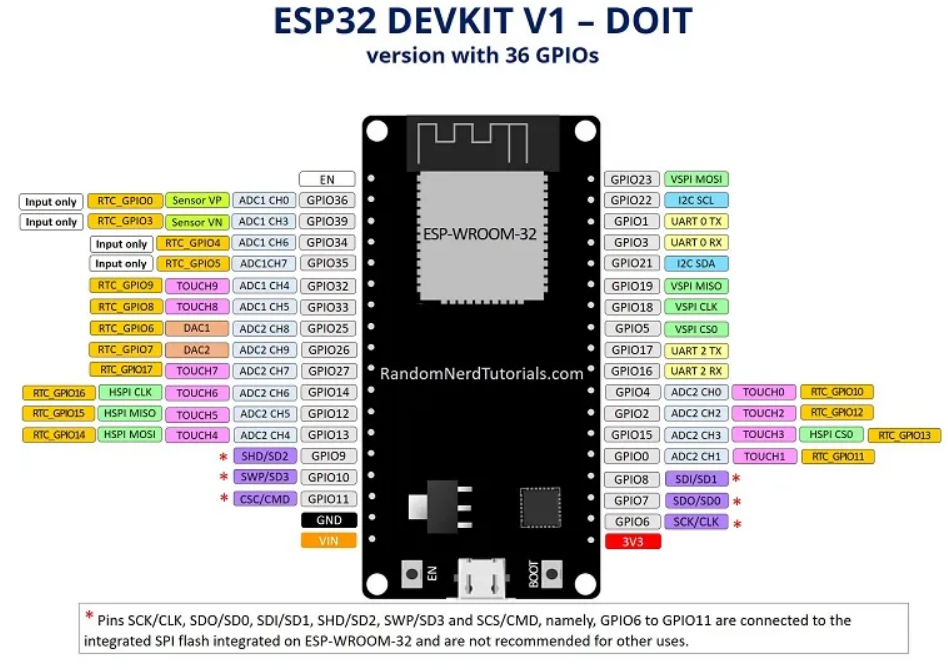
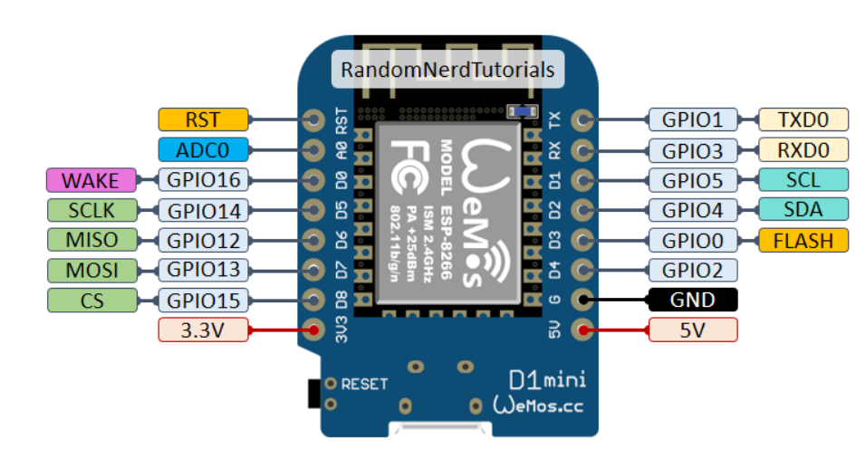

# Reflection day 1

## Who am I?
My name is Finn, I'm currently 21 years old and I'm from The Netherlands. I study ICT at Fonty's, my main expertise is in IoT and embedded systems. So I have previous experience for this module, which will come in handy i am sure. 

## Lecture reflection
The first lecture of this module was the introduction to IoT. Having worked with IoT before and embedded systems, I found it to be quite refreshing. On this day I did feel quite bad, I had food poisoning and had to puke several times, hence why I left the classroom during an explanation. The lecture went through an explanation on IoT, some IoT domains, microcontrollers used and protocol examples. We also talked about the advantages/disadvantages that are present within the IoT field. 

### What is IoT?
IoT, or the Internet of Things, is like giving everyday objects the ability to connect to the internet and talk to each other. Imagine your fridge telling your phone when you're out of milk, or your thermostat adjusting the temperature in your home based on the weather forecast. It's all about making our things smarter and more helpful by connecting them to the internet and each other.

#### Benefits of IoT
-   Automation and Efficiency
-   Data Collection and Analysis
-   Improved Quality of Life
-   Cost Savings
-   Environmental Impact
-   Enhanced Safety and Security

#### Challenges of IoT
-   Data leaks
-   Privacy issues
-   Regulatory and Legal Hurdles
-   Data overload

#### ESP32 pinout and information
The ESP32 is the holy grail of IoT. It's a simple microcontroller with a lot of support and documentation, an easy way for beginners to get into IoT. It has built-in WiFi support, enough GPIO pins to connect sensors and actuators. It can also be programmed with Arduino embedded C/C++, making it easy to get into for people who have experience with Arduino.

#### Wemos D1 mini pinout and information
The Wemos D1 Mini is a compact development board designed for IoT projects. It is based on the ESP8266 Wi-Fi module and features a USB interface, making it easy to program and integrate with other hardware. The board offers built-in Wi-Fi connectivity, GPIO pins for connecting sensors and peripherals, and compatibility with the Arduino IDE.

**How are programs saved and run on the Wemos D1 Mini/ESP32 – how many at once?**

You upload them onto the board, you can only have 1 program at a time. They are saved on the onboard flash memory.

**What did I miss in video?**

Good question

**Which voltage are we usually using?**

5V

**What means High and what means Low?**

Turning a pin high means writing a 1, and low means writing a 0

**Where do you look easiest for examples for your solutions?**

Arduino IDE -> Examples

**What is special about the onboard led on the Wemos D1 Mini?**

That it can be accessed by using LED_BUILTIN

## Lab reflection
The lab exercises on this day were relatively easy for the most part. I set up the GIT repository for my team, and explained to them how they can use the basics of GIT.

### 1. Arduino Blink:
In order to blink the Arduino we used the example code from Arduino. This blinks the LED with a blocking delay."

[Arduino Blink](/Teamfolder/Group1/exercises/exercise01/README.md#example---blinking-led)

### 2. Arduino button LED:
Second assignment was to create a program that would read button input and turn on an LED while holding the button.

[Arduino button LED](/Teamfolder/Group1/exercises/exercise01/README.md#extra-switch-led-with-button)

### 3. Arduino toggle button LED:
The third and final assignment was to create a toggle button for an LED. So we created a program that remembered the last button state, this makes sure that once the button is released the LED stays on. And turns off when the button is pressed again  

[Arduino button toggle LED](/Teamfolder/Group1/exercises/exercise01/README.md#toggle-led-with-button)