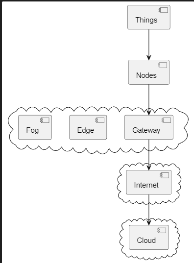

# Reflection day 2

## Lecture reflection
### Architecture IoT
During this lecture we first talked about Architecture in IoT, I made the following diagram:

This diagram should somewhat resemble how a typical IoT architecture looks like. 

Things: Things are commonly refered to as sensors/actuators connected to a device.

Nodes: A node is usually a module of a microcontroller that has a collection of things, and is able to transmit data to a gateway of some sort.

Fog, Edge, Gateway: These 3 are placed together since they are somewhat the same. They are the the last point before data gets transmitted over the internet.

Internet: This should speak for itself. It's past the gateway where we can send data to other places around the world.

Cloud: The cloud is the central place where data gets distributed.

The only thing that's missing is the swarm. A swarm is a collection of IoT devices(Nodes). The term swarm is not standardized, but this is the general idea how I understand it.

### User story
The second part of the lecture waas about user stories. We read an example of a user story but since we already made some in Lleida we got started on our own. This is our user story for our project: 

**MEETING CALL**

Fred is in his office, and he is really excited to be working for such an advanced company. Right now, he is working on a really important design, but he feels stuck. He has been staring at the same design for hours without being convinced of it. He decides he needs one of his colleagues' opinions.

What he loves about the company he is working for is their accessibility tools. He has a gyroscope in his right hand, and with that, he can easily call his colleague, Rebecca. Carefully, he moves his right hand and makes the sign to call her.

Rebecca is focused on her work when she feels a buzz in her left arm. She glances at it and sees her smartwatch with a notification of an upcoming meeting from his colleague and friend Fred.She presses one of the buttons, accepting the call. Her monitor displays the Sign Syncer translating site.

In another room, Fred, who, after requesting a meeting with Rebecca, kept working, feels a buzz from his own smartwatch. When he glances at it, he sees that Rebecca has accepted his call and that his desktop monitor is now on the Sign Syncer translating site.

### Data exchange formats
Text Data Format:
Text-based formats like plain text or CSV can be used in IoT for simple data exchange, especially when the data is human-readable and doesn't need complex structuring. However, they might not be efficient for transmitting large amounts of data or structured data.

XML (eXtensible Markup Language):
XML is a structured and extensible data format that can be suitable for IoT applications where data needs to be well-defined, organized, and easily parseable. However, XML can be more verbose compared to other formats like JSON and may require more bandwidth for communication.

JSON (JavaScript Object Notation):
JSON is an efficient data format for IoT due to its lightweight, human-readable, and easy-to-parse structure. It's well-suited for IoT applications where data needs to be transmitted efficiently between devices and applications.

YAML (YAML Ain't Markup Language):
YAML is a human-readable and easily writable data serialization format. It's less verbose compared to XML and allows for a clear and structured representation of data. YAML can be a good choice in scenarios where human readability is important, and the data structures are moderately complex.

Binary Data Format:
Binary formats can be highly efficient for transmitting large amounts of data in IoT. They are compact and can significantly reduce bandwidth usage. However, they are not human-readable, which can make debugging and understanding the data more challenging.
## Lab reflection

### Setting up Raspberry PI
In order to set up our raspberry pi we first have to flash an SD card with a suitable rapsberry pi image. We got the image from the lecturer, we flashed this using a program called balenaEtcher. I have used this in the past before, it's easy to use but you can also the raspberry pi image flasher.

### Control LED with web request

1. Set up server on Wemos
2. Set up client on ESP32
3. Send HTTP command to turn on LED
4. Led turns on

[Control LED with web request](/Teamfolder/Group1/exercises/exercise02/README.md#control-led-with-web-request)

### Button for web request
**Blink with web request:**
The first step here was to code the client to make the LED from the server ESP blink with a one second delay. This didn't take too long but we accidently switched the server and client

The second assignment was to use a button on the client side to toggle the LED on the server side. We reused the code from Monday to toggle the LED. 

[Button for web request](/Teamfolder/Group1/exercises/exercise02/README.md#use-a-button-to-create-web-request-step-1)

