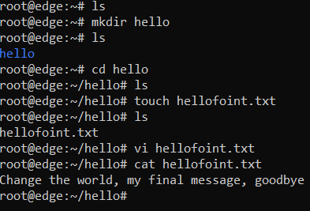
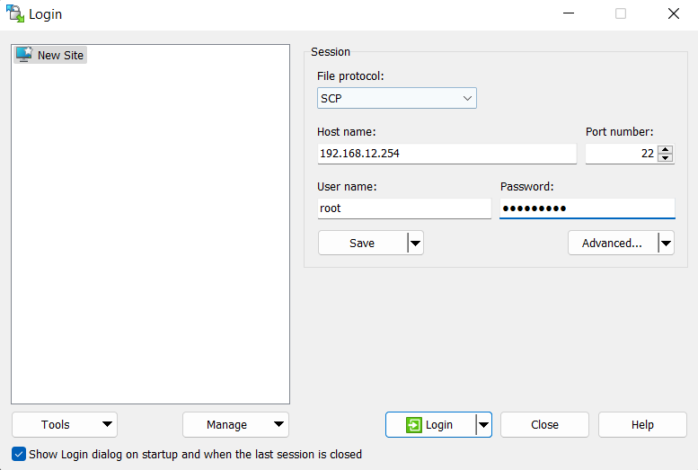
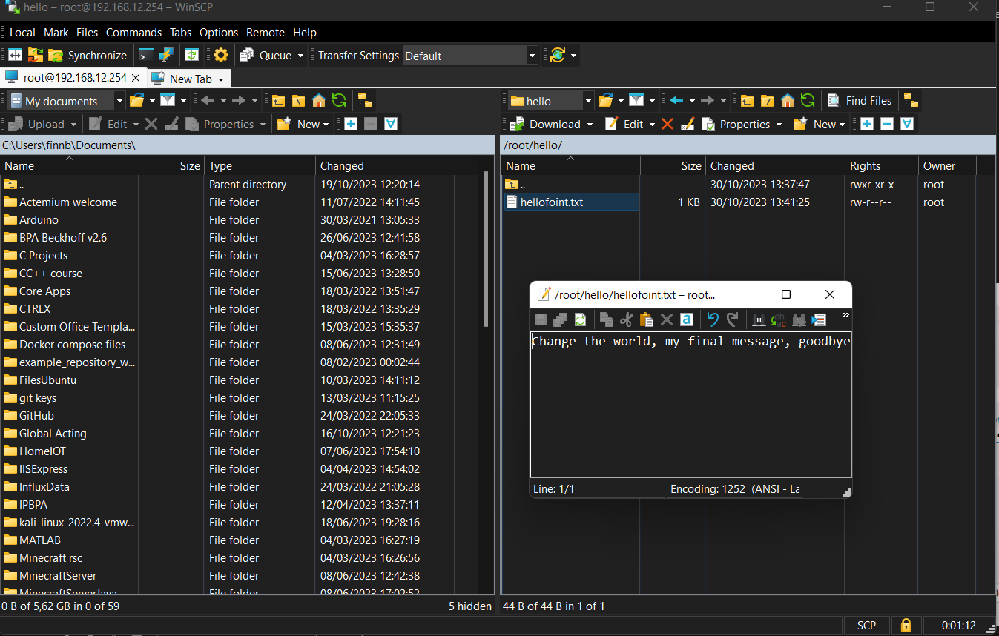

# Exercise 08

## Lecture reflection

In this lecture we learned about securing MQTT broker connections.

### Five different ways to secure MQTT broker communication

1. Port 1883: This is typically associated with the MQTT (Message Queuing Telemetry Transport) protocol, which is a lightweight and efficient messaging protocol often used for IoT applications. 
MQTT by itself does not provide security features, so it is crucial to implement security measures like authentication and encryption when using this port for IoT applications.

2. Port 8883 is the secure counterpart to MQTT, often used for MQTT over TLS/SSL (Transport Layer Security/Secure Sockets Layer) encryption.
MQTT over TLS/SSL adds encryption and authentication, making the communication secure. 
Security implications: The use of TLS/SSL on this port helps protect data in transit, ensuring the confidentiality and integrity of messages exchanged.

3. Unix-Domain sockets are not associated with a specific port number but instead use a file-based mechanism for inter-process communication (IPC) on Unix-based operating systems.
They allow communication between processes running on the same system through file-like objects in the filesystem.
Security implications: Unix-Domain sockets are generally more secure than network sockets because they are limited to local communication, reducing exposure to remote attacks. 

4. Port 8080 is often associated with HTTP, used for web services and applications.
It is commonly used as an alternative to the default HTTP port (Port 80) when hosting multiple web services on the same server.
Security implications: Port 8080 requires security measures such as firewalls, intrusion detection systems, and access controls to protect web applications and their data.

5. Port 8088 is another HTTP port commonly used for web services. It's often used to host web applications alongside other services that may be running on different ports.
Security implications: Similar to Port 8080, Port 8088 requires standard web application security practices to safeguard against threats like SQL injection, cross-site scripting (XSS), and other web-related attacks.

### Two types of encryption

*Symmetric encryption* is fast and efficient, making it suitable for encrypting large volumes of data. 

The problem is securely sharing the encryption key between the sender and receiver. If an attacker gains access to the key, they can decrypt the data.

*Asymmetric encryption* uses a pair of keys: a public key and a private key. 

Data encrypted with the public key can only be decrypted with the corresponding private key, and vice versa. This system eliminates the need for secure key exchange, making it more suitable for scenarios like digital signatures and secure key distribution.

## Lab reflection

### Exercise 01. Security vulnerabilities in IoT scenarios
Next we had to analyse the security vulnerabilites in our IoT scenarios. For this we came up with 4 in total:

1. No data encryption. The data that we sent over MQTT was not encrypted. it could be read by anyone who was listening. To solve this certificates should be used on both the server and the client side.
2. No SSL/TLS. TLS (Transport Layer Security) and SSL (Secure Sockets Layer) are cryptographic protocols that provide secure communication over a network, such as the internet. They ensure data confidentiality, integrity, and authenticity by encrypting data and enabling secure connections between clients and servers, commonly used for securing web traffic via HTTPS.
3. Passwords are visible in code, we hardcoded the password variables which meant that anyone could read them that had access to our GIT repo. To keep our passwords safe they should be in a file that is not visible on our GIT repo.
4. Unsecured port. The most common port used for MQTT is port 1883. This port however is not secured. In order to combat this we can use a different port like 8883, this port is commonly used as a TLS/SSL port that secures the communication.

### Exercise 02. The Chain of Trust

**What is a cipher suite?**

A cipher suite is a combination of encryption and security algorithms used to protect data during network communication. It includes methods for securing data and ensuring its authenticity. Cipher suites are often used in protocols like SSL/TLS for secure online communication.

**What is a chain of trust?**

A chain of trust is a hierarchical structure of digital certificates, where each certificate is verified by a trusted authority, creating a path of trust from end entities to a trusted root.

**What is the root certificate authority (CA)?**

The root certificate authority (CA) is the highest authority in a certificate chain of trust, responsible for issuing and signing certificates. It is self-signed and considered the ultimate trust anchor.

**What is an intermediate certificate authority (ICA)?**

An intermediate certificate authority (ICA) is a subordinate CA that is not the root CA but is still trusted by the root CA. It issues certificates on behalf of the root CA, extending the trust chain.

**What is an end-user certificate?**

An end-user certificate is a certificate issued to an individual or entity, such as a person or a server, to enable secure communication and validate their identity.

**What topological structure of certificates is created by a CA?**

The topological structure of certificates created by a CA is typically a hierarchical tree, with the root CA at the top, intermediate CAs below it, and end-user certificates at the leaves.

**What is the depth of a certificate?**

The depth of a certificate refers to its position in the certificate chain, indicating how many certificates need to be traversed to reach the root CA.

The CA chain of trust is a representative for the trust chain type root of trust
What ist the name of an other prominent representative of a chain of trust?

Another prominent representative of a chain of trust is the public key infrastructure (PKI).

**What is the name of another prominent representative of a chain of trust?**
Web of trust

- **How do root of trust and web of trust differ?**

Root of trust and web of trust differ in their trust models. Root of trust relies on a centralized authority (the root CA) for trust, while web of trust is a decentralized model where trust is established through peer recommendations and direct verification.

- **Which one is more secure?**

Root of trust is generally considered more secure because it relies on a centralized, highly trusted authority, whereas web of trust can be more vulnerable to inaccuracies and malicious recommendations, making it less secure in some cases.

### Exercise 03. Key Exchange

**How are Diffie-Hellman key exchange and SSL/TLS related?**

Diffie-Hellman is a key exchange algorithm that allows two parties to securely negotiate a shared secret key over an insecure channel without transmitting the key itself. This shared secret key can be used for subsequent symmetric encryption, ensuring the confidentiality and integrity of data exchanged between the parties.

SSL/TLS uses symmetric and asymmetric encryption. The Diffie-Hellman key exchange is one of the methods used within SSL/TLS for securely agreeing on a shared secret key, particularly for key exchange in the initial handshake phase.

**How are RSA key exchange and SSL/TLS related?**

RSA is a fundamental component of TLS/SSL protocols, primarily used for secure key exchange and server authentication during the handshake process. It ensures that data encryption keys are exchanged securely, and it verifies the identity of the server. RSA is not used for the actual data encryption; instead, symmetric encryption is used

### Exercise 04. Symmetric validation

**What forces Bob to validate Alice's certificate?**

Bob is compelled to validate Alice's certificate to ensure that he is connecting to the legitimate server (Alice). Validation is important to prevent man-in-the-middle attacks and verify that Alice's certificate is issued by a trusted certificate authority (EXCA). Bob's trust in Alice's certificate is crucial for establishing a secure connection.

**Is it possible to also force Alice to validate Bob's identity?**

Yes, it is possible for Alice to validate Bob's identity by requesting and verifying Bob's certificate. This can be done by configuring Alice's server to request a client certificate from Bob. If Bob is not able to provide a valid client certificate signed by a trusted CA, Alice can choose to deny the connection.

**Which additional certificates are necessary?**

For Alice to validate Bob's identity, Bob needs to have a client certificate signed by a trusted CA, similar to Alice's certificate. This means that Bob should possess a certificate issued by EXCA or another trusted CA that Alice recognizes. Bob's certificate is necessary for mutual authentication and can be used to prove his identity to Alice.

### Exercise 05. OpenWRT 
**1. Access the WEB interface of OpenWRT.**

    Do this by navigating to the IP in the browser: 
    192.168.12.254
    
**2. Discover the symbolic host name of the lan interface address.**

    Symbolic host name of LAN interface address: br-lan

**3. Ssh into the router using the IP address or the symbolic host name and execute shell commands.**

Password is "iotempire"    

    ssh root@192.168.12.254

Shell commands:

**4. Sftp into the router and upload/download files to and from it.**

SFTP didn't work for me so I used SCP.

After logging in we can see the file I created and download it:

From here I can download the file and upload my own files

**5. Install new packages on the router using either the WEB interface or the opkg command line utility**

Installing packages can be done ssh'ing into the router and using opkg [command]:

    opkg upgrade
    opkg list

**6. Where are the remote package repositories configured?**

You can find them using:

    nano /etc/opkg/distfeeds.conf

The final group assignment was documented in Vincent's folder:
[Final assignment](/Vincent/Days/Ninthday/README.md)
