# Reflection 10

## OpenWRT
-   Open source firmware/operating system for (WiFi) router.
-   Used on most consumer routers as base firmware (often modified by vendor).
-   Provides a largely POSIX conform Linux kernel and standard libraries.
-   Uses the small footprint full POSIX conform musl libc instead of the GNU C
library as standard C library.
- In principal, all software existing for Linux can be brought to OpenWRT based devices.
-   Limiting factors: 
    -   Resources of the device
    -   RAM
    -   Flash memory
    -   System on a Chip (SOC) performance
    -   Small differences in the behaviour of musl libc and GNU libc

## SSL/TLS Configuration options of *mqttbroker*

**How to request a full "template" command line for mqttbroker?**

    mqttbroker --commandline-full

**How to retrief the current configuration of mqttbroker?**

    mqttbroker -s

**How to write current configuration to a config file?**

    mqttbroker -w

**How many server instances (services) does the mqttbroker offer?**

    5:
      legacyin
           Configuration for server instance 'legacyin'
      tlsin
           Configuration for server instance 'tlsin'
      legacyun
           Configuration for server instance 'legacyun'
      mqtttlswebview
           Configuration for server instance 'mqtttlswebview'
      mqttlegacywebview
           Configuration for server instance 'mqttlegacywebview'

**What type of service do the individual instances offer?**

    See last question

**Via which protocol are the individual instances accessible?**

**Do all server instances offer the same configuration sections (categories)?**

    They don't

**Which section of the instances providing encrypted communication, provides the configuration option for SSL/TLS?**

    Configuration of SSL/TLS behaviour for instance

**What options can be configured for SSL/TLS encryption?**

    ## Options (persistent)
    Certificate chain file
    #mqtttlswebview.tls.cert-chain=""

    # Certificate key file
    #mqtttlswebview.tls.cert-key=""

    # Password for the certificate key file
    #mqtttlswebview.tls.cert-key-password=""

    # CA-certificate file
    #mqtttlswebview.tls.ca-cert-file=""
    
    # CA-certificate directory
    #mqtttlswebview.tls.ca-cert-dir=""
    
    # Use default CA-certificate directory
    #mqtttlswebview.tls.ca-use-default-cert-dir=false
    
    # Cipher list (openssl syntax)
    #mqtttlswebview.tls.cipher-list=""
    
    # OR combined SSL/TLS options (openssl values)
    #mqtttlswebview.tls.tls-options=0
    
    # SSL/TLS initialization timeout in seconds
    #mqtttlswebview.tls.init-timeout=10
    
    # SSL/TLS shutdown timeout in seconds
    #mqtttlswebview.tls.shutdown-timeout=2
    
    # Server Name Indication (SNI) Certificates:
    # sni = SNI of the virtual server
    # <key> = {
    #           "CertChain" -> value:PEM-FILE,
    #           "CertKey" -> value:PEM-FILE,
    #           "CertKeyPassword" -> value:TEXT,
    #           "CaCertFile" -> value:PEM-FILE,
    #           "CaCertDir" -> value:PEM-CONTAINER:DIR,
    #           "UseDefaultCaDir" -> value:BOOLEAN [false],
    #           "SslOptions" -> value:UINT
    #         }
    #mqtttlswebview.tls.sni-cert=""
    
    # Force using of the Server Name Indication
    #mqtttlswebview.tls.force-sni=false

## Creating certificates

**First step is to create a certificate, we fill in the following information. This information is not required**

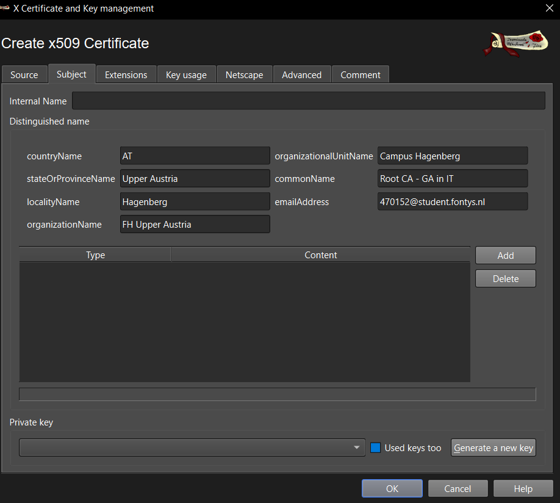

**Generate a new key, select name and key size**

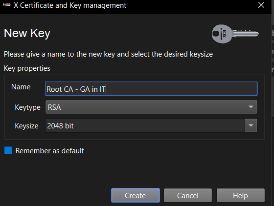

**Creation succesful**

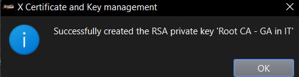

**Select type as "Certficiation Authority", time range on 10 days**

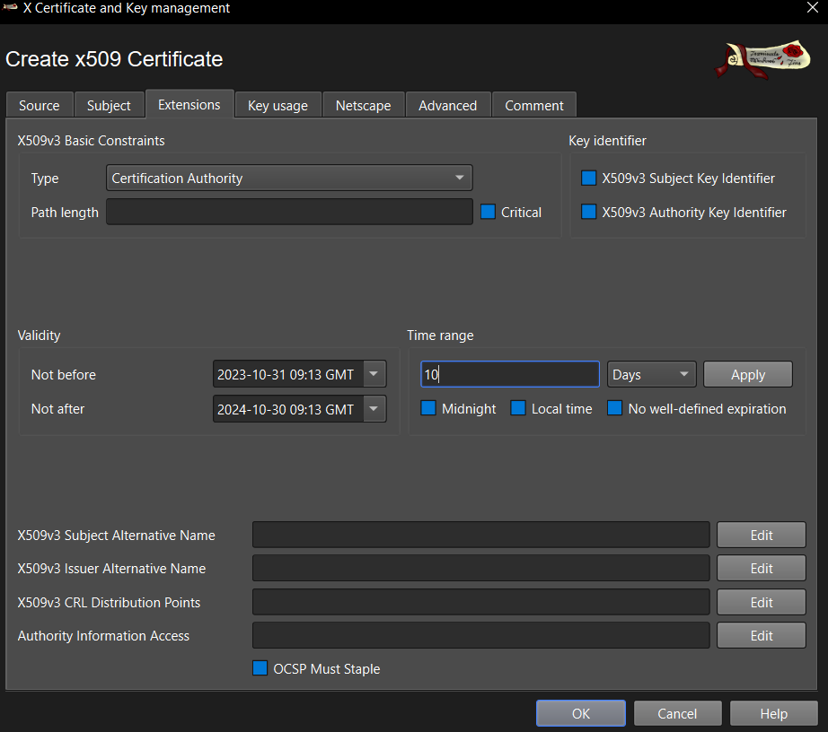

**Select the following key usages**

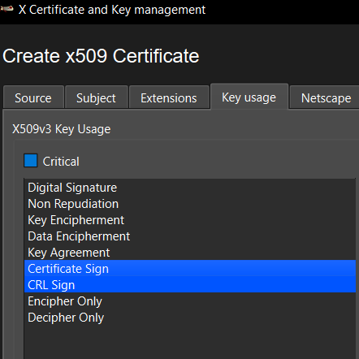

**Press "OK" and then the private key and certificate have been created**

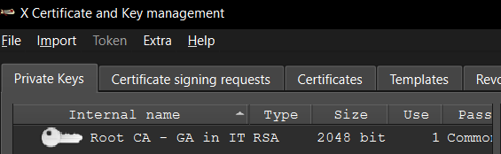

**Export the certificate**

**Create a new End Entity certificate**

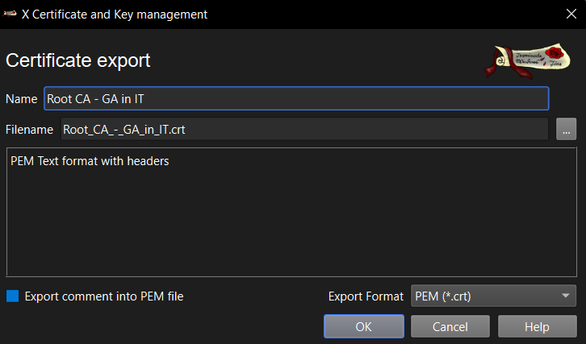

**Fill in info and generate a new key**

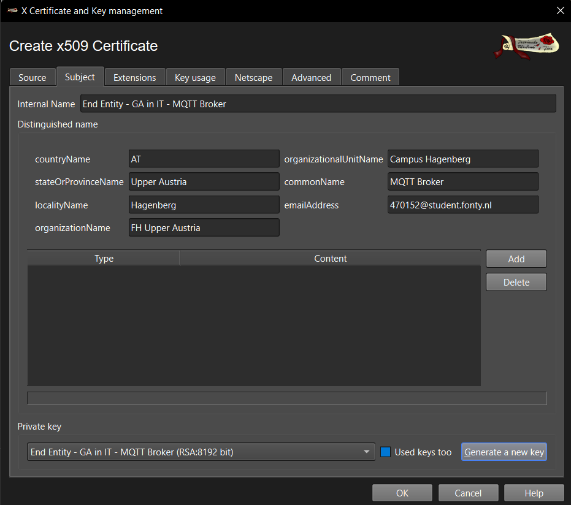

**Edit the "Type", "Time Range" and the "X509v3 Subject Alternative Name"**

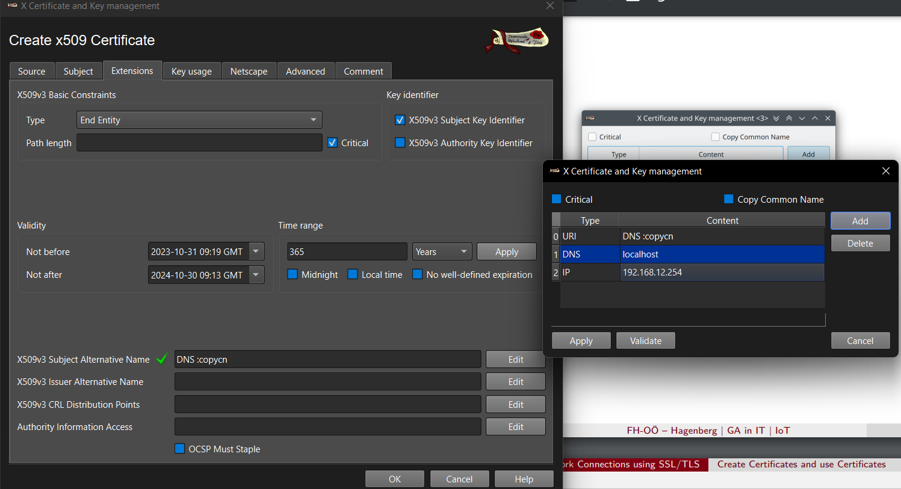

**Create it**

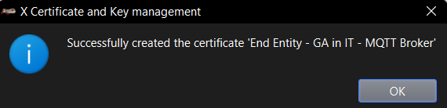

**Export doesn't ask for password the second time but gives an overwrite message**

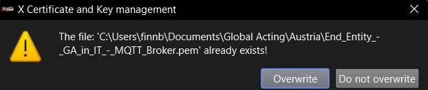

**All the required documents have been received**

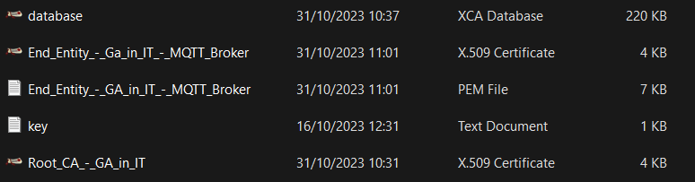

### Group assignment

1. Install the root CA certificate on your webbrowser.

This step requires us to go to our browser settings, finding the certficate option and importing the root certificate that we just generated.

2. Configure the mqtttlswebview instance of the mqttbroker to use the created end entity server certificate chain and the corresponding private key

Start by accessing the router by using SSH, and run the following command:

    mqttbroker mqtttlswebview tlsin socket --reuse-address tls --cert-chain path-to-certifcate --cert-key path-to-key --log-level 6 --verbose-level 3

Should return something like the following:
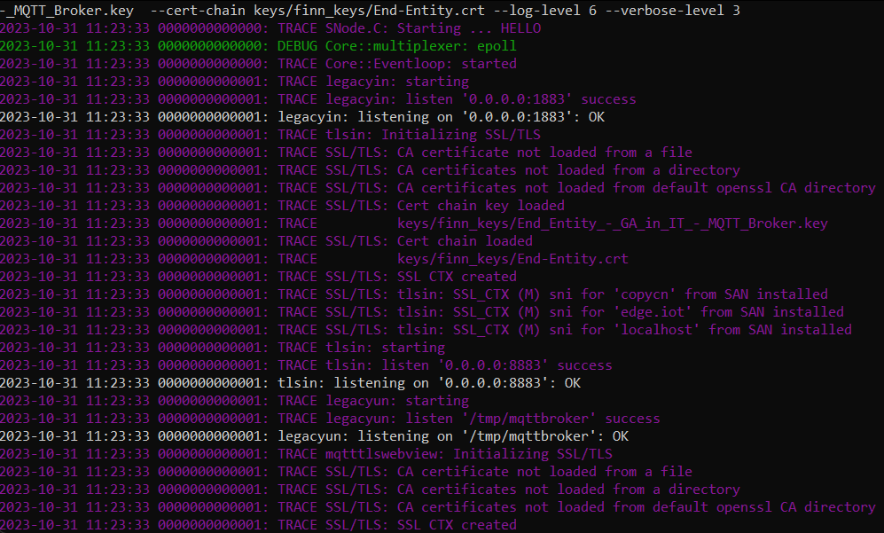

4. Point your web browser to location https://edge.iot/clients/ and check if the connection is secure.

5. Secure the mqttbroker instance tlsin with certificates and configure Node-Red to also communicate securely with the mqttbroker.

Node-Red MQTT configuration to use certificates:

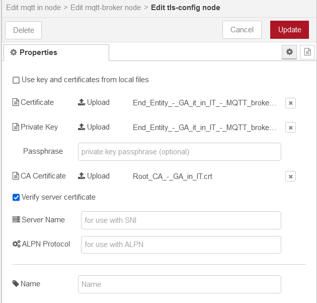

6. Configure Node-Red to check if mqttbroker is trustworthy.

After deploying you can see that the connection has been made using the certificates, because the Node-Red block says "connected:

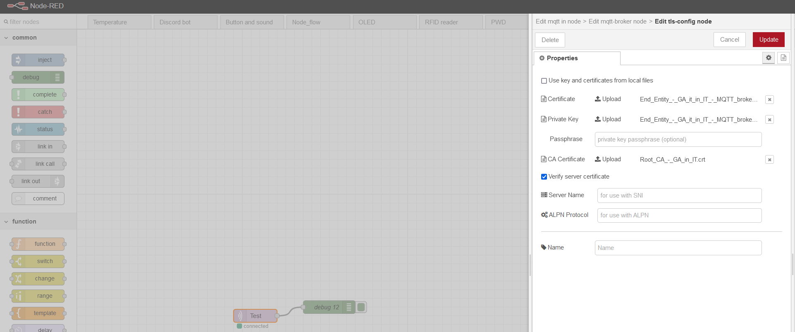

