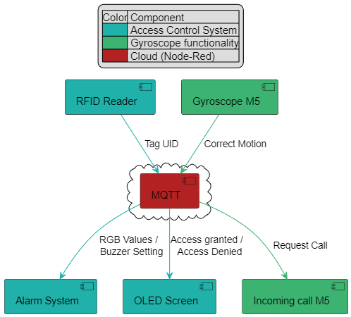

## Alarm system

The alarm system uses an RGB led and a buzzer. It is not coded with IoTEmpower but rather with platformIO. The program uses OOP to make the code more readable. It has the basic functionality to connect to WiFi and MQTT. 

Next to that it is possible to change the RGB values of the LED using MQTT. It has 3 seperate topics for every value:

    magnusp/rgb/red
    magnusp/rgb/green
    magnusp/rgb/blue

When overwriting one of the colors the others will remain unchanged, to ensure that the color changes to the desired color. It would've been easier to use a JSON object on one topic to change the values.

The buzzer can be turned on or off by sending either a "1" or a "0" to the following topic:

    magnusp/buzzer

## Component diagram
The image below displays the component diagram. It is divided into 3 different components, the ACS (**A**ccess **C**ontrol **S**ystem), the gyroscope functionality, and the cloud connecting the other components. 

The idea is that the RFID reader sends the tag UID to the cloud using MQTT. Node-Red can read and act according to the MQTT messages. Node-Red checks the UID, if the person has access, MQTT will publish the required RGB values, buzzer setting and an "Access Granted" messages to the respected topics. This goes for access denied as well. 

The other part of this system is the call function. The gyroscope from one M5 can trigger an MQTT publish when it is moved in a certain direction. When this happens MQTT will send a message to the other M5 that it wants to have a call. The other M5 responds by making a noise and displaying "Incoming Call".

