# Research records 
[Other Researches](../README.md)

## Contents
1. [Explore the SSL/TLS Configuration Options of mqttbroker](#explore-the-ssltls-configuration-options-of-mqttbroker)
    - [How to request a full "template" command line for mqttbroker?](#how-to-request-a-full-template-command-line-for-mqttbroker)
    - [How to retrief the current configuration of mqttbroker?](#how-to-retrief-the-current-configuration-of-mqttbroker)
    - [How to write current configuration to a config file?](#how-to-write-current-configuration-to-a-config-file)
    - [How many server instances (services) does the mqttbroker offer?](#how-many-server-instances-services-does-the-mqttbroker-offer)
    - [What type of service do the individual instances offer?](#what-type-of-service-do-the-individual-instances-offer)
    - [Via which protocol are the individual instances accessible?](#via-which-protocol-are-the-individual-instances-accessible)
    - [Do all server instances offer the same configuration sections (cathegories)?](#do-all-server-instances-offer-the-same-configuration-sections-cathegories)
    - [Which section of the instances providing encrypted communication, provides the configuration option for SSL/TLS?](#which-section-of-the-instances-providing-encrypted-communication-provides-the-configuration-option-for-ssltls)
    - [What options can be configured for SSL/TLS encryption?](#what-options-can-be-configured-for-ssltls-encryption)
2. [Certificates](#certificates)
    - [Install XCA](#install-xca)
    - [Certificate Management](#certificate-management)
3. [Lab](#lab)
## Explore the SSL/TLS Configuration Options of mqttbroker

First, we need to open the PowerShell, and write down:

    ssh root@192....

We get asked our password: iotempire

Once we are connected, we write:

    mqttbroker
    
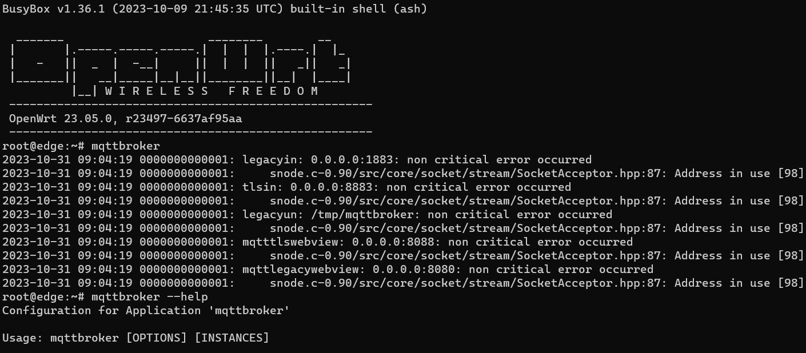

After we can execute the next command:

    mqttbroker --help

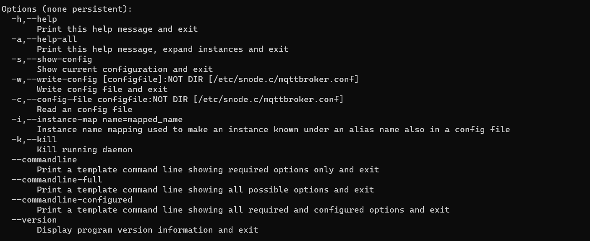

In here we get a list of the commands witha brief explanation, this will be useful for the activities.

### How to request a full "template" command line for mqttbroker?

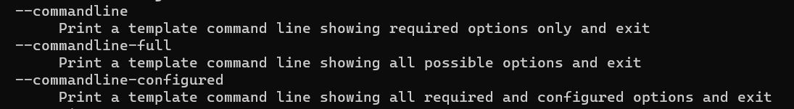

    --commandline-full

### How to retrief the current configuration of mqttbroker?

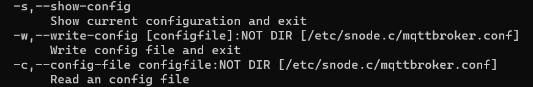

    --s, --show-config

### How to write current configuration to a config file?

    --s, --write-config [configfile]

### How many server instances (services) does the mqttbroker offer?

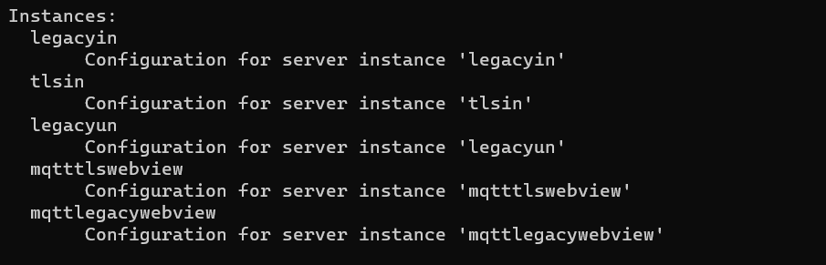

    legacyin
    tlsin
    legacyun
    mqtttlswebview
    mqttlegacywebview

### What type of service do the individual instances offer?

- **legacyin**

- **tlsin**

- **legacyun**

- **mqtttlswebview**connection Configuration of established connections 

- **mqttlegacywebview**

### Via which protocol are the individual instances accessible?

    SSL / TLS

### Do all server instances offer the same configuration sections (cathegories)?

    No

### Which section of the instances providing encrypted communication, provides the configuration option for SSL/TLS?

    MQTTTLSWebview

### What options can be configured for SSL/TLS encryption?

- Certificate chain file
- Certificate chain file
- Password for the certificate key file
- CA-certificate file
- CA-certificate directory
- Use default CA-certificate directory
- Cipher list
- OR combined SSL/TLS options
- SSL/TLS initialization timeout in seconds
- SSL/TLS shutdown timeout in secondsç

## Certificates

### Install XCA

1. Download XCA from its website https://hohnstaedt.de/xca/ and install it.
2. Start XCA.

### Certificate Management
First thing we had to do was create a new database. Once that was done, we were able to create new certificates.

We modified the section "Subject" as shown in the image:

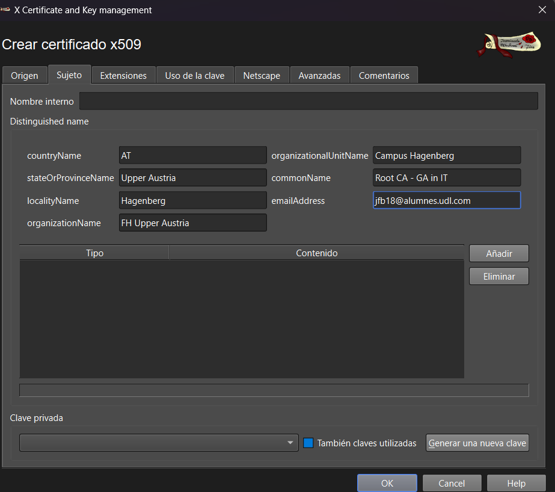

On the bottom of that same section, we generate a new key and selected it.

After that, we went to the section "Extensions" and changed the default type to "Certified authority"

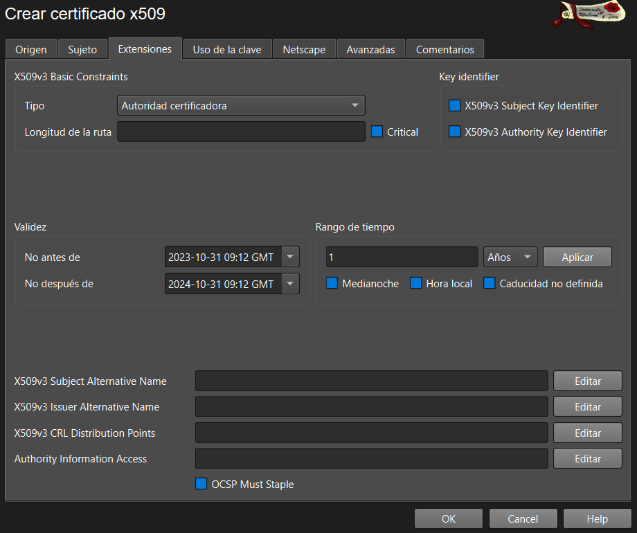

We continued by going to "Key Usage", there we selected two Key Usages as in the image:

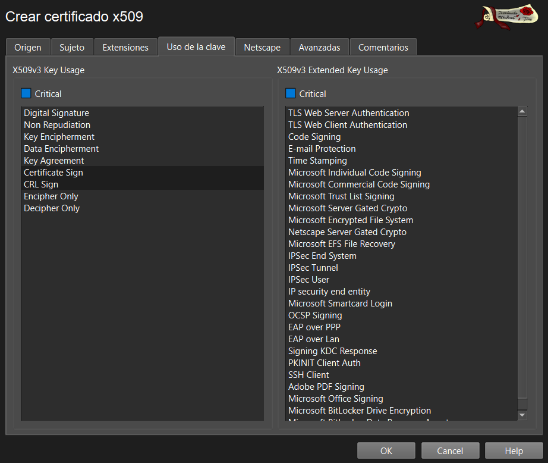

After that we saved and exported the certificate. 

Then we created another certificate for the End Entity.

Once again, we modified the "Subject" section and generated a Key. 

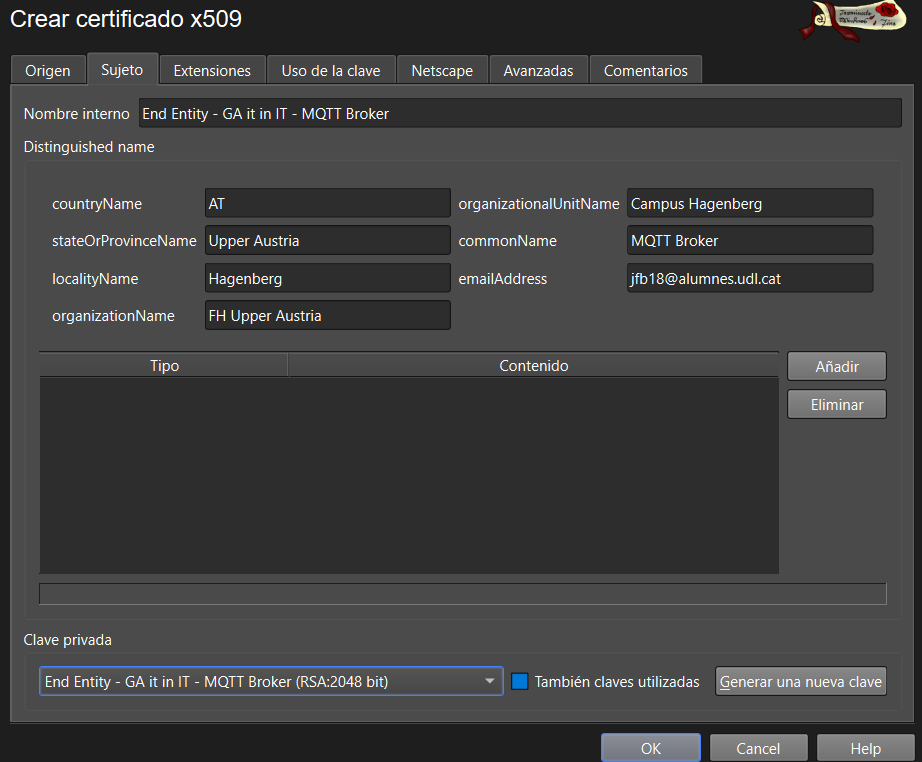

We went to the "Extensions" section and modified as shown in the image:

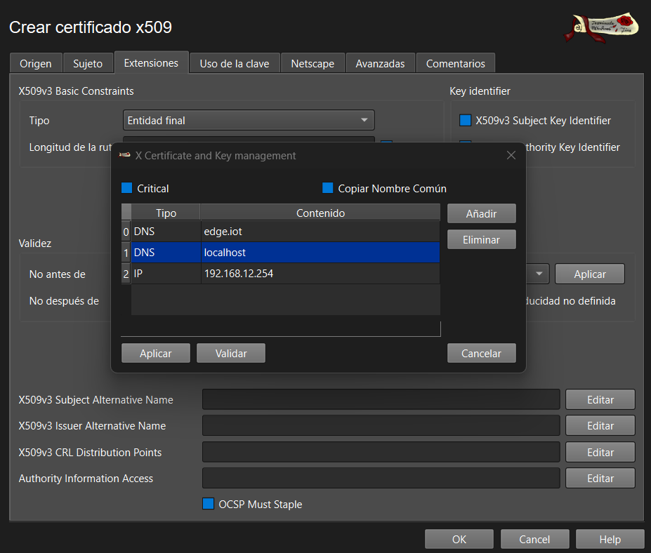

This is how the section ended up looking like:
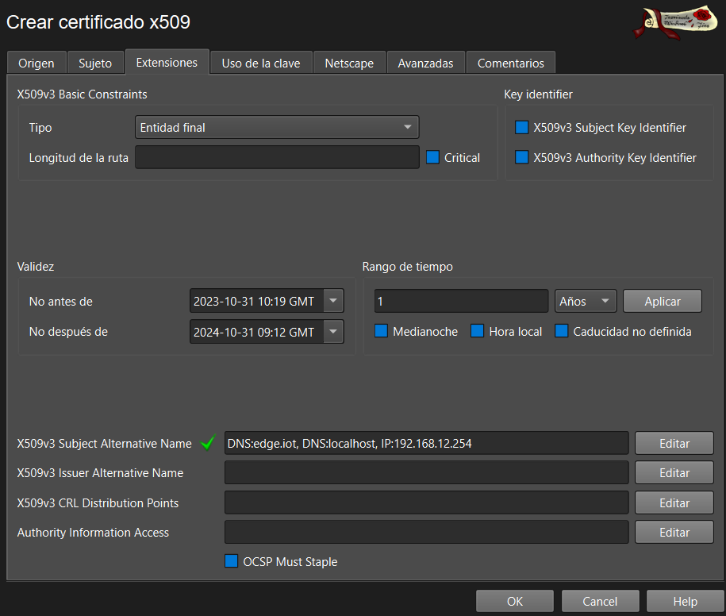

We saved an once again we exported the certificate.

After that we exported the key.
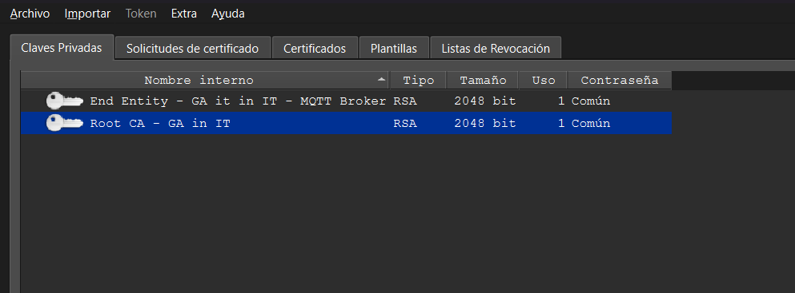

Then the group added the certificate to the browse.

## Lab
Final Project can be found in its folder:
[Final Project](/Teamfolder/Final%20Project/)