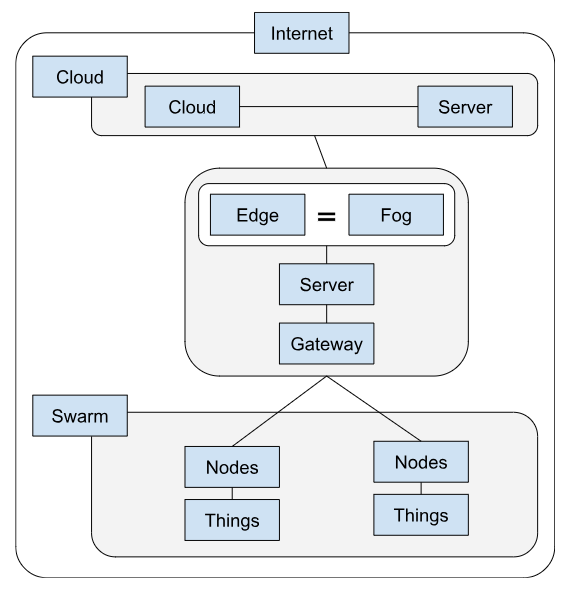

# Research records 02
[Other Researches](../README.md)

## Contents
1. [Activities](#activities)
    - [Persona and Scenearios](#persona-and-scenraios)
    - [Terminology IoT](#terminology-iot)
2. [IoT Architecture](#iot-architecture)
3. [Exchange Formats](README.md#exchange-formats--data-serialization)
4. [IoT Protocols](README.md#iot-protocols)
    - [HTTP](README.md#http-hypertext-transfer-protocol)
    - [CoAP](README.md#coap-constrained-application-protocol)
    - [MQTT](README.md#mqtt-message-queuing-telemetry-transport)
    - [BLE](README.md#ble-bluetooth-low-energy)
    - [OSC](README.md#osc-open-sound-control)
5. [MQTT](#mqtt)
    - [MQTT Basics](#mqtt-basics)
    - [Main Steps](#main-steps)
    - [What stands out?](#what-stands-out)
6. [IoTempower Gateway](#iotempower-gateway)
    - [Set Up](#set-up)
2. [Lab](#lab)

## Activities

The research done today has been all done in pairs. We have done a user persona and created two scenarios.

### Persona and Scenraios

Activity can be found here: [Persona and Scenearios](/Teamfolder/Group1/exercises/exercise02/Stories_Scenario/README.md)

### Terminology IoT

After that, we have researched about some terminology of IoT, and relationed different concepts.

Activity can be found here: [Terminology IoT](/Teamfolder/Group1/exercises/exercise02/Terminology_IoT/README.md)

## IoT Architecture
Research IoT architecture in respect to:

- Internet
- Server
- Clould (-computing)
- Edge (-computing)
- Fog (-computing)
- Swarm
- Things
- Gateway
- Nodes

### How are these connected?
Because the cloud is linked to the internet, it is the only way to access it. The server is also linked to the internet.
These ideas are linked together in a variety of ways to form a comprehensive IoT architecture. 

IoT devices (Things and Nodes) use Gateways to collect data and communicate. 

Edge and fog computing move processing closer to the data source, reducing latency and enhancing real-time decision-making. 

Servers in the cloud store, analyse, and provide access to IoT data. Additionally, concepts like swarms can add collaborative and adaptive capabilities to IoT applications. 

The internet, of course, serves as the connectivity backbone, allowing all of these elements in the IoT ecosystem to communicate with one another.

### Image

## Exchange Formats / Data Serialization
**Formats:** 
- Text
- XML (i.e.SOAP)
- JSON
- YAML
- Binary (i.e.Python’s pickle and CBOR → maybe relate to JSON)

Regarding these, we had to do some research and determine which ones are especially suitable for IoT systems and which ones are especially unsuitable.

After some research, I found out that it mostly depends on things like the use case, the hardware capabilities, the data complexity, and the interoperability requirements.

The most popular one is JSON, and it is also a versatile choice. YAML is quite similar to it and is the second most used.

**Suitable:**
- **JSON:** it is compact, human-readable, has wide support and can support complex data structures.
- **YAML:** Human friendly, supports complex data structures, supports metadata and comments.

**Not suitable:**
- **Text:** Lack of hierarchical structure and metadata support. Not efficient. Good for just one data.
- **XML:** Well-structured. Relatively verbose, which leads to larger data sizes compared to other compact formats (JSON). Parsing it can be computationally extensive. Lots of incompatibilities. 

**Depends:**

I choosed to create this category because it really depends on the case of use for this specific format.

- **Binary:** Efficient, minimal overhead, which makes it the best option, but is not human-readable.

## IoT Protocols
There are a great variety of IoT protocols, and in class we have named the followings:
- HTTP
- CoAP
- MQTT
- BLE
- OSC

### HTTP (Hypertext Transfer Protocol)
Web Request is a widely used communication protocol on the internet, and it is also commonly used in IoT applications. 

It is based on a client-server model, where clients (IoT devices) send HTTP requests to servers to retrieve or send data.

**Use case**
IoT devices can use HTTP to communicate with web servers or cloud services to exchange data, request updates, or send sensor data. It's suitable for scenarios where a stateless, request-response model is acceptable.

### CoAP (Constrained Application Protocol)
Specialized protocol designed for IoT and constrained environments. 

It is a lightweight, UDP-based protocol that enables efficient communication between IoT devices and is specifically designed for resource-constrained devices, such as those with limited memory and processing power.

**Use case**
CoAP is often used in scenarios where lightweight communication is needed, such as in home automation, industrial IoT, and sensor networks.

### MQTT (Message Queuing Telemetry Transport)
Is a publish-subscribe messaging protocol that is widely used in IoT and M2M (Machine-to-Machine) communication. 

Designed for low-bandwidth, high-latency, or unreliable networks, making it well-suited for IoT.

**Use case**
MQTT is commonly used for real-time data streaming and control in IoT, including scenarios like smart homes, industrial automation, and remote monitoring. It provides efficient, bi-directional communication.

### BLE (Bluetooth Low Energy)
It is not a protocol but a wireless communication technology specifically designed for low-power IoT devices. It operates over the Bluetooth standard and is optimized for energy efficiency.

**Use case**
BLE is widely used in IoT applications like wearables, beacons, and home automation due to its low power consumption. It's suitable for scenarios where IoT devices need to communicate with each other or with smartphones and tablets over short distances.

### OSC (Open Sound Control)
Designed for communication between multimedia devices, including audio and visual equipment. While not as common in traditional IoT, it has been used in IoT applications where real-time, multimedia data needs to be exchanged.

**Use case**
OSC is more commonly used in creative and artistic IoT projects, where sensor data is used to generate multimedia or interactive content.

## MQTT

### MQTT Basics

We don't need extra software. 

#### Main Steps

**Terminal 1**
1. Open the cmd
2. ssh iot@192.168.12.1 --> connects to rb pi / out gateway
3. mosquitto_sub -t magnusp -h 192.168.12.1 (subscibe to the magnusp topic in that host)

**Terminal 2**
1. Open a new cmd
2. ssh iot@192.168.12.1 --> connects to rb pi / out gateway
3. mosquitto_pub -t magnusp -h 192.168.12.1 -m "Hello" (sends a message to the magnusp topic on that host)

The first terminal recives the message. 

#### What stands out?

For me, someone who did not know anything of this before starting this module, is amazing to finally light some light on how IoT works. 

It seems to be simple and straight forward, and I am curios to try some implementations of if.

## IoTempower Gateway
### Set up
First, we had to download the bit image in order to flsh it to the Raspberry PI.

We could find the image here:
[iotgateway-pi64.img.xz](https://drive.google.com/file/d/1zz-bvu_x7rynVBTDSdJqs3SnXT4-cLyP/edit)

After that, we wrote the image to an SD-Card with Etcher.

Once that was done, we open the SD card in our computer.

Then we find the "wifi.txt". Edit it we decided to change the name to "iotempire-magnus-perfectus", but we left the password as teh default.

We saved, and put the SD-Cardunto the Raspberry Pi, and then power it up.

## Lab
Activities can be found in the Group1 folder: 
[Activities](/Teamfolder/Group1/exercises/exercise02/README.md)

