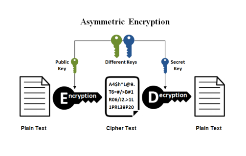

# Research records 09
[Other Researches](../README.md)

## Contents
1. [Secure the Network Connections using SSL/TLS](#secure-the-network-connections-using-ssltls)
    - [Identify Security Risks](#identify-security-risks)
    - [Secure Communication](#secure-communication)
        - [Encrypted communication](#encrypted-communication)
        - [The Chain of Trust](#the-chain-of-trust)
        - [Diffie-Hellman Key Exchange](#diffie-hellman-key-exchange)
        - [RSA Key Exchange](#rsa-key-exchange)
        - [Symmetric validation](#symmetric-validation) 
2. [OpenWRT](#openwrt)
     - [Exercise: OpenWRT](#exercise-openwrt)
          - [1. Access the WEB interface of OpenWRT](#1-access-the-web-interface-of-openwrt)
          - [2. Discover the symbolic host name of the lan interface address](#2-discover-the-symbolic-host-name-of-the-lan-interface-address)
          - [3. Ssh into the router using the IP address or the symbolic host name and execute shell commands](#3-ssh-into-the-router-using-the-ip-address-or-the-symbolic-host-name-and-execute-shell-commands)
          - [4. Sftp into the router and upload/download files to and from it](#4-sftp-into-the-router-and-uploaddownload-files-to-and-from-it)
          - [5. Install new packages on the router using either the WEB interface or the opkg command line utility](#5-install-new-packages-on-the-router-using-either-the-web-interface-or-the-opkg-command-line-utility)
          - [6. Where are the remote package repositories configured?](#6-where-are-the-remote-package-repositories-configured)
3. [Final Assignment](#final-assignment)

## Secure the Network Connections using SSL/TLS

There are five different ways to secure MQTT broker communication:

1. **Port 1883:** 

    It's the default MQTT port, but it operates without encryption or security mechanisms. It's commonly used for non-secure MQTT communication. Data transmitted over this port is not encrypted, making it vulnerable to interception or tampering.

2. **Port 8883:**
    
    It is often used for secure MQTT communication. It uses TLS/SSL (Transport Layer Security/Secure Sockets Layer) to encrypt data between the MQTT client and the broker. This encryption ensures that data is protected from eavesdropping and manipulation during transmission.

3. **Unix-Domain:**
    
    Used for local interprocess communication on Unix-like systems. They are typically more secure for local communication within the same machine because they don't rely on network ports. However, this is not suitable for communication over a network or the internet.

4. **Port 8080:**

    It is not a standard MQTT port. If MQTT communication is configured on port 8080, its security depends on the specific configuration. It may or may not include encryption or authentication. Always check the configuration to determine if it's secure.

5. **Port 8088:**

    It is not a standard MQTT port. Similar to port 8080, its security depends on the specific configuration. If it is used for MQTT communication, review the configuration to assess its security measures.

### Identify Security Risks

**Which security vulnerabilities did you encounter in your IoT scenarious?**
1. **No certificates**

    This means that the data was not encrypted, hence anyone listening would have access to the data.

2. **No SSL/TSL**

    These are protocoles that secure the communication over a network. Since we did not implement any of those, there is no confidentiality, integrity or authentication, hence there are no secure connections.

3. **Unsecured Port**

    The most commun MQTT port is 1883, which is not secured.

4. **Unautorized access**

**Which measures can be taken to close the vulnerabilities?**
1. **Using certificates**

    Use certificates in both server and client side.

2. **Implement SSL/TSL protocols**

    Use either SSL or TLS protocols by encrypting data and enabling secure connections.

3. **Changing the port**

    Changing the MQTT port to 8883, which is secured.

4. **Access validation methods**

### Secure Communication
#### Encrypted communication
**Symmetric Encryption**

Fast and efficient. Suitable for large volumes of data. 

The key needs to be shared in a safe way between the sender and receiver. If an attacker gets the key, they can decrypt the data.

**Asymmetric Encryption**

Data encrypted with public key. To be decrypted it is necessary a private key. 

This system does not require to exchange the secure key.

#### The Chain of Trust

**What is a cipher suite?**

A cipher suite is a set of encryption and security techniques that are used to safeguard data during network transmission. It contains ways for protecting data and verifying its authenticity. Cipher suites are frequently used in secure internet communication protocols such as SSL/TLS.

**What is a chain of trust?**

A chain of trust is a hierarchical structure of digital certificates, each of which is confirmed by a trusted authority, forming a trust path from end entities to a trusted root.

**What is the root certificate authority (CA)?**

The root certificate authority (CA) is the highest authority in a certificate chain of trust, and is responsible for certificate issuance and signing. It is self-signed and often regarded as the ultimate trust anchor.

**What is an intermediate certificate authority (ICA)?**

A subordinate CA that is not the root CA but is nevertheless trusted by the root CA is referred to as an intermediate certificate authority (ICA). It extends the trust chain by issuing certificates on behalf of the root CA.

**What is an end-user certificate?**

A certificate granted to an individual or entity, such as a person or a server, to enable secure communication and validate their identity is known as an end-user certificate.

**What topological structure of certificates is created by a CA?**

A CA's certificates typically have a hierarchical structure, with the root CA at the top, intermediate CAs below it, and end-user certificates at the leaves.

**What is the depth of a certificate?**

The depth of a certificate refers to its position in the certificate The length of the chain indicates how many certificates must be traversed to reach the root CA.

**The CA chain of trust is a representative for the trust chain type root of trust**

- **What is the name of an other prominent representative of a chain of trust?**
    
    Another prominent representative of a chain of trust, is the  Public Key Infrastructure (PKI).

- **How do root of trust and web of trust differ?**
    
    The trust models of the root of trust and the web of trust differ. Root of trust trust is established through peer recommendations and direct verification, whereas web of trust trust is established through peer recommendations and direct verification.

- **Which one is more secure?**

    Root of trust is generally considered more secure because it is based on a centralized, highly trusted authority, whereas web of trust is more susceptible to inaccuracies and malicious recommendations, making it less secure in some cases.

#### Diffie-Hellman Key Exchange
Diffie-Hellman (DH) key exchange is used in many symmetric encryption algorithms.

- **How are Diffie-Hellman key exchange and SSL/TLS related?**

    Diffie-Hellman is a key exchange algorithm that enables two parties to negotiate a shared secret key securely over an insecure channel without transmitting the key itself. This shared secret key can then be used for symmetric encryption to ensure the confidentiality and integrity of data exchanged between the parties.

    SSL/TLS employs both symmetric and asymmetric encryption techniques. The Diffie-Hellman key exchange is one of the SSL/TLS methods for securely agreeing on a shared secret key, particularly during the initial handshake phase.

#### RSA Key Exchange
Rivest–Shamir–Adleman (RSA) key exchange is used in many asymmetric encryption algorithms.

- **How are RSA key exchange and SSL/TLS related?**

    RSA is a key component of TLS/SSL protocols, primarily used during the handshake process for secure key exchange and server authentication. It ensures that data encryption keys are exchanged securely and verifies the server's identity. RSA is not used to encrypt data; instead, symmetric encryption is used.

#### Symmetric validation

**What forces Bob to validate Alice's certificate?**

Bob is required to validate Alice's certificate in order to connect to the legitimate server (Alice). Validation is necessary to avoid man-in-the-middle attacks and to ensure that Alice's certificate was issued by a trusted certificate authority (EXCA). Bob must have faith in Alice's certificate in order to establish a secure connection.
**Is it possible to also force Alice to validate Bob's identity?**

Yes, Alice can validate Bob's identity by requesting and verifying Bob's certificate. This is accomplished by instructing Alice's server to request a client certificate from Bob. If Bob cannot provide a valid client certificate signed by a trusted CA, Alice has the option to reject the connection.
**Which additional certificates are necessary?**

Bob must have a client certificate signed by a trusted CA, similar to Alice's certificate, for Alice to validate his identity. This means Bob should have a certificate issued by EXCA or another trusted CA recognized by Alice. Bob's certificate is required for mutual authentication and can be used to establish Bob's identity with Alice.

## OpenWRT
OpenWRT is an open source firmware/operating system for (WiFi) router. It is used on most consumer routers as base firmware (often modified by vendor).

It provides a largely [POSIX](https://en.wikipedia.org/wiki/POSIX) conform Linux kernel and standard libraries.

It uses the small footprint full POSIX conform [musl lib](https://musl.libc.org/) instead of the [GNU C library](https://www.gnu.org/software/libc/) as standard C library.

Can be limited by the resources of the device, such as:
- RAM
- Flash memory
- System on a Chip (SOC) performance
- Small differences in the behaviour of musl libc and GNU libc

### Exercise: OpenWRT

#### 1. Access the WEB interface of OpenWRT
Do this by navigating to the IP in the browser: 
   
    192.168.12.254

After going to the website, I logged in using the password:

    iotempire

#### 2. Discover the symbolic host name of the lan interface address
Symbolic host name of LAN interface address: 
    
    br-lan

#### 3. Ssh into the router using the IP address or the symbolic host name and execute shell commands
The password is "iotempire"    

    ssh root@192.168.12.254

Shell commands:

#### 4. Sftp into the router and upload/download files to and from it
SFTP did not work.

#### 5. Install new packages on the router using either the WEB interface or the opkg command line utility

I used the comand:

    opkg upgrade
    opkg install nano

#### 6. Where are the remote package repositories configured?

You can find them using:

    nano /etc/opkg/distfeeds.conf

## Final Assignment

The final group assignment was documented in Vincent's folder:
[Final assignment](/Vincent/Days/Ninthday.md#last-challenge-of-the-day)

