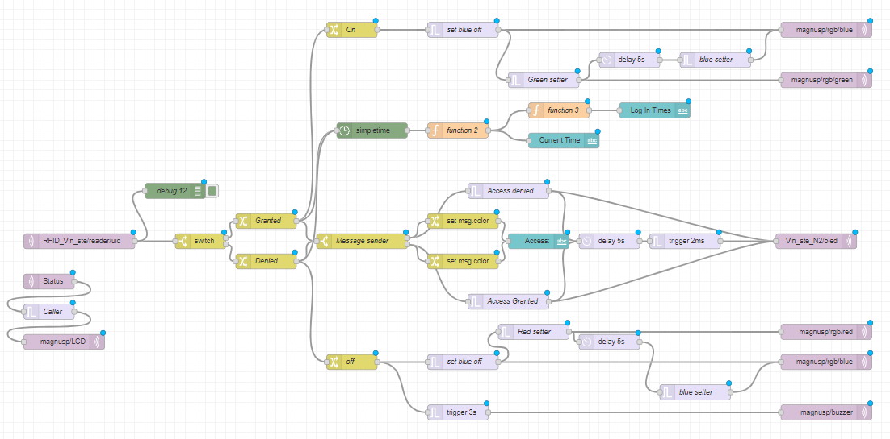
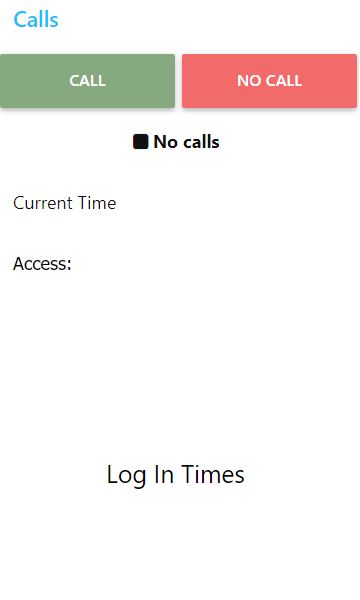
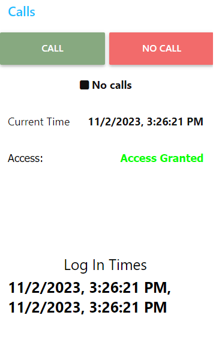
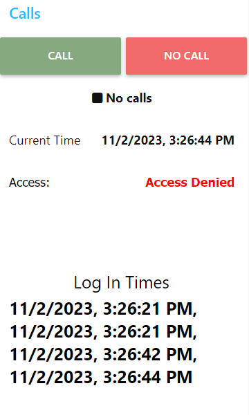

# Research records 
[Other Researches](../README.md)

## Contents
1. [Project](#project)
    - [M5 Stick C Plus](#m5-stick-c-plus)
    - [Node-Red Dashboard](#node-red-dashboard)
        - [Steps](#steps)
        - [Pictures](#pictures)
        - [Node-Red Flow](#node-red-flow)
        - [Final Result](#final-result)

## Project
### M5 Stick C Plus
I worked along with Stephan on the node-red flow and some additional features for the M5 worked on the previous day.

It is documented in the final project folder: 
[M5 Stick 2](/Teamfolder/Final%20Project/M5%20Stick%202/README.md#final-adjustments)

### Node-Red Dashboard
#### Steps
Ulno told us to improve our dashboard with some information from the RFID reader.  

The group decided to add some text saying the current time, the access state (access granted or rejected) and the last 5 attempts to log in. 

Stefan and I worked on it. 

We started by creating the text displaying whether the access was granted or not. It was a really easy task, we just added two "change" nodes after tge main one (at the center of the flow). We changed the payload (and a new variable to switch the colors of the text) and connected both nodes with a "text" node.

After that, we installed a palette to extract the current time, called "node-red-contrib-simpletime". 

We added one of the nodes to our flow, and connected it with the "change" nodes labeled as "Granted" and "Denied". In there, we selected the checkbox "mytimes".

After that, we connected it to a "text" node to check if it worked. It did, so we moved on and created a node "function" with the following code:

    // Initialize a circular buffer to store the last five times
    if (!context.timeBuffer) {
        context.timeBuffer = [];
    }

    // Get the current time from the message
    const currentTime = msg.mytimes;

    // Push the current time into the buffer
    context.timeBuffer.push(currentTime);

    // Limit the buffer size to the last 5 times
    if (context.timeBuffer.length > 5) {
        context.timeBuffer.shift();
    }

    // Set the msg.previousTimes to the buffer
    msg.previousTimes = context.timeBuffer;

    // Split the time string into hours, minutes, and seconds
    const [hours, minutes, seconds] = currentTime.split(':');

    // Create a new Date object with the current date and the extracted time
    const currentDate = new Date();
    currentDate.setHours(hours);
    currentDate.setMinutes(minutes);
    currentDate.setSeconds(seconds);

    // Format the current time
    const formattedCurrentTime = currentDate.toLocaleString(); // You can customize the format as needed

    // Set the formatted time in msg.payload
    msg.payload = formattedCurrentTime;

    return msg;

After that, we connected it to a "text" node, and created another function to keep log of the last 5 attempts to access.

    // Assuming msg.previousTimes is an array containing the previous times as strings
    const previousTimes = msg.previousTimes;

    if (Array.isArray(previousTimes) && previousTimes.length > 0) {
        const formattedPreviousTimes = previousTimes.map(time => {
            // Parse the time string into hours, minutes, and seconds
            const [hours, minutes, seconds] = time.split(':');

            // Create a new Date object with the current date and the extracted time
            const currentDate = new Date();
            currentDate.setHours(parseInt(hours, 10));
            currentDate.setMinutes(parseInt(minutes, 10));
            currentDate.setSeconds(parseInt(seconds, 10));

            // Format the time
            return currentDate.toLocaleString(); // Customize the format as needed
        }).join(', ');

        msg.payload = formattedPreviousTimes;
    } else {
        msg.payload = "No previous times available.";
    }

    return msg;

With this, the only thing left was styling the dashboard.

#### Pictures
Folder with pictures can be found here: [Pictures](./Pictures/)

#### Node-Red Flow
Node-Red flow can be found here: [Flow](./flows.json)

#### Final Result

