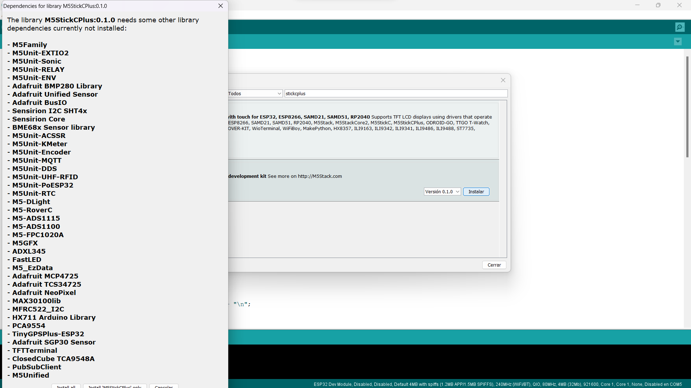
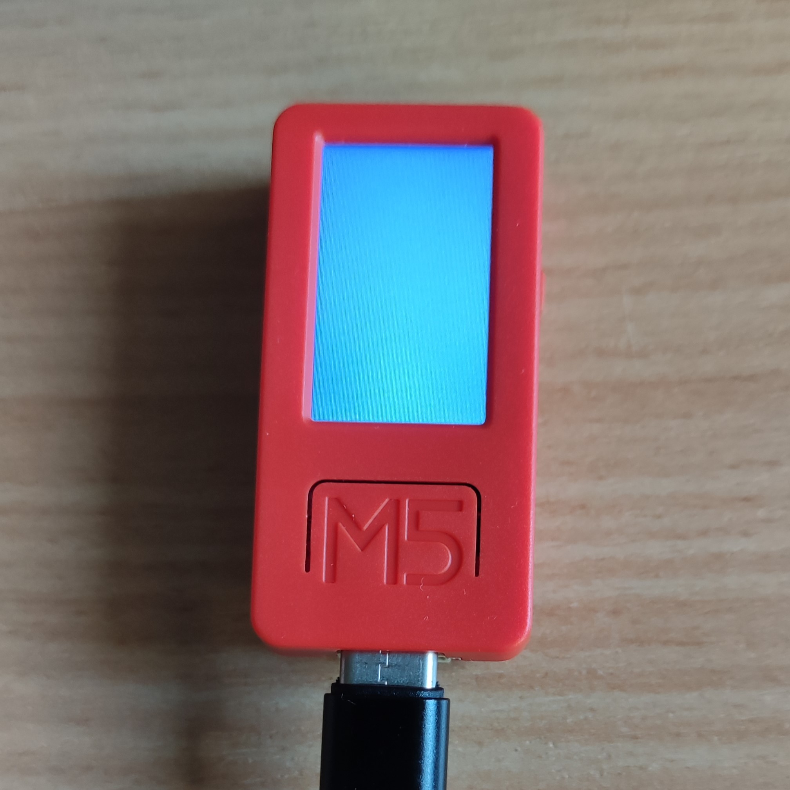
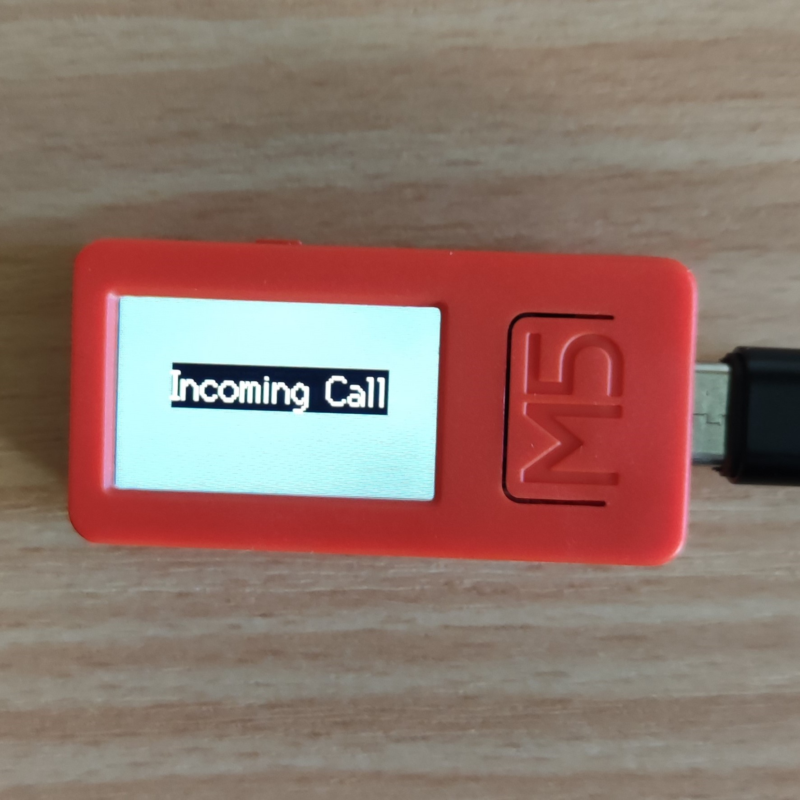
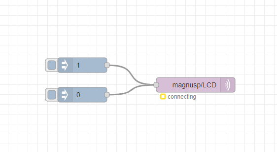

# M5 Stick Plus
We used the following website as a guide to do the first steps:

https://docs.m5stack.com/en/quick_start/m5stickc_plus/arduino 

## Contents
1. [Setting up](#setting-up)
    - [Device Drivers](#device-drivers)
    - [Arduino IDE](#arduino-ide)
    - [Fist Attempt](#fist-attempt)
2. [LCD Display](#lcd-display)
    - [First Code](#first-code)
    - [Second Code](#second-code)
    - [Third Code](#third-code)
    - [Fourth Code](#fourth-code)
        - [Code](#code)
        - [Pictures](#pictures)
3. [MQTT Code](#mqtt-code)
    - [Idea](#idea)
    - [Flow](#flow)
    - [Codes](#codes)
        - [Dummy Text](#dummy-text)
        - [Dummy Color](#dummy-color)
        - [Dummy Color with ChatGPT](#dummy-color-with-chatgpt)
        - [ChatGPT](#chatgpt)
        - [M5 MQTT](#m5-mqtt)
            - [Final Code](#final-code)
            - [Pictures](#pictures-1)

## Setting up
### Device Drivers
To begin with this part of the project, we connected the M5 Stick C Plus to our computer. We also downloaded the drivers for the hardware from the website: https://ftdichip.com/drivers/vcp-drivers/.

After that we went to our "Devide Manager" and found out that Windows was not recognizing the device, so we updated the drivers which the ones we had previously downloaded.

### Arduino IDE
We decided to use Arduino IDE to create our program. But first, we configurated the board and some libraries.

To add the board, we went to "Preferences" -> "Additional Development Board Manager" and added the following:

    https://m5stack.oss-cn-shenzhen.aliyuncs.com/resource/arduino/package_m5stack_index.json

The result is as shown in the image:

Once we had that, we went to "Tools" -> "Development Board"-> "Development Board Manager"

We searched for the following:

    M5Stack

After that, we installed the boards.

Once we had that, we proceded to install some libraries just in case. We went to "Project" -> "Include Library" -> "Manage Libraries"

Once there, we searched for the following:

    M5StickCPlus

We installed the library.

### Fist Attempt
To try if the installation had succesfully worked, we tried out a basic code from the website:

    #include <M5StickCPlus.h>

    /* After M5StickC is started or reset
    the program in the setUp () function will be run, and this part will only be run once.
    After M5StickCPlus is started or reset, the program in the setup() function will be executed, and this part will only be executed once. */
    void setup(){
    // Initialize the M5StickCPlus object. Initialize the M5StickCPlus object
    M5.begin();

    // LCD display. LCd display
    M5.Lcd.print("Hello World yey :)");
    }

    /* After the program in setup() runs, it runs the program in loop()
    The loop() function is an infinite loop in which the program runs repeatedly
    After the program in the setup() function is executed, the program in the loop() function will be executed
    The loop() function is an endless loop, in which the program will continue to run repeatedly */
    void loop() {
}

As a result, the LCD display on the M5 showed the message "Hello World yey :)", as shown in the following image:

## LCD Display
Next thing we did was getting an idea of our assigment.

We needed to change the color of the display every 2 seconds, up to 10 colors.

### First Code
To begin with it, we included the needed library:

    #include <M5StickCPlus.h>

After that, we created an array of 10 different colors:

    int color[] = {0xfd79, 0xe8e4, 0xfbe4, 0xff80, 0x2589, 0x51d, 0x3a59, 0xa254, 0x7bef, 0xffff};

With this done, we then proceded with the setup, where we Initialize the M5.

    void setup() {
    // Initialize the M5StickCPlus object. Initialize the M5StickCPlus object
    M5.begin();
    }

Then, we edited the loop. We createde a FOR to iterate thought the whole array. Inside the FOR, we added the code to change the color of the LDC display and a delay of 2 seconds.

    void loop() {
        for (int i = 0; i < 10; i++) {
            M5.Lcd.fillScreen(color[i]);
            delay(2000);
        }
    }

### Second Code

Our teammate Finn suggested that we should not use the delay, and insted he suggested using "Milles()", se we went ahead and googled it up.

We added two more variables to the code:

    unsigned long previous_time = 0;
    int period = 2000;

With this, we can keep track of the time that goes by and the time we need to wait for the color to change.

There were no changes on the setup.

On the loop, however, we did some changes. We created and IF to check if the millis() minus the previous time was greater than the amount of time between colors. 

    void loop() {
        if (millis() - previous_time >= period) {
            for (int i = 0; i < 10; i++) {
            previous_time = millis();
            M5.Lcd.fillScreen(color[a]);
            }
        }
    }

With this, we get the exact same result as in the First Code, but now it's made in a correct way. 

### Third Code
In this code, we were requested to pick the color randomly. 
In order to do that, we created a new variable, and we assigned to it a random number between 0 and 9:

    int a = random(0, 9);

The variable is located in "void loop".

Since now this is the new index for the array, we don't need the FOR anymore, because every two seconds the loop will repeate and the value for a will change.

So the void loop looks like this:

    void loop() {
        int a = random(0, 9);
        if (millis() - previous_time >= period) {
            previous_time = millis();
            M5.Lcd.fillScreen(color[a]);
        }
    }

### Fourth Code
For this, Stefan suggested to put some text in it, something like an "incoming call" message.

It was really easy to do.

We added two lines to our loop.
One to change the size of the text and make it bigger.

    M5.Lcd.setTextSize(2.5);

And another one to write and place the desired text:

    M5.Lcd.drawString("Incoming Call", M5.Lcd.width()/6, M5.Lcd.height()/3, 2);

The resulting loop looks like the following:

    void loop() {
        int a = random(0, 9);
        if (millis() - previous_time >= period) {
            previous_time = millis();
            M5.Lcd.fillScreen(color[a]);
            M5.Lcd.setTextSize(2.5);
            M5.Lcd.drawString("Incoming Call", M5.Lcd.width()/6, M5.Lcd.height()/3, 2);
        }
    }

Also, we added a line on the setup to rotate the position of the LCD pannel. 
    
    M5.Lcd.setRotation(1);

Now our text appears horizontally in the screen.

#### Code
The full code can be found here: [Code](./M5_2/M5_2.ino)

#### Pictures 
All pictures related to the M5 can be found here: [Pictures](./Pictures/)

## MQTT Code
Lastly, Vincent told us to implement the MQTT listen. 

### Idea
The idea was to make the M5 listen to a topic (we picked "magnusp/LCD"), and whenever this topic received a message it should change the M5.

Our intention was to make two options. 

- One to turn it off, meaning that there is no call request. (0)
- One to turn it on, showing the colors and the message. (1)

### Flow
First, I created a basic Node-Red flow. 

This flow is just two injects (on injects a 0 and the other a 1) to simulate a message from another device. Both injects are connected to the same MQTT_out, on the topic "magnusp/LCD".

You can find the compact flow here: [Flow](./M5_MQTT/flow.txt)

### Codes

At the beggining, we had some difficulties finding out where to start, and we spent a good amount of time in class trying to figure things out. However, we decided we should call it a day, and try it again the next day.

So on wednesday, I asked Pol for help. 

Together, we managed to generate a few promps for CHATGPT to get the basics of the code such as the connection to the wifi and subscribing to a topic, since it is the part that is more difficult for me.

#### Dummy Text

The first promt is the following:

    I have a m5 stick plus connected to my computer, it should subscribe to mqtt broker and the topic is magnusp/LCD. Depending on the message, adjust the LED_BUILTIN brightness. The message can be 0 or 1, string number.
    I missed something, can you change the LED brightness settings to put on the m5 plus stick some dummy text on it as it not has a BUILTIN LED in it, my mistake.

With this, ChatGPT generated us a code, and I could understand better some basics of the mqtt proces using Arduino IDE.

We got the following code: [Dummy Text](./MQTT_STEPS/1/m5_mqtt_dummy_text/m5_mqtt_dummy_text.ino)

In this, whenever we press on of the injects, the M5 LCD screens shows us a message, as we can see in the callback function.

    void callback(char* topic, byte* payload, unsigned int length) {
        String message = "";
        for (int i = 0; i < length; i++) {
            message += (char)payload[i];
        }

        int value = message.toInt(); // Convert the message to an integer

        // Update the M5Stick Plus screen text based on the received value
        if (value == 0) {
            M5.Lcd.fillScreen(BLACK);
            M5.Lcd.drawString("Message: 0", 10, 10);
        } else if (value == 1) {
            M5.Lcd.fillScreen(BLACK);
            M5.Lcd.drawString("Message: 1", 10, 10);
        }
    }

#### Dummy Color

We manually modified the callback function to make it change the LCD screen color every two seconds, but we did not succesfully make it random.

We used the following code: [Dummy Colors](./MQTT_STEPS/2/m5_mqtt_dummy_color_random/m5_mqtt_dummy_color_random.ino)

#### Dummy Color with ChatGPT
To try to solve it, we asked ChatGPT, each time being more specific about what we wanted. We tried to mix both codes, the one generated by ChatGPT and the one with no MQTT.

    I have a m5 stick plus connected to my computer, it should subscribe to mqtt broker and the topic is magnusp/LCD. Depending on the message, i want you to use the following code to know what i to do depending on the message. The message can be 0 or 1, string number.

    unsigned long previous_time = 0;
    int period = 2000;
    int color[] = {
    0xfd79, 0xe8e4, 0xfbe4, 0xff80, 0x2589, 0x51d, 0x3a59, 0xa254, 0x7bef, 0xffff
    };

    void setup() {
        // Initialize the M5StickCPlus object. Initialize the M5StickCPlus object
        M5.begin();
    }

    void loop() {
        a = random(0,9);
        if (millis() - previous_time >= period) {
            for (int i = 0; i < 10; i++) {
            previous_time = millis();
            M5.Lcd.fillScreen(color[a]);
            }
        }
    }

However, our prompt was not enough specific, since we got a code that worked, but that also missed the rando: [Code by ChatGPT](./MQTT_STEPS/3/m5_mqtt_no_random/m5_mqtt_no_random.ino)

#### ChatGPT

We improved our prompt, making

    I have a m5 plus stick connected to my computer, it should subscribe to mqtt broker and the topic is magnusp/LCD. Depending on the message, I want to change the m5 cplus stick screen color every 2 seconds. The message can be 0 or 1, string number. 

    The color settings I want to use are the following one's:
    
        unsigned long previous_time = 0;
        int period = 2000;
        int color[] = {
        0xfd79, 0xe8e4, 0xfbe4, 0xff80, 0x2589, 0x51d, 0x3a59, 0xa254, 0x7bef, 0xffff
        };

        void setup() {
            // Initialize the M5StickCPlus object. Initialize the M5StickCPlus object
            M5.begin();
        }

        void loop() {
            a = random(0,9);
            if (millis() - previous_time >= period) {
                previous_time = millis();
                M5.Lcd.fillScreen(color[a]);
            }
        }

However, the result was not as we expected. It certainly worked better than our attempt, but it only worked halfly. The reason behind it is because we never told ChatGPT what to do in any of the cases, so we told him:

    Sorry, i forgot to say that when the message recived on the topic is 0, the screen color should be black, can you added, please?

    I also want that when the message on the topic is 0, the screen color sets to black and does not change until the topic receives a new message

With this, and some manual corrections, we succesfully achived the two cases.

Code can be found here: [Code](./MQTT_STEPS/4/m5_mqtt_no_text/m5_mqtt_no_text.ino)

#### M5 MQTT
The only thing missing now was the text. 

To do that, we modified the last code.

We added one bool, to check whether the message should appear or not.

    bool shouldChangeColor = true;
    bool isIncomingCall = false;

On the LOOP, we added an IF at the end:

    void loop() {
        if (!client.connected()) {
            reconnect();
        }
        client.loop();

        if (shouldChangeColor && millis() - previous_time >= period) {
            previous_time = millis();
            M5.Lcd.fillScreen(color[currentColor]);
            currentColor = (currentColor + 1) % 10;
        }

        if (isIncomingCall) {
            M5.Lcd.setTextFont(2);
            M5.Lcd.setTextSize(2);
            M5.Lcd.setTextColor(TFT_WHITE,TFT_BLACK);
            M5.Lcd.setCursor(20, 100);
            M5.Lcd.print("Incoming call");
        }
    }

We used the bool created as a condition to know whether show the text or not. 

To modify the value of the bool, we set it on the callback funtion:

    void callback(char* topic, byte* payload, unsigned int length) {
        String message = "";
        for (int i = 0; i < length; i++) {
            message += (char)payload[i];
        }
        int messageValue = message.toInt();
        if (messageValue == 0) {
            shouldChangeColor = false;
            M5.Lcd.fillScreen(TFT_BLACK);
            isIncomingCall = false;
        } else if (messageValue == 1) {
            shouldChangeColor = true;
            isIncomingCall = true;
        }
    }

In here, whenever the injected value is '0', we set the bool "isIncomingCall" to "false". And whenever the injected value is '1', we set it to "true".

With this, we successfully solved all our requierments.

##### Final Code

**Final code** can be found here: [Code](./M5_MQTT/M5_MQTT.ino)

##### Pictures

**Videos** can be found here: [Videos](./Pictures/mqtt/)