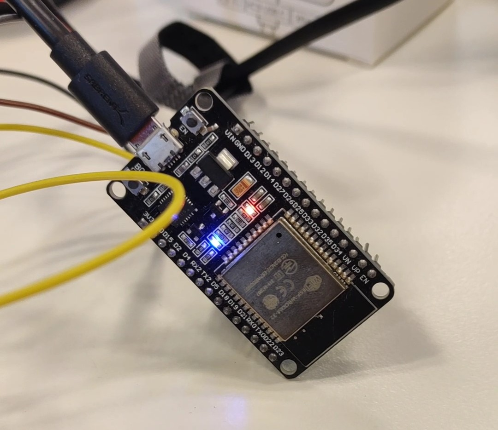

# Exercise 01
For the first exercise we wrote three small Arduino programs.

## Overview
1. [Introduction](#introduction)
	- [The Kit](#the-kit)
	- [Breadboard](#breadboard)
	- [Wemos D1 Mini and ESP32](#wemos-d1-mini-and-esp32)
		- [Wemos D1](#wemos-d1)
		- [ESP32](#esp32)
2. [Preparation](/Teamfolder/Group1/exercises/exercise01/README.md#preparation)
3. [Example - blinking LED](/Teamfolder/Group1/exercises/exercise01/README.md#example---blinking-led)
	- [How to begin](/Teamfolder/Group1/exercises/exercise01/README.md#how-to-begin)
	- [Code](/Teamfolder/Group1/exercises/exercise01/README.md#code)
	- [Pictures](/Teamfolder/Group1/exercises/exercise01/README.md#pictures)
4. [Toggle Led With Button](/Teamfolder/Group1/exercises/exercise01/README.md#toggle-led-with-button)
	- [How to begin](/Teamfolder/Group1/exercises/exercise01/README.md#how-to-begin)
	- [Code](/Teamfolder/Group1/exercises/exercise01/README.md#code-1)
	- [Pictures](/Teamfolder/Group1/exercises/exercise01/README.md#pictures-1)
5. [Extra: Switch Led With Button](/Teamfolder/Group1/exercises/exercise01/README.md#extra-switch-led-with-button)
	- [How to begin](/Teamfolder/Group1/exercises/exercise01/README.md#how-to-begin-2)
	- [Code](/Teamfolder/Group1/exercises/exercise01/README.md#code-2)
	- [Pictures](/Teamfolder/Group1/exercises/exercise01/README.md#pictures-2)	

## Introduction
### The Kit
Find attached the sheet with the hardware included in the kit.
[Kit](./UT-CS-IoT-Kit%20Parts%20Discovery%20List.xlsx)

### Breadboard
We wired up an ESP32 to our computer via USB cable. We wired a yellow and red LEDs with 330 Ohm resistors.

### Wemos D1 Mini and ESP32
#### Wemos D1
The Wemos D1 Mini is a compact development board based on the ESP8266 microcontroller. It is designed to be easy to use and is compatible with the Arduino IDE, making it a popular choice for IoT (Internet of Things) projects. 

#### ESP32
The ESP32 is a more powerful microcontroller compared to the ESP8266, and it has become popular for a wide range of IoT applications. It's also used for Bluetooth and Wi-Fi communication.

## Preparation
Before we could start doing the first little example, we had to setup our ESP32.
1. We installed the Arduino IDE from https://www.arduino.cc/en/Main/Software
2. We added support for ESP32 to the Arduino environment by following these steps: https://github.com/esp8266/Arduino

## Example - blinking LED
For this small example we created an Arduino program which makes the onboard LED of the ESP32 blink every second.

### How to begin
1. Tools > Board > ESP32 DEV MODULE
2. Files > Example > Built in examples > 01. Basics > Blink
3. Verify the program
4. Upload File to ESP32

### Code
Here you can find the code -> [builtinLedBlink.ino](/Teamfolder/Group1/exercises/exercise01/builtinLedBlink/builtinLedBlink.ino/)

### Pictures
Pictures and videos can be found in teh following folder:
[Pictures](/Teamfolder/Group1/pictures/exercise01/builtinLedBlink/)

## Toggle Led With Button
In this little project we wanted to make a toggle button that changed the state of the leds.

### How to begin
1. File > New
1. Tools > Board > ESP32 DEV MODULE
3. Connect the cables between the ESP32 and the button
2. Write the code
3. Verify the program
4. Upload File to ESP32

#### Code
Here you can find the code -> [buttonToggle.ino](/Teamfolder/Group1/exercises/exercise01/buttonToggle/buttonToggle.ino)

#### Pictures
Pictures and videos can be found in teh following folder:
[Pictures](/Teamfolder/Group1/pictures/exercise01/buttonToggle/)

## Extra: Switch Led With Button
In this little project we wanted to make a toggle button that changed the led that was on.

### How to begin
1. File > New
1. Tools > Board > ESP32 DEV MODULE
3. Connect the cables between the ESP32 and the button
2. Write the code
3. Verify the program
4. Upload File to ESP32

#### Code
Here you can find the code -> [buttonLED.ino](/Teamfolder/Group1/exercises/exercise01/buttonLED/buttonLED.ino)

#### Pictures
Pictures and videos can be found in teh following folder:
[Pictures](/Teamfolder/Group1/pictures/exercise01/buttonLED/)

