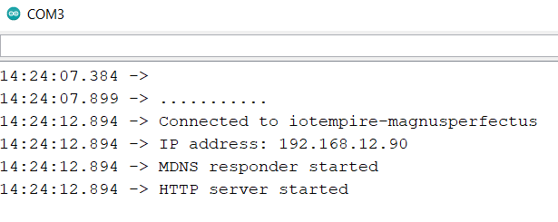
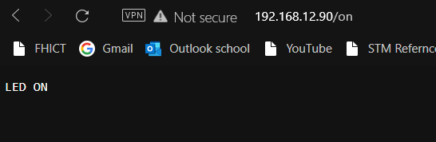
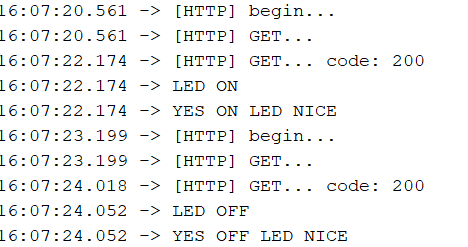
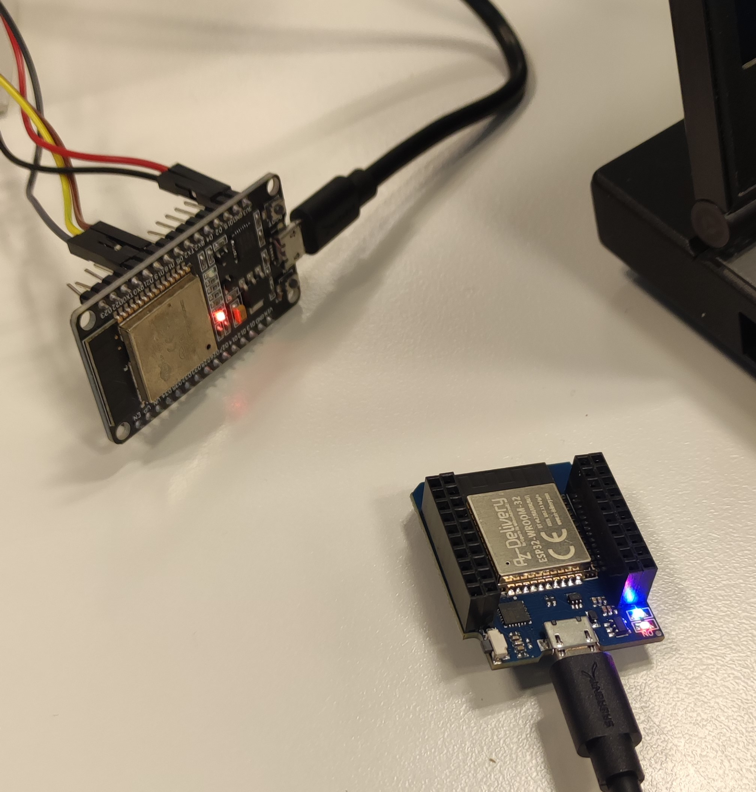

# Exercise 02
We did some Arduino and VS Code programs related with IoT.

## Overview
1. [Persona and Scenraios](/Teamfolder/Group1/exercises/exercise02/README.md#persona-and-scenraios)
1. [Terminology IoT](/Teamfolder/Group1/exercises/exercise02/README.md#terminology-iot)
1. [Preparation](/Teamfolder/Group1/exercises/exercise02/README.md#preparation)
2. [Control Led with Web Request](/Teamfolder/Group1/exercises/exercise02/README.md#control-led-with-web-request)
	- [How to begin](/Teamfolder/Group1/exercises/exercise02/README.md#how-to-begin)
	- [Code](/Teamfolder/Group1/exercises/exercise02/README.md#code)
	- [Pictures](/Teamfolder/Group1/exercises/exercise02/README.md#pictures)
3. [Use a Button to Create Web Request Step 1](/Teamfolder/Group1/exercises/exercise02/README.md#use-a-button-to-create-web-request-step-1)
	- [Client](/Teamfolder/Group1/exercises/exercise02/README.md#client)
		- [How to begin](/Teamfolder/Group1/exercises/exercise02/README.md#how-to-begin-1)
		- [Code](/Teamfolder/Group1/exercises/exercise02/README.md#code-1)
	- [Server](/Teamfolder/Group1/exercises/exercise02/README.md#server)
		- [How to begin](/Teamfolder/Group1/exercises/exercise02/README.md#how-to-begin-2)
		- [Code](/Teamfolder/Group1/exercises/exercise02/README.md#code-2)
	- [Pictures](/Teamfolder/Group1/exercises/exercise02/README.md#pictures-1)
4. [Use a Button to Create Web Request Step 2](/Teamfolder/Group1/exercises/exercise02/README.md#use-a-button-to-create-web-request-step-2)
	- [Client](/Teamfolder/Group1/exercises/exercise02/README.md#client)
		- [How to begin](/Teamfolder/Group1/exercises/exercise02/README.md#how-to-begin-1)
		- [Code](/Teamfolder/Group1/exercises/exercise02/README.md#code-3)
	- [Server](/Teamfolder/Group1/exercises/exercise02/README.md#server)
		- [How to begin](/Teamfolder/Group1/exercises/exercise02/README.md#how-to-begin-2)
		- [Code](/Teamfolder/Group1/exercises/exercise02/README.md#code-4)
	- [Pictures](/Teamfolder/Group1/exercises/exercise02/README.md#pictures-2)	

## Persona and Scenraios

Activity can be found here: [Persona and Scenearios](/Teamfolder/Group1/exercises/exercise02/Stories_Scenario/README.md)

## Terminology IoT

After that, we have researched about some terminology of IoT, and relationed different concepts.

Activity can be found here: [Terminology IoT](/Teamfolder/Group1/exercises/exercise02/Terminology_IoT/README.md)

## Preparation
Before we could start doing the first little example, we had to setup our Raspberry Pi.
1. We downloaded the image for the Raspberry Pi from https://github.com/iotempire/iotempower/blob/master/doc/image-pi.rst
2. We checked the checksum with the tool from https://raylin.wordpress.com/downloads/md5-sha-1-checksum-utility/
3. We downloaded etcher from https://www.balena.io/etcher/
4. We flashed the image to the Raspberry Pi with etcher and validate it
5. In wifi.txt we changed the WiFi name and password and removed '#' from the WiFi name line
6. We connected the Raspberry Pi to the network via Ethernet cable and powered it up

## Control Led with Web Request
For this small example we created an Arduino program which makes the onboard LED of the ESP32 change it's state depending on the IP we go to.

### How to begin
1. File > New
2. Tools > Board > ESP32 DEV MODULE
3. Write the code
4. Verify the program
5. Upload File to ESP32

### Code
Here you can find the code -> [HelloServer.ino](/Teamfolder/Group1/exercises/exercise02/HelloServer/HelloServer.ino)

### Pictures
Pictures and videos can be found in teh following folder:
[Pictures](/Teamfolder/Group1/pictures/exercise02/HelloServer/)

## Use a Button to Create Web Request Step 1
In this project we use 2 ESP32, one as a server and one as a client, to change the state of the builtin led. We did this by using an HTTP GET request to the server that triggered the server code to turn on the builtin LED.

### Client

#### How to begin
1. File > New
1. Tools > Board > ESP32 DEV MODULE
3. Connect the cables between the ESP32
2. Write the code
3. Verify the program
4. Upload File to ESP32

#### Code
Here you can find the code for the client -> [BasicHttpClient.ino](/Teamfolder/Group1/exercises/exercise02/BasicHttpClient/BasicHttpClient.ino)

### Pictures
Pictures and videos can be found in teh following folder:
[Pictures](/Teamfolder/Group1/pictures/exercise02/)

### Server

#### How to begin
1. Keep the code from HelloServer.ino

#### Code
Here you can find the code -> [HelloServer.ino](/Teamfolder/Group1/exercises/exercise02/HelloServer/HelloServer.ino)

## Use a Button to Create Web Request Step 2
In this project we use 2 ESP32, one as a server and one as a client, to change the state of the builtin LED.
When the button was integrated into the client code, we were able to toggle an HTTP GET request. The server code didn´t have to change, since it still reacted to the HTTP request like normal.

### Client

#### How to begin
1. Modify the code
2. Verify the program
3. Upload File to ESP32

#### Code
Here you can find the code for the client -> [BasicHttpClient.ino](/Teamfolder/Group1/exercises/exercise02/BasicHttpClient/BasicHttpClient.ino)

### Server

#### How to begin
1. Keep the code from HelloServer.ino

#### Code
Here you can find the code -> [HelloServer.ino](/Teamfolder/Group1/exercises/exercise02/HelloServer/HelloServer.ino)

### Pictures
Pictures and videos can be found in teh following folder:
[Pictures](/Teamfolder/Group1/pictures/exercise02/ButtonHttpClient/)