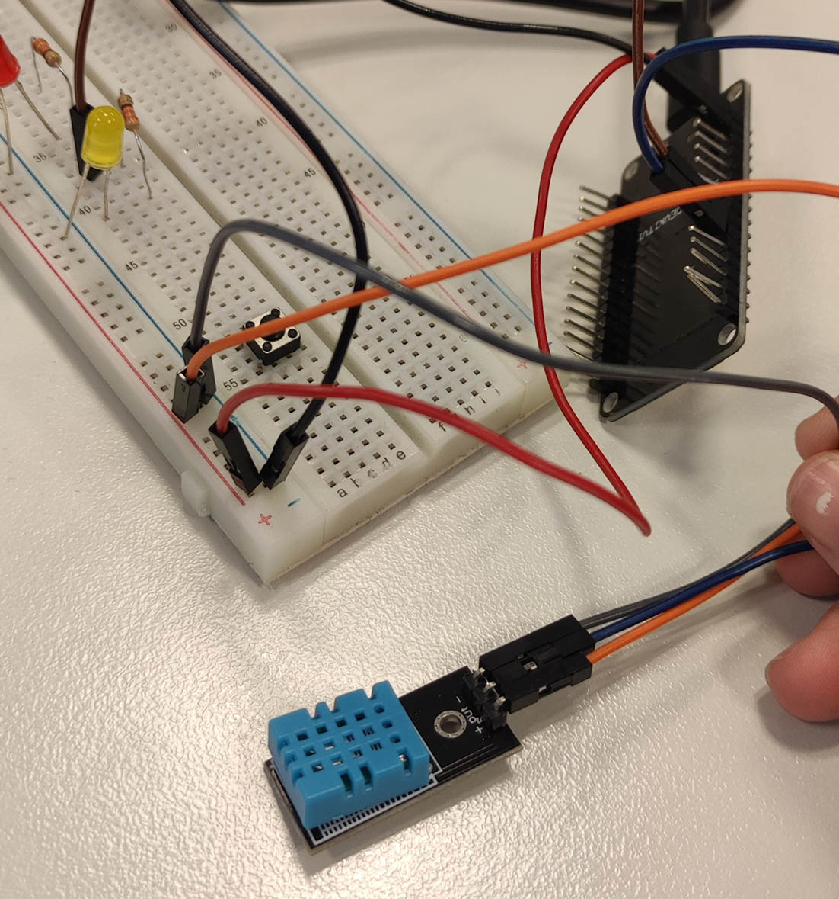

# Exercise 03
We did some activities regarding Mosquitto and MQTT.

## Overview
1. [MQTT Basics](/Teamfolder/Group1/exercises/exercise03/README.md#mqtt-basics)
	- [How to begin](/Teamfolder/Group1/exercises/exercise03/README.md#how-to-begin)
	- [Pictures](/Teamfolder/Group1/exercises/exercise03/README.md#pictures)
2. [MQTT Simulation](/Teamfolder/Group1/exercises/exercise03/README.md#mqtt-simulation)
	- [How to begin](/Teamfolder/Group1/exercises/exercise03/README.md#how-to-begin-1)
	- [Simulation Flow](/Teamfolder/Group1/exercises/exercise03/README.md#simulation-flow)
	- [Pictures](/Teamfolder/Group1/exercises/exercise03/README.md#pictures-1)
3. [MQTT on microcontroller](/Teamfolder/Group1/exercises/exercise03/README.md#mqtt-on-microcontroller)
	- [How to begin](/Teamfolder/Group1/exercises/exercise03/README.md#how-to-begin-2)
	- [Code](/Teamfolder/Group1/exercises/exercise03/README.md#code)
	- [Simulation Flow](/Teamfolder/Group1/exercises/exercise03/README.md#simulation-flow-1)
	- [Pictures](/Teamfolder/Group1/exercises/exercise03/README.md#pictures-2)

## MQTT Basics
We started with watching a video on the basics of IoT. in thsi video Ulrich explained how we can use the raspberry pi connection to communciate between terminals with MQTT.

### How to begin
1. ssh into raspberry pi using the ip adress
2. use one terminal to subscribe to a topic
3. open a new terminal, ssh into pi, and publish on the topic that the first terminal is subscribed to.
4. On the subscriber terminal you should see the text that was sent.

### Pictures
Here you can find a picture -> [Picture](/Teamfolder/Group1/pictures/exercise03/MQTT_BASICS/)

## MQTT Simulation
As agreeded with the professor, we did our simulation using Node-Red. In this simulation we did three components:

1. **Temperature Sensor:**  We use a Slider to simulate the change of temperature, and send the value to the topic "magnusp/temp".
2. **Integrator:** We recive the data send from the temperature sensor on the same topic ("magnusp/temp"). After that, we use a switch to choose what to do next depending on the value of the data. We send a string (based on the temperature value) to the topic "magnusp/AC/mode". 
3. **AC Unit:** We recive the data send from the temperature sensor on the same topic ("magnusp/AC/mode") and display a text indicating which mode the AC should be in.

### How to begin
1. Open Node-Red
2. Create the components and its relations
3. Check if it works properly

### Simulation Flow
Here you can find the compact JSON code to import the flow -> [Compact JSON](/Teamfolder/Group1/exercises/exercise03/MQTT-Simulation/MQTT-Simulation-flow.txt)

### Pictures
Here you can find some pictures -> [Pictures](/Teamfolder/Group1/pictures/exercise03/MQTT_Simulation/)

## MQTT on microcontroller
In order to work on this assignment efficiently, we divided the assignment into 3 parts. 
1. **Temperature Sensor:**  The code from the temperature sensor connects to the internet, subscribes to the MQTT topic (magnusp/DHTtemp). It then publishes the temperature data every 2 seconds using a non-blocking delay. 
2. **Integrator:** For the intergator we use the same Node-Red flow as before, we only changed the topics, since we are using different topics than the simulation assignment.
3. **AC Unit:** The AC unit uses the mqtt_esp8622 example code. We changed the topics it would subscribe to, added the WiFi credentials and the server IP and port. 

### How to begin
1. Open Node-Red
2. Create code in visual studio for temperature sensor
3. Create code in Arduino for AC Unit.
4. Check if it works properly

### Code
Here you can find the different codes -> [Code VS](/Teamfolder/Group1/exercises/exercise03/ESP32%20to%20MQTT%20(DHT22)/) and 
 [Arduino](/Teamfolder/Group1/exercises/exercise03/mqttAC/mqttAC.ino)

### Simulation Flow
Here you can find the compact JSON code to import the flow -> [Compact JSON](/Teamfolder/Group1/exercises/exercise03/MQTT-Simulation/MQTT-Simulation-flow.txt)

### Pictures
Here you can find some pictures -> [Pictures](/Teamfolder/Group1/pictures/exercise03/MQTT_microcontroler/)

