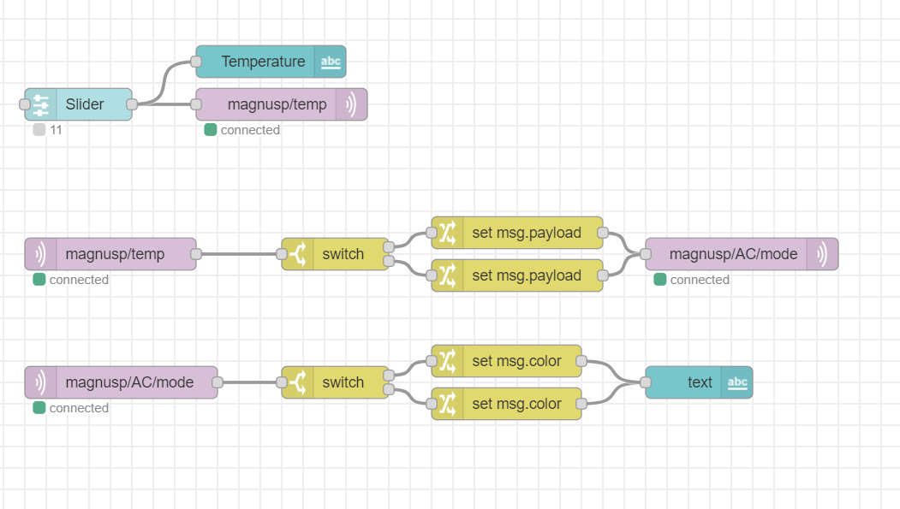
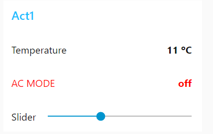
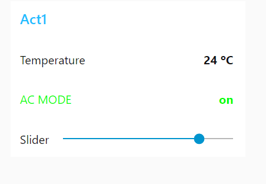

# Exercise 04
For the first exercise we wrote three small Arduino programs.

## Overview
1. [Node-Red Intro](#node-red-intro)
	- [How to begin](/Teamfolder/Group1/exercises/exercise04/README.md#how-to-begin)
	- [Simulation Flow](/Teamfolder/Group1/exercises/exercise04/README.md#simulation-flow)
	- [Pictures](/Teamfolder/Group1/exercises/exercise04/README.md#pictures)
2. [Emergency Button](/Teamfolder/Group1/exercises/exercise04/README.md#mqtt-simulation)
	- [How to begin](/Teamfolder/Group1/exercises/exercise04/README.md#how-to-begin-1)
	- [Simulation Flow](/Teamfolder/Group1/exercises/exercise04/README.md#simulation-flow-1)
	- [Pictures](/Teamfolder/Group1/exercises/exercise04/README.md#pictures-1)
3. [Remote Control an Internal Device](/Teamfolder/Group1/exercises/exercise04/README.md#mqtt-simulation)
	- [How to begin](/Teamfolder/Group1/exercises/exercise04/README.md#how-to-begin-1)
	- [Simulation Flow](/Teamfolder/Group1/exercises/exercise04/README.md#simulation-flow-1)
	- [Pictures](/Teamfolder/Group1/exercises/exercise04/README.md#pictures-1)

## Node-Red Intro
We started with watching a video on the basics of Node-Red. In this video Ulrich explained how we can do some basic flows with Node-Red. After that, we had to rebuid our MQTT integrator component in Node-Red, but we had already done that yesterday. Folowing that, we had to rebuild the switch-simulator/AC-unit-simulator with a Node-RED dashboard text, which we also did yesterday. The only additional thing we did was editing the label to change its color based on the temperature.

### How to begin
1. Open Node-RED
2. Get the flow from yesterday
3. Edit the AC component
4. Check if it works properly

### Simulation Flow
Here you can find the compact JSON code to import the flow -> [Compact JSON](/Teamfolder/Group1/exercises/exercise04/node-red-basics/Simulation-flow.txt)

### Pictures
Here you can find some pictures -> [Pictures](/Teamfolder/Group1/pictures/exercise04/node-red-basic/)

## Emergency Button
We started by creating a Discord Bot (named Judith&Finn BOT). After that we went to node-red and created the flow, making sure to properly set the discord nodes and linking them to our bot.

Then we created the code for the button. In this code we publish every time we click the button. We used the toggle code that we had from before and implemented that into the existing esp32 code. 

We faced some problems like not being able to properly link the discord bot to node-red, but thanks to Jan we solved it out. Also faced some issues with versions of the node.js library, but that was eventuall fixed.

### How to begin

1. Create a bot
2. Install in node-red the library for discord
3. Create the flow in node-red
4. Create code in visual studio for the button
5. Check if it works properly

### Simulation Flow
Here you can find the compact JSON code to import the flow -> [Compact JSON](/Teamfolder/Group1/exercises/exercise04/emergency_button/Simulation-flow.txt)

### Code
Here you can find the visual studio code -> [Code](/Teamfolder/Group1/exercises/exercise04/emergency_button/ESP32%20to%20MQTT%20(DHT22)/)

### Pictures
Here you can find some pictures -> [Pictures](/Teamfolder/Group1/pictures/exercise04/emergency-button/)

## Remote Control an Internal Device
In this activity, we had to trigger a real physical device by sending a message on the discord server. In order to do that, we created a flow in Node-red that uses the bot previously created to to read the #sandbox channel. If the bot reads a certain message, it publishes on the topic a text that triggers the ESP32 to turn on or off the LED.

### How to begin

1. Create a Node-red flow for the bot to publish on the topic when message recived
2. Create a code in visual studio for the ESP32 to toggle the LED
3. Send a Discord message on the #Sandbox Channel
4. Wait for the LED to toggle its state

### Simulation Flow
Here you can find the Node-red flow -> [Compact JSON](/Teamfolder/Group1/exercises/exercise04/remote-control/)

### Code
Here you can find the visual studio code -> [Code](/Teamfolder/Group1/exercises/exercise04/remote-control/)

### Pictures
Here you can find a picture -> [Picture](/Teamfolder/Group1/pictures/exercise04/remote-control/)

