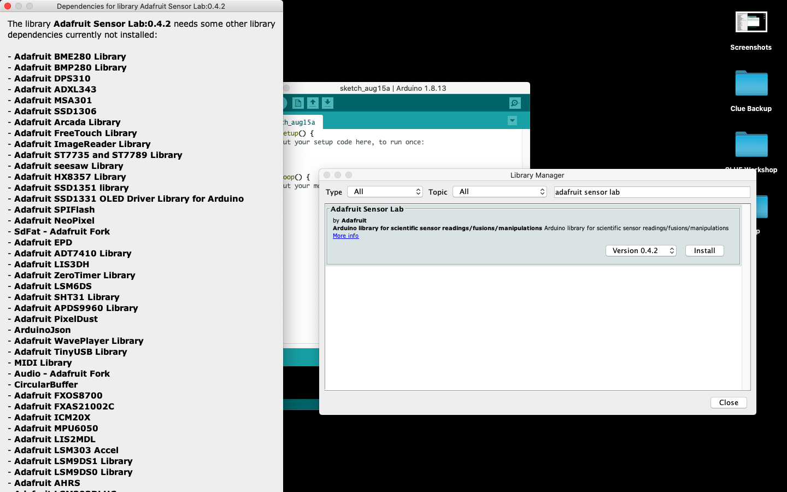
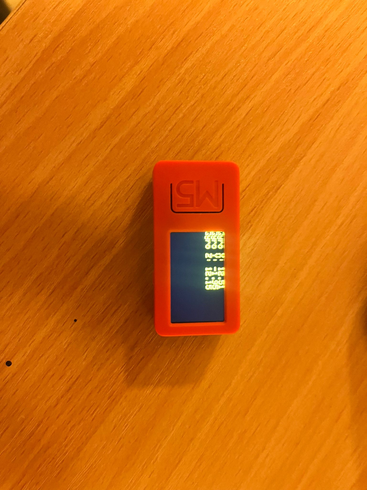

# Day 8

Today we started rough. Ulrich had recieved a "complained" from some of the mentors from different students. 

Some people made complains that the material was to hard and that we are going to fast. My own opinion in this one is mixed. I have previous experience with IoT, and do a lot of IoT in my free time, so I know a lot of IoT already. But I could kinda get where some people come from. 

After a lengtly discussion, we could finally start with the excercises of today

# Own project

This week stands in symbole of our own IoT project that connects to the the other modules. 
I had a talk with my teammates about what I wanted to do the next day and shared my ideas. We thought that having more Internet of Things (IOT) devices would help us get a better score for our project. So, I made a detailed list of the things we needed:

- An RFID Scanner: This device scans and identifies how can use the IoT network
- Two M5 devices: We wanted two of these because they can do different tasks in our project. One for the Gyroscope and the other use cases, is as a alarm. 
- An RGB-LED: Shows what status the RFID scanner is
- An OLED screen: This displays what you need to do with the entry card
- A Buzzer: This buzzer would make sounds for false entry.

To create this, we decided to use some of the thing we did on day 6. That project is almost the same as the project we are gonna do right now, it only expand on it. 

## Working on the first thing

Because Judith and Stefan needed to go, Finn and I went on and make a part of the project. Finn started with the RGB-Led and the buzzer. In contrast to the project we did on day 6, we decided to challenge ourself, and use a little of IoT-empire as possible. So Finn and I made everything in a IDE.

While Finn was working on the RGB-Led and MQTT I started to work on the RFID reader, That was really easy beause i just used the same exact code that I got from day 6 and that worked instantly. After I finished the RFID reader is started with the M5StickCplus. This is a device that can do a lot of things, but most importantly for us, it has a build-in gyroscope. So thats why we use it in our project.

I started first started to use the IDE I'm the most familair with, which is Arduino IDE. 

The first thing I needed to do was download the right board and library's... but this proved to be a challenge. Because if I wanted to the list of dependencies was to long and you couldn't scroll down.

The "Error" looked as followed:



Finn adviced me to just use Platform.IO, so I switched to VScode with PlatformIO, Here I could install the dependencies... but when I tried to run the code I got the following error:

- Compilation error: exit status 1

This is an error which doesn't give me any information on whats wrong... so I googled it... nothing...

After rebooting VScode, and restarting my laptop and even reconfigure my project, still the same error.

After the Platform fiasco, I decided to install Arduino IDE 2. And try it in that, In this IDE I could install all the dependencies and the correct board. 

But once again, when I tried to run the code for the third time I got the same error as in platform IO.

I decided to test what exactly the issue was, so I took a note on how to troubleshoot and tested the following things:

- Does the library work
    - Yes they worked, because if I only include the libraries, the code run
- Does the M5 work?
    - Yes, because if I uploaded a "hello world" template it would again run
- Is the code functional?
    - Yes, both ChatGTP and Bard didnt have an issue with the code, they gave no feedback on how to improve it, and said that it should run
- Is the gyroscope module broken?
    - No, the gyroscope worked, but I did finally found the answer, the problem lays in the call function to call upon the gyro function


So now I knew what the problem was, the only thing I could find about it online is that the original Arduino IDE didnt have this issue. So I tried the last thing I could think of.

I download the depedencies in Arduino IDE 2, go in to my files, scrape the dependencies and ZIP them, then I include the ZIP in Arduino IDE 1. 

After 2 hours of troubleshooting, the above solution... **WORKED**, I could finally run the following code:

```
#include <M5StickCPlus.h>
void setup() {
  M5.begin();
  M5.IMU.Init(); 
  M5.Lcd.setRotation(3); 
  M5.Lcd.fillScreen(BLACK);
  M5.Lcd.setTextColor(YELLOW);
  M5.Lcd.setTextSize(2);
}

void loop() {
  float gyroX, gyroY, gyroZ;

  M5.IMU.getGyroData(&gyroX, &gyroY, &gyroZ);

  M5.Lcd.fillScreen(BLACK);

  M5.Lcd.setCursor(0, 0);
  M5.Lcd.print("Gyro X: ");
  M5.Lcd.println(gyroX);
  M5.Lcd.print("Gyro Y: ");
  M5.Lcd.println(gyroY);
  M5.Lcd.print("Gyro Z: ");
  M5.Lcd.println(gyroZ);

  delay(1000);
}
```

When I uploaded the code I saw the following thing on my M5:



So after a lot of struggles I finally got the Gyroscope working, so now we can, on monday finish our project.

The only things that now need to be done in the project are:

- the second M5
- MQTT broker
- combine everything

so the thing we need to do as a team isnt that much, but it will probably take a full day before our project is finished.

# Feedback and reflection
## Feedback 
For Feedback I have little to give, Finn worked perfectly on the RGB LED and got it to work already. The buzzer I also heared it worked (literly). What Judith and Stefan did, after they left, I have no clue upon, sinds I havent spoken to them since.

## Reflection

The only thing I can really reflect upon, is that I should asked the teachers, our one of my students to ask how to fix the problem with the M5. Maybe they have other solutions that I now did. But I truly wanted to find the solution myself. So thats the reason why I didnt asked. I can be really stubbern in these things. Maybe it would be smart to be a little bit less stubbern with this. 