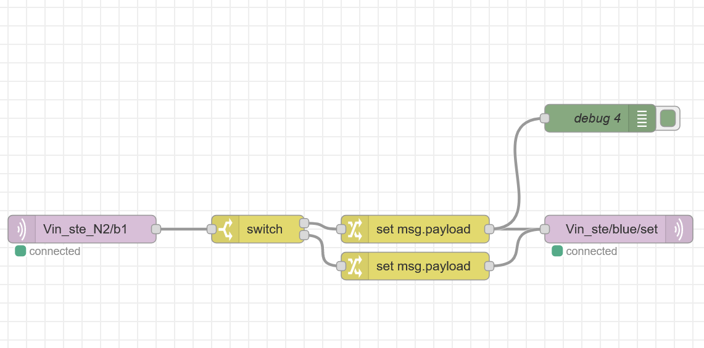
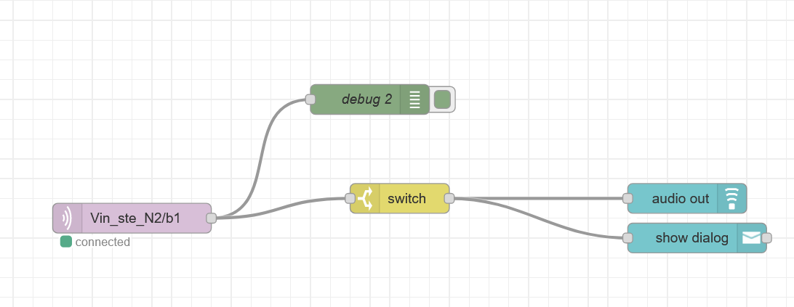
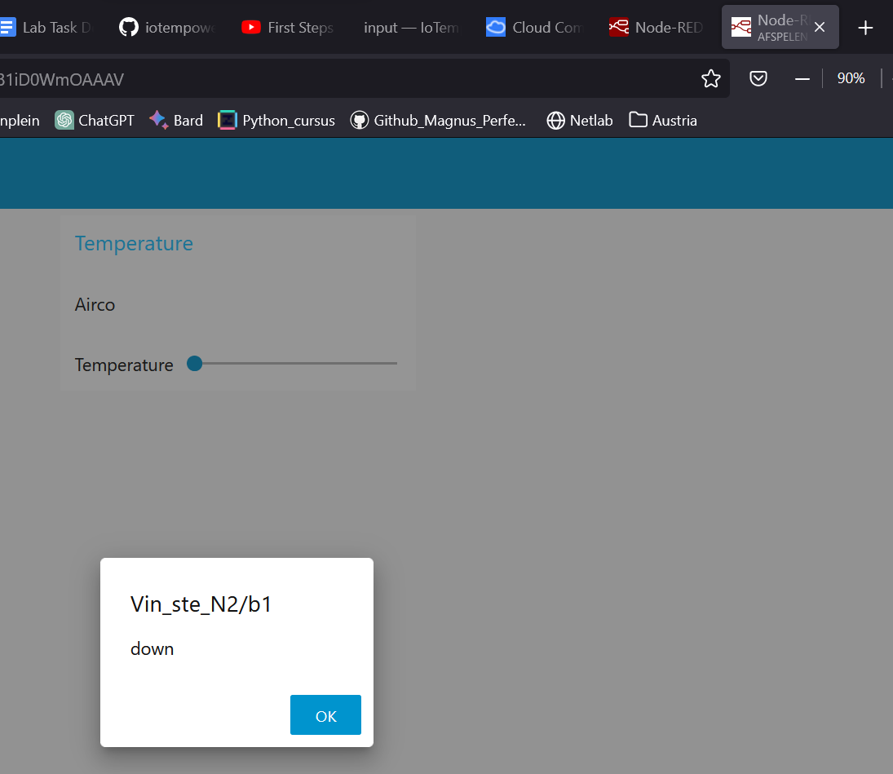
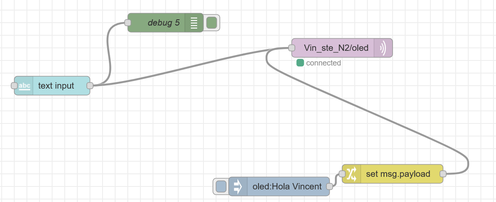

# Day 5

# Questions
- What will be issues scaling (system size, number of systems, management)
    - Scaling isn't always favourable, because it requires more resources. When you need more resources you need to spend more money. Futhermore if you scale up you also require more bandwith from you network. Scaling up just ask more of your current network and places
- How can we do testing?
    - You could simulate it, when simualting a network and a area, you could get the speficis of requirements. However simulation is not always the best way to test it. another way of testing is to make the network in a exclusive zone, so your own network doesnt have hinder from changing things. You could also do one for one for one for one. 
- What would you like to see for scaling up?
    - What I would like is to scale the network up, currently we have a lot of issues with the way the network is programmend, but that can be resolved if we use good networking equipment. Futhermore I would like to have more Arduino stuff, because right now we have a little bit to little to little. As for the last thing, I would like for everyone to have there own Raspberry PI, not a PI 400, but a Pi 3/4 or 5. 
- What role will play simulator (-component)s, MQTT and stories
    - Simulating the hardware is a good way to test surten things. I simulate Node-Red for example and it's really handy to simulate it, because my laptop has enough power right now to work. So I could simulate other things as well.

# What is IoTempire?

IoTempire is a framework and environment for making the Internet of Things (IoT) accessible for everyone. It is designed to empower tinkerers, makers, programmers, hobbyists, students, artists, and professionals alike to explore and develop for the IoT.

IoTempire provides a number of features that make it easy to get started with IoT development, including:

    A library of pre-built IoT components, such as sensors, actuators, and communication modules
    A visual programming environment that allows users to create IoT applications without writing any code
    A cloud-based platform for managing and deploying IoT applications

IoTempire is also open source, so it is freely available to use and modify.

Here are some examples of what you can do with IoTempire:

    Build a smart home system that controls your lights, thermostat, and other devices
    Develop an IoT-based weather station that collects and reports data on temperature, humidity, and other weather conditions
    Create a wearable device that tracks your fitness activity and health data
    Build a prototype for a new IoT-enabled product or service

IoTempire is a powerful and versatile platform for IoT development. It is a great choice for anyone who wants to get started with IoT, regardless of their experience level.

# Challenge 1

The first challenge is as following: 

- Study about tool support in IoTempower - Which commands are there, write down your first idea what they do and if or where you could use them (some of them give you extra information, when you call them with help) 	
 	
- Check out the documentation server (if you installed it on your own pc, you can start it with iot doc serve. Attention, the search does not work locally as it is a local web server without CGI support - using web_install and web_start will give you the full experience on port 40080 also on a local installation). Open "Commands'' and search how to use the rfid reader, PWM, a servo motor, ultrasonic distance sensor (RCWL-1601 or HC-SR04 - build a voltage divider for the later with resistors splitting 1 to 2 - compare https://www.instructables.com/Modify-Ultrasonic-Sensors-for-3-Volts-Logic-prepar/), and a single rgb led (you probably don't even need Google here, but if you are interested about more, feel free to find some more information about the hardware you are actually using) - note the example code you intend to use for both as well as some important remarks about wiring (you will need this information in the next labs to actually install these devices). <- so this task is only for summarizing documentation and giving you a feel for it

For this excercise we have to do nothing, only reading. So thats what i did. I made the following cheatsheet:
    
IoTempire is an open-source IoT (Internet of Things) exploitation framework. Here are some of the key commands used in IoTempire:

- use: Select a specific IoT exploitation module.
- show: Display information about available modules or details about the current module.
- set: Set parameters and options for the selected module.
- unset: Remove previously set parameters.
- run: Execute the selected module with the configured parameters.
- search: Search for available IoT exploitation modules.
- help: Display help and usage information for a specific command or module.
- back: Return to the main menu.
- exit: Exit the IoTempire framework.

These commands provide the basic functionality for interacting with and exploiting IoT devices using the IoTempire framework. Please note that the specific commands and modules available may change over time, so it's a good idea to refer to the official documentation or the latest information from the IoTempire project for the most up-to-date details.

Futhermore I read the node.conf and the setup.cpp, so now I now know more what I am about the do

# Challenge 2 

The challenge is as followed:
- Follow the First Node manual as well as the linked tutorial video (https://youtu.be/fTWNYXfet9E) and do all subtasks (be aware that some things might not be updated, ask instructor and file issues if you spot some potential improvements for the documentation – or even PRs) - only follow the steps regarding the “pi-image” - you can ignore most of the Windows and WSL related steps. For the step "Next deployments" connect the node to external USB power as suggested and show that the deploy step still works.

To do this Challenge I first watched the YouTube video. This video was really helpful in getting started with the IoTempire node

## The issue
But of course, things could never be so easy, so we had a lot of troubles. Trying to make the first node we got a problem with one piece of techology that stole the show:
- ESP32-Wroom-32

The issue was while trying to initialize Serial, the script to let the ESP do nothign, it would get an error in the library: **arduino.h.**. 
Normally in the node.conf we need to change: **Wemos D1 Mini** to **esp32minikit**. So we did that, but then we would get the error in the Arduino.h file. If we tried to just use the ESP-8622 we didn't get any errors, so we decided that use the ESP-8622 for the first challenge. In the second challenge we needed to use 2 ESP's, and because we only have 1 ESP-8622 the issue needed to be resolved. Our teacher, Ulrich helped us with this issue. 

The solution was to remove a file from the Pi, so that is was forced to reinstall it, and that seem to fix the issue, so we could use the ESP32

## Continue Challenge 2
So now back to the challenge itself. After watching the video we now know what we needed to do. So we did the following things:

- Go to gw.iotempire.net
    - So we could use iotempire
- Create a new node
    - use F2 and select the option **C** so that we made a new node
- Change the node.conf file
    - Change the "board = "Wemos D1 mini"" to "board = "esp32minikit"". 
- Change the setup.cpp file 
    - We added this line: "led(blue, LED_BUILTIN).inverted();".
- Go to the terminal
    - Use F2 and then V
- Initialize Serial. 
    - Use I

So when all that is said and done, We watched that it worked. We could change the button via a MQTT query

# Challenge 3
The challenge is as followed:
- Follow the manual here and do all the subtasks, but don’t do the “adoption”-related tasks, also using the toggle node.

So we needed to make a second a second node, so the second node can interact with the first one. 

To do that we also needed to use Node-Red, so I once again powered on my Virtual Machine that would allow to use my own Node-Red.

So we did the same as detailed in Continue Challenge 2. After that we we made a Node-Red to send the button input to the first node. So we made the following Node-Red layout:

So The first ESP send a MQTT message to the MQTT broker, After that we filter the answer to get the correct answer. After that we send a MQTT message to the second ESP. As expected the buildin LED would turn on with the press of a button and would turn off with another press of the button.

There is a video, which can be found at our github page, with the final result.

# Challenge 4

The challenge is as following:

- Create a physical button device that uses MQTT and make it play a sound and show a notification in the Node-RED dashboard (consider testing the dashboard both on the desktop and on a phone) - all necessary functionality is in the dashboard nodes.

Because I knew that today was going to be difficult to be working in pairs. I already made the Node-Red code yesterday. So the Node-red code is as following:

We didn't need to alter much in the code. Now we only needed to use one ESP, so we used the one that already had the button. So the button one had the following following config in Setup.cpp

- Button(lower, D4, "released", "pressed").with_debounce(5);

So when the button is pressed we got a MQTT message in Node-Red, so then we switch the input so it was split in a message and in a audio signal. To prove that it actually worked:

As you can see, you see at the top, were the internet tabs were, you can see that is says "afspelen" which is dutch for (a sound)playing. Futhermore you could see that we have a message on the screen, so both objectives are filled and are done.

# Challenge 4
The last challenge of the day was as followed:

- Figure out how to use the given OLED I2C display and implement a MQTT text receiver (send a short message and show it on the screen) (No extra library needed for this display in IoTempower - the small screen example is in the IoTempower display documentation, you can just copy it from there.) Follow the video from the lecture slides.
Send some MQTT messages for testing that the message arrives in the dashboard.
Make this message also show up on the display.

So the last tasks is to display a word that we typed on the display. 

So we used our second note for this challenge, because that one had no broadboard in it. So we plugged the display in it, and changed the setup.cpp to: 
- U8G2_SSD1306_64X48_ER_F_HW_I2C u8g2(U8G2_R0);
- 5display(oled, u8g2, font_tiny);

To have something show up on the OLED display we could manually add it with the command:

- MQTT_send oled "message"

We learned on how to use the oled screen thanks to the excellent documentation on it:

After that we needed to make a Node-Red version of this. So Stefan and i went to work with that.
In the end we ended with the following flow:

The only challenging thing that was difficult was the text input, so that it would only send after we pressed enter. After reading the documentation about the text input we knew how to do that, so the it worked as intended.

As always, we have a video that proves that we did it, which can be find in the github itself.

# Feedback/Reflection

After a long and hardworking day I can reflect on what I did and what we have achieved today.

## Feedback

As for feedback I have little feedback, only that the documetation need some rework, because some things are old and not up-to-date. Futhermore the other feedback I have is that the ESP32 didn't work from the start, so thats also a thing that needs to be looked in to, why it didnt work from the start. Because I thought that is was because we did something wrong. Futhermore I wouldn't run IOTempire on the raspberry pi, because the pi have a lot of limitations. One of them is that the PI is really slow, so working on this is difficult/near impossible. It involves a lot of waiting.

## Reflection
On the reflection part, I think I did a good job today. I read a lot more of the official documentation then I would normally do. I think this is way better then to ask the teacher or to ask ChatGTP. So I'm glad that I did that.
Futhermore I worked a lot better today with Stefan. Where the first few days I did almost everything by myself (Not because Stefan didn't want to, but because I wanted to do everything). So today we really split the work in a good par. So we both have the same workload. 