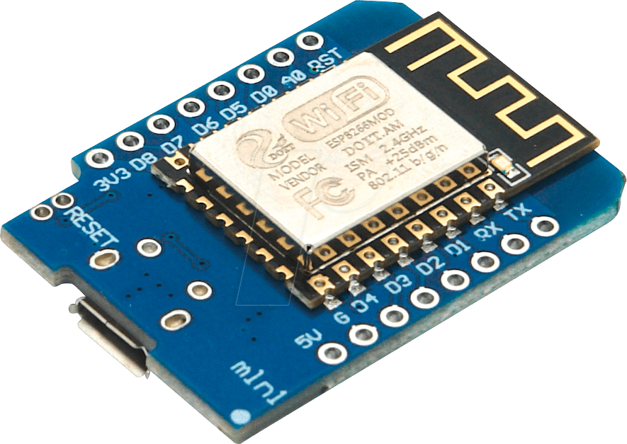
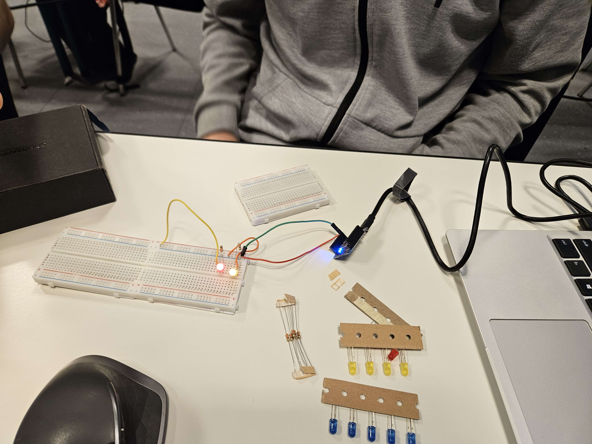
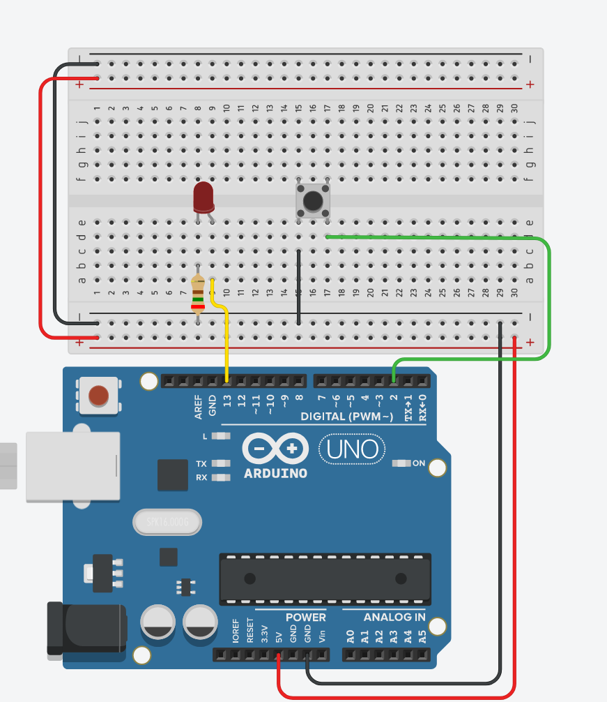

# Who am I?

My name is Vincent van Werkhoven and I am 22 years old. 
Currently I study IT in Fontys in Tilburg in the Netherlands
Im currently doing the minor: Global Acting in IT.

I know a bit about IoT because I do it alot in my free time. Futhermore I really enjoy doing it.

# What is IoT?

IoT stands for Internet of Things, and it applies to small computers and board that can do mostly one task, but some can do multiple tasks. It revolves around the following things for example:

- Raspberry pi
- Arduino
- ESP
- Orange

From the **video's** (the Bosch and the Ulrich videos) that we watched I got the following information:

IoT is everywhere. There are a lot of domains and implications for IoT. 3 big domains that IoT is being used a lot are the following domains:

- wearables
    - Smartwatches
    - Smartglasses
- Smart home applications
    - Smart TV
    - Smart Fridge
    - Smart Lamps
    - Smart oven
    - Smart vacuum cleaner
- Smart cities
    - Lora wan 
- Smart companies
    - Hospitals
    - Banks
    - Governments

Of course, IoT, being a part of IT, requires protocols to function. In the IT world there are a lot of protocols that can provide these tasks, but the most common are:

- MQTT (Message Queueing Telemetry Transport)
- HTTP (HyperText Transfer Protocol)
- XMPP (Extensive Messaging and Presence protocol)
- Websockets
- DDS (Data Distribution Service)

As stated above, there are a lot of IoT devices. There are even devices I can use myself to play around with IoT, devices that I use a lot are as followed:

- Arduino
- ESP
- Raspberry Pi
- Amazon Echo
- Ring Doorbell
- Lora Wan

But what are the benefits of IoT? Well, IoT has a lot of benefits. For example, you can manage your time better. For example, you can start your oven when you are already driving home from work.

You can also improve your lifestyle with IoT. A smart fridge can help you with eating healthy and getting better in shape. It can help you decide what food to buy. 
Another more minor detail about IoT, is that is doesn’t require a lot of space or memory, Because IoT are often small boards, it doesn’t require a lot of power or much resources. 

But we must not forget that there are challenges in IoT. One of the biggest challenge is that security is a really big issue in IoT. A lot of devices aren’t that well protected against cyber-attacks. And with small devices like a smart fridge hacked, most of the time hackers have all the access they want on a network.

Another challenge is ethics. Do we really want to live in a world where there is a camera in every living room? This is a really ethic question, that even big techwizz like Mark Zuckerberg asked. And in a world where, things today are out-dated tomorrow, we need to thing about these questions.

Another big challenge is privacy. With the internet being so big, what privacy can we still have. Do we even have privacy, our is that something from the past. What kind of data does a IoT device need, and the data that de IoT device needs, how do we know how they use that data?  Companies want to have data, and they are willing to do not ethics thing to get that data. These are another ethics questions that needs to be answered as soon as possible. 

All these things combine creates what IoT is, and what it is being used for and how its interpretation within our world and within some communities. But we don’t need to forget that IoT cant solve everything. Like a famous quote: “If the only tool you have is a hammer, you tend to see every problem as a nail”. This extents to IoT.  And the risks that IoT still comes with, is something else we need to think about, and quickly as possible.

# The Kit

We, as a group got the following kit:

[The kit checklist](../UT-CS-IoT-Kit%20Parts%20Discovery%20List.xlsx)

# The device we are going to use:
In the device that we are going to use are:

- Wemos D1 mini 

It looks as followed:

The Wemos D1 Mini is a compact development board based on the ESP8266 microcontroller. It offers built-in Wi-Fi connectivity and is compatible with the Arduino IDE, making it easy to create IoT projects. The D1 Mini features a USB interface, GPIO pins, and various add-on modules, making it a convenient and versatile choice for IoT prototyping.

- ESP8266

It looks as followed: 

The ESP8266 is a popular low-cost, Wi-Fi-enabled microcontroller module. It's widely used for IoT (Internet of Things) projects, offering wireless connectivity and a small form factor. It's based on the Espressif Systems' ESP8266 SoC (System on a Chip) and can be programmed to perform various tasks, such as connecting devices to the internet or creating smart home solutions. It's a versatile and affordable option for IoT development.

# challenges 

## Feedback on team
the challenge was as followed:
- Get feedback on repository and personal portfolio(s) from one instructor (tomorrow)

The feedback i have is as followed:
Today was the first day of the IoT module. I think it went really well, but I do have the following feedback:
- I think the explanation went to fast
- I think not everyone understands everything, some people have 0 experience with IoT, so the teachers need to start at square one
- Clearer explanation on what needs to be done
Besides the points standing above, the lesson was really nice and worked well. 

## Breadboard and Electronic Prototyping (pair)

I made a pair with Stefan. We did all the experiments together.
For the first experiment we tested if our led and Wemos D1 even worked. After putting in the LED test code, which will be included at the end of the document. We have the following result:



So we know for sure that the D1 works and that the leds work. 

Because I know already a little bit about Arduino, I knew how to connect them (make a circle with the ground, 5V and a resistor in between the 5v and the LED). 

## Blink on the Wemos D1 mini (pair)
As you have only one Wemos per group, do this task in both sub-pairs with the same Wemos.

- Wemos D1 Mini and ESP32 Minikit
  - Google and document the Wemos D1 Mini and ESP32 Minikit pinout and general intro info.
  - Elaborate on different addressing schemes of ports, find a corresponding GPIO and board pin number for D6.

- Follow the "Blink on Wemos D1 Mini" video from the slides.
  - Coarse steps:
    1. Install Arduino IDE (v2)
      - Done
    2. Install ch340 driver (if on Windows or older Mac) and plug in a Wemos D1 Mini to one of your computers.
      - Done
    3. Check if you can find "Wemos D1 Mini & R2" board and select it (if not, follow [this link](https://github.com/esp8266/Arduino#installing-with-boards-manager) to add the respective link to preferences - additional board managers).
      - Done
    4. Select the serial port.
      - Done, in my case, it was com4
    5. Select the example (Blink).
      - Done, code will be provided at the end of the document.
    6. Compile and flash -> enjoy
      - Video will be provided at the end of the document.

The Video will be in another ZIP file     

## Toggle led with button
Stefan and I went to work to tackle the last set of challenges. This one was really difficult, because it require a technic called debouncing. The way to explain deboucing is that the button reacts to quickly. If you hold the button, the button will think it as if it was pressed very quickly, repeatedly. 

This is a difficult part of the is the decouning part because its really difficult if you don't know how to do it.

There are 2 ways to do it
the first way is with debouncing
```

const int buttonPin = 2;  // the number of the pushbutton pin
const int ledPin = 13;    // the number of the LED pin

// Variables will change:
int ledState = HIGH;        // the current state of the output pin
int buttonState;            // the current reading from the input pin
int lastButtonState = LOW;  // the previous reading from the input pin


unsigned long lastDebounceTime = 0;  // the last time the output pin was toggled
unsigned long debounceDelay = 50;    // the debounce time; increase if the output flickers

void setup() {
  pinMode(buttonPin, INPUT_PULLUP);
  pinMode(ledPin, OUTPUT);
  Serial.begin(9600);
  digitalWrite(ledPin, ledState);
}

void loop() {

  int reading = digitalRead(buttonPin);
  if (reading != lastButtonState) {
    lastDebounceTime = millis();
  }

  if ((millis() - lastDebounceTime) > debounceDelay) {
    if (reading != buttonState) {
      buttonState = reading;
      if (buttonState == HIGH) {
        Serial.println("button is pressed, and turns the LED on");
        ledState = !ledState;
      }
    }
  }
  Serial.println("button is pressed, and turns the LED off");
  digitalWrite(ledPin, ledState);

  lastButtonState = reading;
}
```

the second one is without deboucing:
```
const int ledPin = 3;
const int Button = 2;

int buttonpushcounter = 0;
int buttonState = 0;
int lastButtonState = 0;


void setup()
{
  Serial.begin(9600);
  pinMode(ledPin, OUTPUT);
  pinMode(Button, INPUT);
}
void loop()
{
buttonState = digitalRead(Button);
  if (buttonState != lastButtonState)
  {
    if (buttonState == HIGH)
    {
      buttonpushcounter++;
    }
  }
  lastButtonState = buttonState;
  if(buttonpushcounter == 1)
  {
    Serial.println("button is pressed, and turns the LED on");
   digitalWrite(ledPin, HIGH);
  }
  if(buttonpushcounter == 2)
  {
    Serial.println("button is pressed");
    Serial.println("button is pressed, and turns the LED off");
    digitalWrite(ledPin, LOW);
    buttonpushcounter = 0;
  }
}
```

The one with debouncing is a lot clearer and is fool proof, while the second one is easier but can sometimes brake. 

This challenge was really diffult because i didn't know how to use debouncing. I needed to relearn from courses i did in the past, on how to use debouncing.

Proof that we made this is here:


Futhermore there will be a video in the ZIP with more prove that we did the challenge. 

# Answering some questions:
Ulrich wanted me to answer some questions. The questions are:

● How are programs saved and run on the Wemos D1 Mini/ESP32 – how many at once?
It can only run one program at the time. The programs are saved in the onboard ram/memory of the device. 

● What did I miss in video?

● Which voltage are we usually using?
3.3V
● What means High and what means Low?
High means there is voltage on it, low means there is no voltage
● Where do you look easiest for examples for your solutions?
In the example tab in the Arduino IDE
● What is special about the onboard led on the Wemos D1 Mini?
It can change colour and is on board. 

## Feedback/reflection

There are some feedback points that need to be discussed. I think the teachers did a fantasic job showing there enthusiasm, but some times it was really difficult to follow what they were talking about. 

Futhermore I don't think it's fair to talk about something as strange as debouncing. There are a lot of students who don't have IoT experience, and they rely on the persons who have experience. I just don't think thats fair for them.

My feedback would fall that the teachers just start at the start, and go a bit more slowly through the module, because if this is the rythme for the whole module, it's going to be difficult be keep up.

BUT, with the feedback I gave, I want to adress that the way they teach is good, and interessing. So that's something I truely want to address. 

I helped today Stefan with his project. So he know how the ESP even worked and how we needed to communicate with it. 