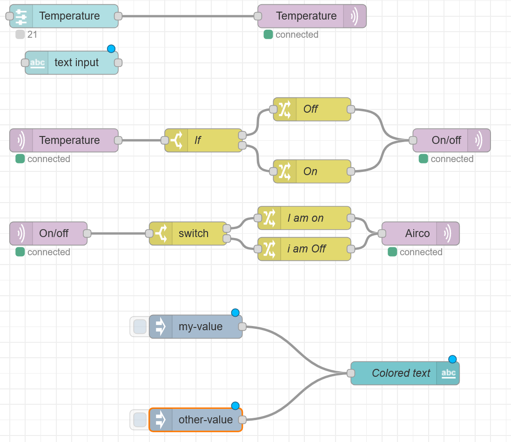
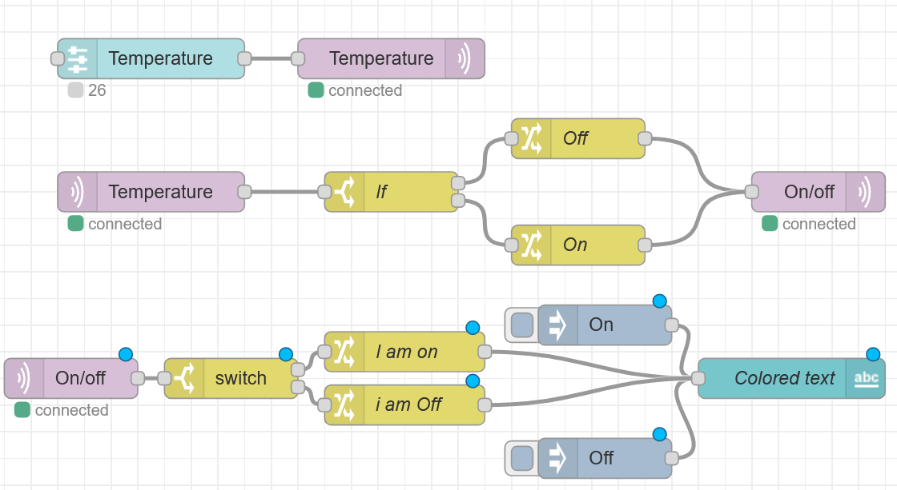
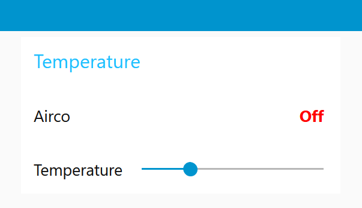
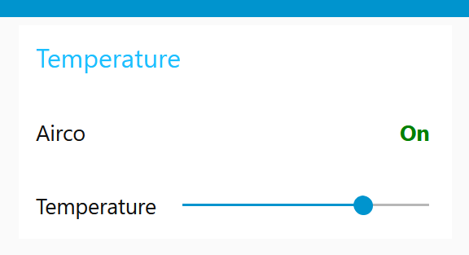
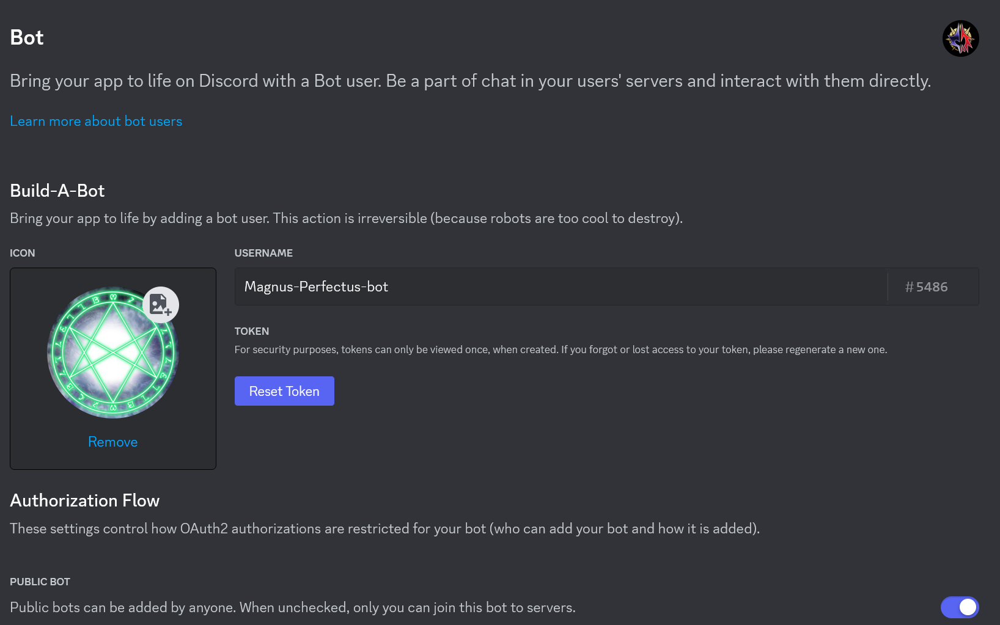
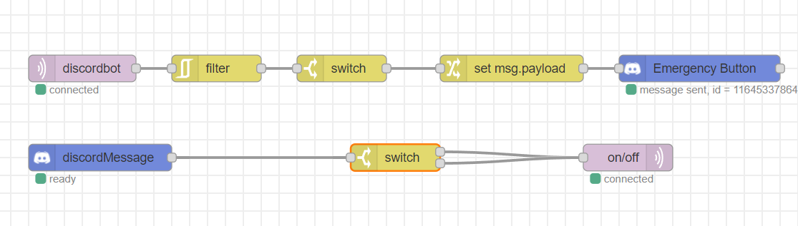

# Day 4

Today we needed to continue what we did yesterday. But this time we needed to use node-red.

# What is Node-Red?

Node-RED is an open-source flow-based development tool for visual programming. It is typically used for connecting and automating various IoT (Internet of Things) devices and services. Node-RED allows users to create applications by wiring together different nodes, where each node represents a specific function or service. These nodes are linked in a flowchart-like interface, making it easy to design and deploy applications for tasks such as data processing, device control, and automation. Node-RED is commonly used in home automation, industrial automation, and other IoT-related projects to simplify the development of custom solutions without extensive programming.

## Installing Node-Red

Because Docker on my laptop doesn't work as intended, I decide to use one of my Ubuntu GUI VM machines. To install Node-Red I used the following command:
- Sudo snap install node-red

This started to install it. Using a VM gives other challenges to connect to it. Because a VM uses its own IP range, and not the IP range from our router (iotempire-Magnusperfectus), I needed to do something sneeky, I bridge my VM, so my VM got the following IP address (192.168.12.179). With that I could access Node-Red from my Windows Laptop.

# Challenge 1
The challenge is as followed
- Please deliver for your portfolio  your implementation steps, screenshots of the flows, and exports of your flows. It is advised to watch the supplied Node-RED introduction movie.
These are the tasks to familiarize yourself with Node-RED. Use for this task the node-RED installation on the iotempire gateway (https://gw.iotempire.net/nodered/)
    1. Rebuild your MQTT integrator component in Node-RED.
    2. Rebuild the switch-simulator/AC-unit-simulator with a Node-RED dashboard text field in Node-RED. The field should change colors and its value based on the status of the switch. 

I have seen Node-Red before, but never have worked with it. So I used the material we got from the teacher. So with that we know we needed the following libraries:
- node-red-contrib-mqtt-broker
- node-red-dashboard

Thanks to Finn (one of my teammates in Magnus Perfectus) we could start with the challenge. 

After playing around with it, I get how Node-Red works. And we could make challenge 1.




## Part 2 
The second part of this challenge was to make a dashboard with a color that changes if the Airco is on or off. The dashboard is reachable on the following website (192.168.12.179:1880/ui)

With the code provide by the teacher for the color changing we got the following result:


The Json code for this is:

```
[
    {
        "id": "cfb3416b92cc25ee",
        "type": "tab",
        "label": "Discord bot",
        "disabled": false,
        "info": "",
        "env": []
    },
    {
        "id": "7f1e9d45ff833454",
        "type": "rbe",
        "z": "cfb3416b92cc25ee",
        "name": "",
        "func": "rbe",
        "gap": "",
        "start": "",
        "inout": "out",
        "septopics": true,
        "property": "payload",
        "topi": "topic",
        "x": 350,
        "y": 220,
        "wires": [
            [
                "b100c0115a793ecc"
            ]
        ]
    },
    {
        "id": "34ecd7ab3237472f",
        "type": "mqtt in",
        "z": "cfb3416b92cc25ee",
        "name": "",
        "topic": "discordbot",
        "qos": "2",
        "datatype": "auto-detect",
        "broker": "dd9b4f2dc72e7dbc",
        "nl": false,
        "rap": true,
        "rh": 0,
        "inputs": 0,
        "x": 200,
        "y": 220,
        "wires": [
            [
                "7f1e9d45ff833454"
            ]
        ]
    },
    {
        "id": "d9da85113d0a9d22",
        "type": "discordMessage",
        "z": "cfb3416b92cc25ee",
        "name": "",
        "channelIdFilter": "1164495245019463740",
        "token": "",
        "x": 220,
        "y": 320,
        "wires": [
            [
                "71ce9741ae076f24"
            ]
        ]
    },
    {
        "id": "44e762aa1ec9d6e4",
        "type": "mqtt out",
        "z": "cfb3416b92cc25ee",
        "name": "",
        "topic": "on/off",
        "qos": "",
        "retain": "",
        "respTopic": "",
        "contentType": "",
        "userProps": "",
        "correl": "",
        "expiry": "",
        "broker": "dd9b4f2dc72e7dbc",
        "x": 810,
        "y": 320,
        "wires": []
    },
    {
        "id": "bc12f67966676955",
        "type": "discordMessageManager",
        "z": "cfb3416b92cc25ee",
        "name": "Emergency Button",
        "channel": "1164495245019463740",
        "token": "",
        "x": 890,
        "y": 220,
        "wires": [
            []
        ]
    },
    {
        "id": "b100c0115a793ecc",
        "type": "switch",
        "z": "cfb3416b92cc25ee",
        "name": "",
        "property": "payload",
        "propertyType": "msg",
        "rules": [
            {
                "t": "eq",
                "v": "ON",
                "vt": "str"
            }
        ],
        "checkall": "true",
        "repair": false,
        "outputs": 1,
        "x": 490,
        "y": 220,
        "wires": [
            [
                "a1aa2407d3581776"
            ]
        ]
    },
    {
        "id": "a1aa2407d3581776",
        "type": "change",
        "z": "cfb3416b92cc25ee",
        "name": "",
        "rules": [
            {
                "t": "set",
                "p": "payload",
                "pt": "msg",
                "to": "Emergency!",
                "tot": "str"
            }
        ],
        "action": "",
        "property": "",
        "from": "",
        "to": "",
        "reg": false,
        "x": 680,
        "y": 220,
        "wires": [
            [
                "bc12f67966676955"
            ]
        ]
    },
    {
        "id": "71ce9741ae076f24",
        "type": "switch",
        "z": "cfb3416b92cc25ee",
        "name": "",
        "property": "payload",
        "propertyType": "msg",
        "rules": [
            {
                "t": "eq",
                "v": "MP ON",
                "vt": "str"
            },
            {
                "t": "eq",
                "v": "MP OFF",
                "vt": "str"
            }
        ],
        "checkall": "true",
        "repair": false,
        "outputs": 2,
        "x": 550,
        "y": 320,
        "wires": [
            [
                "44e762aa1ec9d6e4"
            ],
            [
                "44e762aa1ec9d6e4"
            ]
        ]
    },
    {
        "id": "dd9b4f2dc72e7dbc",
        "type": "mqtt-broker",
        "name": "MQTT_gateway",
        "broker": "192.168.12.1",
        "port": "1883",
        "clientid": "",
        "autoConnect": true,
        "usetls": false,
        "protocolVersion": "4",
        "keepalive": "60",
        "cleansession": true,
        "birthTopic": "",
        "birthQos": "0",
        "birthPayload": "",
        "birthMsg": {},
        "closeTopic": "",
        "closeQos": "0",
        "closePayload": "",
        "closeMsg": {},
        "willTopic": "",
        "willQos": "0",
        "willPayload": "",
        "willMsg": {},
        "userProps": "",
        "sessionExpiry": ""
    }
]
```


To prove that is worked we also screenshot the UI:


And on:


This was a fun way to alter the code we made yesterday. And I found it really funny to work with Node-Red. I have learned a lot, but more on that in the feedback/reflection part 

# Challenge 2
The challenge is as followed
- Program a Wemos D1 Mini with a button to use PubSubClient to send/publish its status to/on an MQTT topic. Receive this message in Node-RED. When the button is pressed (use a filter node to only trigger once), let a bot send a message into our #sandbox channel in discord.
For the communication with discord, use the node-red-contrib-discord-advanced module (you can find discord-advanced in palette manager/install in the Node-RED flow editor). The module is hosted here: https://github.com/Markoudstaal/node-red-contrib-discord-advanced
Follow this manual to get a token (only once needed per pair - so only one bot per pair): https://github.com/Markoudstaal/node-red-contrib-discord-advanced/wiki/Installation-and-setup
Also follow the link that explains getting the token in details: https://www.writebots.com/discord-bot-token/

- Add the bot to the IoTempire discord server (let me know if there are permission issues).
Build the Node-RED flow to send a message to the #sandbox channel (you find the ID when copying the link to the channel - last number in URL).

So we needed to make a discord bot, so I made the following Discord bot, because I already knew how to make a discord bot, I didn't need to look anything up, because I already knew it:



Stefan went on and made the Node-Red code while I worked on the ESP code. What was helping is that we only needed to use the code from the previous days. So I got the code from yesterday (from the DTH11 excercise), and the challenge we did on the first day (the debouncing button challenge), by combining those two code I created the following code:

 ```
 #include <WiFi.h>
#include <PubSubClient.h>

const int Button = 4;
int buttonState;            // the current reading from the input pin
int lastButtonState = LOW; 
unsigned long lastDebounceTime = 0;  // the last time the output pin was toggled
unsigned long debounceDelay = 50;

const char* ssid = "iotempire-magnusperfectus";
const char* password = "iotempire";
const char* mqtt_server = "192.168.12.1";
const int mqtt_port = 1883;

WiFiClient espClient;
PubSubClient client(espClient);

void setup()
{
  Serial.begin(115200);
  setup_wifi();
  client.setServer(mqtt_server, mqtt_port);
  pinMode(Button, INPUT_PULLUP);
}

void setup_wifi() {
  delay(10);
  Serial.println();
  Serial.print("Connecting to: ");
  Serial.println(ssid);
  WiFi.begin(ssid, password);
  while (WiFi.status() != WL_CONNECTED) {
    delay(500);
    Serial.print(".");
  }
  Serial.println("");
  Serial.println("WiFi connected");
  Serial.println("IP-adres: ");
  Serial.println(WiFi.localIP());
}

void reconnect() {
  while (!client.connected()) {
    Serial.print("Trying to MQTT-connection...");
    if (client.connect("ESP32Client")) {
      Serial.println("Connected witht MQTT-broker");
    } else {
      Serial.print("Failed, rc=");
      Serial.print(client.state());
      Serial.println("Retry in 5 secondes");
      delay(5000);
    }
  }
}

void loop()
{
    if (!client.connected()) {
    reconnect();
  }
client.loop();

  int reading = digitalRead(Button);
  if (reading != lastButtonState) {
    lastDebounceTime = millis();
  }
  if ((millis() - lastDebounceTime) > debounceDelay) {
    if (reading != buttonState) {
      buttonState = reading;
      if (buttonState == HIGH) {
        Serial.println("button is pressed, and turns on");
        client.publish("discordbot", "ON");
      }
    }
  }
  Serial.println("button is pressed, and turns the LED off");
  client.publish("discordbot", "OFF");
  delay(100);
  lastButtonState = reading;
}
 ```

Stefan made the Node-Red layout, which in the end looked like this: 
 (upper one)

## Challenge 3

The last challenge of the day is as following: 
- This is basically the previous exercise in reverse. Here you want to send a message from the sandbox discord channel that triggers a real physical device to be switched on.
Your task here is to control the relay shield from discord  with a message of your choice, you want to turn the relay on or off. Therefore program a Wemos D1 Mini with relay shield with PubSubClient to subscribe to an MQTT topic receiving “on” or “off” (or “0” as character and “1” - easier to parse in C++) to turn on and off respectively the GPIO port of the relay shield. Then build in Node-RED an integrator/flow that receives messages in our #sandbox discord channel and parses and forwards them to the MQTT topic that the Wemos D1 Mini with relay is listening on. Make use of the node-red-contrib-discord-advanced module as in the previous task.

So this challenge is just the previous challenge but in reverse. Once again, Stefan went on and made the Node-Red code, while I made the Arduino code. The code is almost the exact same except for one part, while in the previous code i was the publisher, now the coded needed to be subscribed to a topic. 

Because I didn't know how to listen to MQTT message, and I didn't want to use CHATGPT again, I decide to use Google. I found the following page (https://docs.arduino.cc/tutorials/uno-wifi-rev2/uno-wifi-r2-mqtt-device-to-device) thanks to this article I made the following code:

```
#include <WiFi.h>
#include <PubSubClient.h>

const char* ssid = "iotempire-magnusperfectus";
const char* password = "iotempire";
const char* mqtt_server = "192.168.12.1";
const int mqtt_port = 1883;

const char* topic = "on/off";

const int ledPin = 32;

WiFiClient espClient;
PubSubClient client(espClient);

void callback(char* topic, byte* payload, unsigned int length) {
  Serial.print("Received message on topic: ");
  Serial.println(topic);
  Serial.print("Message content: ");
  char message[length + 1];
  for (int i = 0; i < length; i++) {
    message[i] = (char)payload[i];
  }
  message[length] = '\0';
  Serial.println(message);
  if (strcmp(message, "MP ON") == 0) {
    digitalWrite(ledPin, HIGH); 
    Serial.println("LED is ON");
  } 
  else if (strcmp(message, "MP OFF") == 0) {
    digitalWrite(ledPin, LOW); 
    Serial.println("LED is OFF");
  }
}

void setup() {
  Serial.begin(115200);
  pinMode(ledPin, OUTPUT);
  setup_wifi();
  client.setServer(mqtt_server, mqtt_port);
  client.setCallback(callback);
}

void setup_wifi() {
  delay(10);
  Serial.println();
  Serial.print("Connecting to ");
  Serial.println(ssid);
  WiFi.begin(ssid, password);
  while (WiFi.status() != WL_CONNECTED) {
    delay(500);
    Serial.print(".");
  }
  Serial.println("");
  Serial.println("WiFi connected");
  Serial.println("IP-addres: ");
  Serial.println(WiFi.localIP());
}

void reconnect() {
  while (!client.connected()) {
    Serial.print("trying to connect MQTT...");
    if (client.connect("ArduinoClient")) {
      Serial.println("connected with MQTT-broker");
      client.subscribe(topic);
    } else {
      Serial.print("Failed to connect..., rc=");
      Serial.print(client.state());
      Serial.println(" Trying again in 5 seconds");
      delay(5000);
    }
  }
}

void loop() {
  if (!client.connected()) {
    reconnect();
  }
  client.loop();
}
```

This code worked to listen to the MQTT broker, And stefan was ready with Node-Red. The last Node-Red looked as followed:

 (Bottom one)

The code for all of the Discord bots in Node-red are as followed:
```
[
    {
        "id": "cfb3416b92cc25ee",
        "type": "tab",
        "label": "Discord bot",
        "disabled": false,
        "info": "",
        "env": []
    },
    {
        "id": "7f1e9d45ff833454",
        "type": "rbe",
        "z": "cfb3416b92cc25ee",
        "name": "",
        "func": "rbe",
        "gap": "",
        "start": "",
        "inout": "out",
        "septopics": true,
        "property": "payload",
        "topi": "topic",
        "x": 350,
        "y": 220,
        "wires": [
            [
                "b100c0115a793ecc"
            ]
        ]
    },
    {
        "id": "34ecd7ab3237472f",
        "type": "mqtt in",
        "z": "cfb3416b92cc25ee",
        "name": "",
        "topic": "discordbot",
        "qos": "2",
        "datatype": "auto-detect",
        "broker": "dd9b4f2dc72e7dbc",
        "nl": false,
        "rap": true,
        "rh": 0,
        "inputs": 0,
        "x": 200,
        "y": 220,
        "wires": [
            [
                "7f1e9d45ff833454"
            ]
        ]
    },
    {
        "id": "d9da85113d0a9d22",
        "type": "discordMessage",
        "z": "cfb3416b92cc25ee",
        "name": "",
        "channelIdFilter": "1164495245019463740",
        "token": "",
        "x": 220,
        "y": 320,
        "wires": [
            [
                "71ce9741ae076f24"
            ]
        ]
    },
    {
        "id": "44e762aa1ec9d6e4",
        "type": "mqtt out",
        "z": "cfb3416b92cc25ee",
        "name": "",
        "topic": "on/off",
        "qos": "",
        "retain": "",
        "respTopic": "",
        "contentType": "",
        "userProps": "",
        "correl": "",
        "expiry": "",
        "broker": "dd9b4f2dc72e7dbc",
        "x": 810,
        "y": 320,
        "wires": []
    },
    {
        "id": "bc12f67966676955",
        "type": "discordMessageManager",
        "z": "cfb3416b92cc25ee",
        "name": "Emergency Button",
        "channel": "1164495245019463740",
        "token": "",
        "x": 890,
        "y": 220,
        "wires": [
            []
        ]
    },
    {
        "id": "b100c0115a793ecc",
        "type": "switch",
        "z": "cfb3416b92cc25ee",
        "name": "",
        "property": "payload",
        "propertyType": "msg",
        "rules": [
            {
                "t": "eq",
                "v": "ON",
                "vt": "str"
            }
        ],
        "checkall": "true",
        "repair": false,
        "outputs": 1,
        "x": 490,
        "y": 220,
        "wires": [
            [
                "a1aa2407d3581776"
            ]
        ]
    },
    {
        "id": "a1aa2407d3581776",
        "type": "change",
        "z": "cfb3416b92cc25ee",
        "name": "",
        "rules": [
            {
                "t": "set",
                "p": "payload",
                "pt": "msg",
                "to": "Emergency!",
                "tot": "str"
            }
        ],
        "action": "",
        "property": "",
        "from": "",
        "to": "",
        "reg": false,
        "x": 680,
        "y": 220,
        "wires": [
            [
                "bc12f67966676955"
            ]
        ]
    },
    {
        "id": "71ce9741ae076f24",
        "type": "switch",
        "z": "cfb3416b92cc25ee",
        "name": "",
        "property": "payload",
        "propertyType": "msg",
        "rules": [
            {
                "t": "eq",
                "v": "MP ON",
                "vt": "str"
            },
            {
                "t": "eq",
                "v": "MP OFF",
                "vt": "str"
            }
        ],
        "checkall": "true",
        "repair": false,
        "outputs": 2,
        "x": 550,
        "y": 320,
        "wires": [
            [
                "44e762aa1ec9d6e4"
            ],
            [
                "44e762aa1ec9d6e4"
            ]
        ]
    },
    {
        "id": "dd9b4f2dc72e7dbc",
        "type": "mqtt-broker",
        "name": "MQTT_gateway",
        "broker": "192.168.12.1",
        "port": "1883",
        "clientid": "",
        "autoConnect": true,
        "usetls": false,
        "protocolVersion": "4",
        "keepalive": "60",
        "cleansession": true,
        "birthTopic": "",
        "birthQos": "0",
        "birthPayload": "",
        "birthMsg": {},
        "closeTopic": "",
        "closeQos": "0",
        "closePayload": "",
        "closeMsg": {},
        "willTopic": "",
        "willQos": "0",
        "willPayload": "",
        "willMsg": {},
        "userProps": "",
        "sessionExpiry": ""
    }
]
```

To see the finall result, you need to watch the video which will be provided in the GITHUB

# Feedback/Reflection

So now that every task is done I have time to give feedback and to reflect on my own actions. 

first, feedback. Today was a good day for both me and Stefan. Stefan did a great work on the Node-red codes and the codes worked really good, so I think today our collaberation worked like a glove. I don't think i have a lot of feedback for Stefan today.

Then a reflection on my own work, I think I did a great job today. I found it really clever from myself to use two different codes, that we already previously made, to recycle them. Futhermore i'm glad that I didn't use ChatGPT in the final part, and just read the official documentation. I think this was the best call, because reading the documentation allows me to better understand the material instead of copy and paste what ChatGPT gives me. Now I think I can make it again, without using Google or ChatGPT. 

For tomorrow I want to continue on the same feet as today. Overall I'm glad with what I made today.