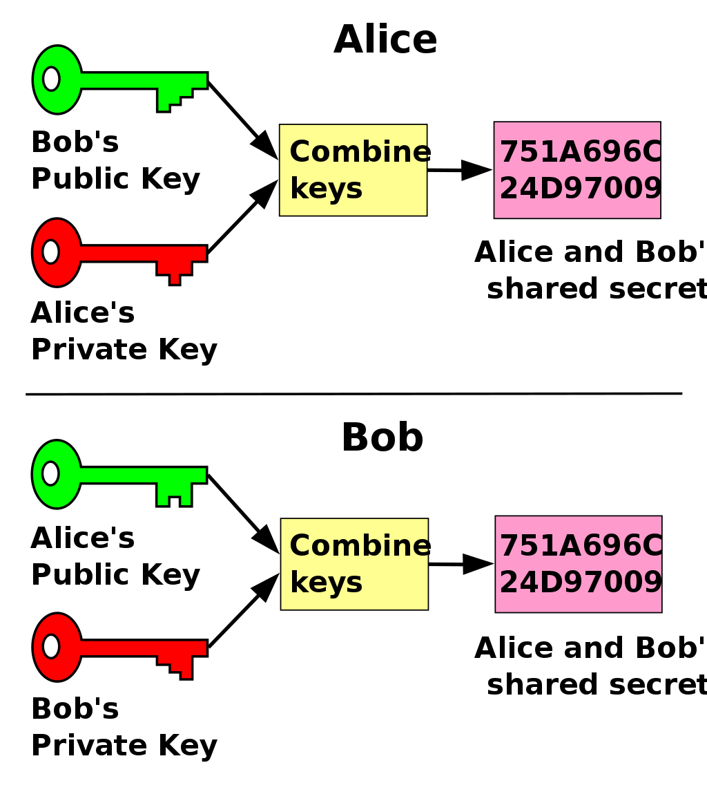
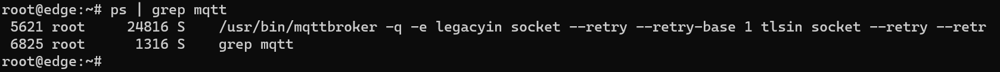

# Day 9

Today was the first lecture from Volkner. So the topic was about securing IoT devices and how to make them safe to use.

In this excercise the broker has the following ports:

- 1883 MQTT
- 8883
- 8080 WWW (unsecured)
- 8088 WWW (secured)

Node-red should connect to 8883 instead of 1883, so the communication is secured

Network connection can be secured with the following protocols:

- SSL 
- TLS

The meaning of this class is the following:

- Identify security risks
- secure communication
- preparation of everything necessary
- Reconfigure the IoT System to use mqtt broker
- Create Certificates and use Certificates

# Excercise 1

The first excercise is answering the following questions:

- Which security vulnerabilities did you encounter in your IoT scenarious?

The first question is just my opinion, but one thing I did notice, is that we always use the correct port. So when we use MQTT, instead of using a different port, we use 1883 (the default MQTT port). This is a security risk, because this way hackers try to hack specific ports. So if you change 1883 to another port number, is a lot safer. 

Another part that is not safe is that our code is hard coded. This means that if the code is hijacked, you can see the SSID and the password. We don't use any password file

Another thing I noticed it that we dont use any form of SSL or TLS. These protocols are neccesary for a safe connection. (There are 65,535 ports, but not all are used every day. The TLS/SSL certificate port, however, is one of the most commonly used ports and is definitely used on a daily basis. So what port is TLS/SSL? The TLS/SSL port is port 443, HTTPS, and uses the TLS/SSL certificates to keep the port connections secure. HTTP is port 80 and is the unsecure protocol port.) Managing TLS/SSL certificates means also having the right knowledge on hand when it comes to security and network connections. It may therefore be useful to know what some of the most common TCP (or transmission control protocol) ports are.

Unsecured port numbers and their function:

    80, HTTP
    21, FTP
    110, POP3
    143, IMAP
    289, LDAP
    119, NNTP

Secured port numbers and their function:

    443, HTTPS
    990, FTPS
    995, POP3S
    993  IMAPS
    636, LDAPS
    563, NNTPS

Another thing i noticed it that we dont make us of certification. 

The last thing i noticed is that our MQTT broker has a really easy username and password and doesn't make the standard requirements for passwords and usernames.

- Which measures can be taken to close the vulnerabilities

A simple way to counter the vulnerabilites is to change the port number. Change the number from 1883 to 8856 for example. If the port is free, the port can original can be used. 

The second thing on how we can fix is, make use of a password file, so the code isnt hard coded

The third thing is making use of SSL and TLS. So that way, we have a safe connection.

The last thing is to create certification and using it, so our website is safe. 

Change the password to a safer one (with special characters, numbers and capital letters)

# Keys

There are ways to encrypt "keys"

    Symmetric Encryption:
        Key: Imagine you have a secret code that you and your friend both know, like "ABC123."
        Process: You use this same secret code to both encrypt and decrypt your messages.
        Example: If you want to send a message like "HELLO," you might encrypt it to something like "IFMMP" using your shared secret code.
        Key Challenge: You need a secure way to share the secret code with your friend. If someone else learns the code, they can decrypt your messages.

    Asymmetric Encryption:
        Key Pairs: You have a pair of keys – a public key and a private key. Think of them like a lock and a key.
        Public Key: You share your public key with everyone, like showing them your lock. They can use it to lock a message or data, but they can't unlock it.
        Private Key: You keep your private key secret, like the only key that can unlock your lock.
        Process: When someone wants to send you a message, they use your public key to lock it, and only you, with your private key, can unlock it.
        Security: Even if others have your public key, they can't decrypt messages without your private key.
        Key Management: You don't have to share your private key, which makes it more secure than symmetric encryption.

In summary, symmetric encryption uses a shared secret key for both encryption and decryption, while asymmetric encryption uses a pair of keys (public and private) for secure communication, with the public key used to encrypt and the private key used to decrypt. Asymmetric encryption is often more secure for exchanging messages or data with others because you don't have to share your private key.

## SSL and TLS in keys

- SSL/TLS supports both, symmetric and asymmetric encryption
- and uses certificates for authentication and encryption.
- A certificate contains
    - A public key
    - Certificate informations ("Identity" information about the user, such as name, user ID, and so on)
    - Information about the domain the certificate is intented for in the subject alternative name (SAN) section.
    - A digital signature from a certificate authority (CA).
- To each certificate a private key exists which can be protected  using a password.
- The public key of a certificate and its private key form a public/private key pair.
- The private key and its password shall be kept extremely safe.

# Excercise 2

The Excercise, is answering a few question:

    Chain of Trust: A chain of trust is a sequence of certificates, where each certificate is signed by the one before it, creating a hierarchical structure of trust.

    Root Certificate Authority (CA): The root CA is the highest authority in a certificate hierarchy. It issues digital certificates to intermediate CAs, establishing trust in the certificates they issue.

    Intermediate Certificate Authority (ICA): An intermediate CA is one that sits between the root CA and the end-user certificates. It can issue certificates to end users or other intermediate CAs, helping manage the hierarchy.

    End-User Certificate: An end-user certificate is issued to an individual or entity, allowing them to secure their communication and data.

    Topological Structure of Certificates: A CA creates a hierarchical structure of certificates, with the root CA at the top, followed by intermediate CAs, and finally, end-user certificates.

    Depth of a Certificate: The depth of a certificate refers to how many steps away it is from the root certificate in the chain of trust.

    Prominent Representative of Chain of Trust: Another representative of a chain of trust is the "Public Key Infrastructure (PKI)."

    Root of Trust vs. Web of Trust:
        Root of Trust: Root of trust relies on a centralized authority (like a root CA) where trust is established through a single, highly trusted entity.
        Web of Trust: Web of trust is decentralized, relying on the collective trust of a community. It's often used in PGP (Pretty Good Privacy) and doesn't depend on a single authority.

    Security Comparison: Root of trust is generally considered more secure because it relies on a highly trusted central authority, whereas the web of trust is as strong as the collective trust of its participants, which can vary.

# Excercise 3

The third challenge is that about diffie-Hellman key. Diffie–Hellman key exchanged is a mathematical method of securely exchanging cryptographic keys over a public channel and was one of the first public-key protocols.

The challenge is answering the following question:

- How are Diffie-Hellman key exchange and SSL/TLS related?

Diffie-Hellman key exchange and SSL/TLS (Secure Sockets Layer/Transport Layer Security) are related in the context of securing communication over the internet. The Diffie-Hellman key exchange, often referred to as simply "Diffie-Hellman" or "DH," is a fundamental cryptographic protocol used to establish a shared secret key between two parties over an unsecured communication channel. This shared secret key can then be used for secure encryption and decryption of messages, ensuring confidentiality and integrity. Here's how they are connected:

    Diffie-Hellman Key Exchange:
        Diffie-Hellman is a cryptographic protocol used to establish a shared secret key between two parties over an insecure communication channel.
        It allows two parties to jointly compute a secret key, which can then be used for encrypting and decrypting messages.
        The key exchange is secure because it doesn't involve the transmission of the shared secret key itself, making it resistant to eavesdropping.

    SSL/TLS and Diffie-Hellman:
        SSL (Secure Sockets Layer) and its successor TLS (Transport Layer Security) are protocols used for securing data transmission over the internet. They provide encryption, data integrity, and authentication.
        SSL/TLS often uses the Diffie-Hellman key exchange as part of the key negotiation process, specifically in the "Key Exchange" phase.
        In SSL/TLS, the Diffie-Hellman key exchange can be used to securely exchange encryption keys between the client and the server, allowing them to establish a secure communication channel.
        This secure key exchange ensures that even if someone intercepts the communication, they cannot easily decrypt it without the shared secret key.

In summary, Diffie-Hellman key exchange is a fundamental component of the SSL/TLS protocol suite, used to establish secure communication channels by securely negotiating encryption keys between the communicating parties. This helps ensure the confidentiality and integrity of data transmitted over the internet.

To secure an e.g. TCP connection . . .

- Bob (the client) contacts Alice (the server).
- At the very beginning Alice sends its server certificate signed by the certificate authority EXCA to Bob.
- Bob also sends a certificate to Alice. In case no client certificate is configured for Bob a public/private key pair is generated randomly.
- Bob can now prove the validity of Alices certificate if he is tolled so (depends on configuration):
    - If Bob trusts certificate authority EXCA than its CA certificate (public key) is knowen by Bob. E.g.
it is installed on the system and made been knowen to Bob by the administrator.
    - Bob can now use the EXCA certificate to validate the certificate of Alice.
    - If Alice certificate is proven valid than Bob can trust Alice,
- In case Bob didn’t trust Alice certificate he shall terminate the connection.
- In case Bob trusts Alice he can use Alice public key and his private key for encryption.
- In that case also Alice can now use Bobs public key and her private key for encryption.

# fourth excercise:

The fourth excercise is about RSA key exchange: RSA (Rivest–Shamir–Adleman) is a public-key cryptosystem, one of the oldest, that is widely used for secure data transmission. RSA (Rivest–Shamir–Adleman) is a widely used asymmetric encryption algorithm, and it plays a critical role in securing communication on the internet. It is often used in key exchange and digital signature operations. RSA is primarily used for key exchange in public key infrastructure (PKI), which is the foundation for secure communication in protocols like SSL/TLS.

The challenge is answering the following question:

- How are RSA key exchange and SSL/TLS related?

RSA key exchange and SSL/TLS are related in the context of secure communication over the internet. SSL (Secure Sockets Layer) and its successor, TLS (Transport Layer Security), are protocols used to establish secure and encrypted communication between a client and a server. RSA (Rivest–Shamir–Adleman) is a cryptographic algorithm used within SSL/TLS to facilitate key exchange and secure data transmission.

Here's how they are related:

    Key Exchange:
        RSA is often used for the initial key exchange phase in SSL/TLS. This phase is crucial for securely sharing the encryption keys that will be used to encrypt and decrypt data during the session.

    Public Key Infrastructure (PKI):
        SSL/TLS relies on a public key infrastructure, where digital certificates play a vital role. Certificates are issued by trusted Certificate Authorities (CAs) and contain a public key. RSA is a commonly used algorithm for creating the key pairs (public and private) used in these certificates.

    Encryption:
        Once the key exchange is completed, SSL/TLS uses symmetric encryption algorithms to secure the actual data transmission. The encryption keys used for symmetric encryption are typically exchanged securely using the RSA key exchange or another key exchange method.

The typical flow of a secure connection using SSL/TLS and RSA key exchange is as follows:

    The server presents its digital certificate, which includes its public key, during the SSL/TLS handshake.
    The client verifies the certificate's authenticity by checking its trust against a root certificate authority and that it hasn't expired.
    The client generates a random symmetric encryption key (session key) for use during the session.
    The client encrypts this session key using the server's public key from the certificate.
    The client sends the encrypted session key to the server.
    The server, using its private key, decrypts the session key.
    Both the client and server now have the same session key and can use it for symmetric encryption and decryption of the actual data exchanged during the session.

By combining RSA for secure key exchange and symmetric encryption for efficient data transmission, SSL/TLS ensures the confidentiality and integrity of data transferred between the client and server. This combination of cryptographic techniques helps protect sensitive information and enable secure communication over the internet.

# Excercise 5

Bob is forced to validate Alice's certificate for several important reasons:

    Ensuring the Server's Authenticity: The validation of Alice's certificate is crucial to verify that Bob is connecting to the legitimate server, not an impostor. Without this validation, Bob might unknowingly establish a connection with an attacker who impersonates Alice. This would expose Bob to various security risks, including man-in-the-middle attacks.

    Public Key Exchange: Bob needs to obtain Alice's public key from her certificate to initiate secure communication. If Bob doesn't validate Alice's certificate, he can't be sure that the public key he receives belongs to the actual server he intends to communicate with. Verifying Alice's certificate helps ensure that Bob is using the correct public key for encryption.

    Trust in Certificate Authorities: By validating Alice's certificate, Bob is also confirming that Alice's certificate was signed by a trusted Certificate Authority (EXCA). This process establishes trust in the authenticity of the certificate chain, which is vital in a public key infrastructure (PKI) setup.

    Data Confidentiality: Ensuring the integrity of the communication channel is a fundamental aspect of secure communication. Validating Alice's certificate helps guarantee the confidentiality of the data exchanged between Bob and Alice, as it enables them to establish a secure, encrypted connection.

As for forcing Alice to validate Bob's identity, it is indeed possible and often recommended in scenarios where mutual authentication is required. To achieve this, Alice would also need to validate Bob's certificate, assuming Bob presents one. If Bob doesn't provide a certificate, Alice can still enforce validation based on a shared trust model. Here's how it works:

    Bob's Certificate: In scenarios where mutual authentication is desired, Bob should have a certificate issued by a trusted Certificate Authority. This certificate typically includes Bob's public key and is signed by the CA. It might also include information about Bob's identity.

    Alice's Trust Configuration: Alice should be configured to trust the CA that issued Bob's certificate. In addition to Alice's CA certificate (EXCA), it should include the CA certificate that issued Bob's certificate.

    Bob's Authentication: When Bob connects to Alice, he sends his certificate. Alice validates Bob's certificate using the CA certificate she trusts. If the validation is successful, Alice knows that Bob is who he claims to be.

    Secure Communication: Once Bob's identity is verified by Alice, they can proceed with secure communication using their public and private keys, just like in the one-way authentication scenario.

In summary, for Alice to validate Bob's identity, she needs to trust the CA that issued Bob's certificate, and Bob must present a valid certificate signed by that CA. Mutual authentication enhances the security of the communication channel by ensuring both parties are who they claim to be.

# Installing MQTTbroker on the router

For the second to last challenge of the day, we are going the reconfigure the router as a MQTTbroker. The reason that we do this, is because the teacher wanted to.

The challenge is as followed:

- Download the key
- Add the key to the Router
- Add the package to the customfeeds.conf
- Install mqttbroker

So as first we needed to get the key. The key is located on a website that was provided by the teacher. The key we used is as followed:

- untrusted comment: Local build key
RWR2RtSIIMm9nRorcS+OJzAMymAjjdBtXr4MpAbbqQuHsDzszEt1pkK4

This key needed to added to the router. To get access to the router I used the following command: 

- ssh root@192.168.12.254 

After I was connected to the Router via SSH, I located the correct file place which is:

- /etc/opkg/keys

This is the location were all the trusted keys are located. 

Because I really dispice Vim I did the following to install nano

- opkg update
- opkg install nano

So with nano now available for me, I created a new file named:

- 7646d48820c9bd9d

In this file I pasted the untrusted comment.

After I did that, I added a https, so I would get the correct package, so I could install the MQTT broker. 

To change the file I did the following command:

- Nano /etc/opkg/customfeeds.conf

The file looks as followed:

After I added the line and saved the document. I did another update with the command:

- opkg update

After that MQTTbroker was available to download. To install the MQTTbroker I did the with the following command:

- opkg install mqttbroker

To check if the broker works I did the following command:

- ps | grep mqtt:

So now we know that MQTT broker works and is running. So I have succesfully installed MQTTbroker on the router. 

# Last challenge of the day.

For the last challenge of the day, we needed to answer a few questions about the router.

The questions are:

- access the WEB interface of OpenWRT.
- discover the symbolic host name of the lan interface address.
- ssh into the router using the IP address or the symbolic host name and execute shell commands.
- sftp into the router and upload/download files to and from it.
- install new packages on the router using either
    - the WEB interface
    - or the opkg command line utility
- where are the remote package repositories configured?

The first challenge is to simply go the webpage. The webpage is accessable via 192.168.12.254

So the first challenge is done.

The second thing is looking up what the name of our lan connection is. This can be found in the network -> interfaces tab. The name is BR-lan:

As discribed in the last chapter, I already connected to the router via SSH, but to prove that I did it, here is prove:

The next thing is upload and download file from the router via SFTP. Because I really don't like using SFTP I used SCP. These are two different protocols. So what is even the difference between them?

SFTP (Secure File Transfer Protocol) and SCP (Secure Copy Protocol) are both secure methods for transferring files over a network, but they differ in how they work and their intended use cases:

    Protocol Type:
        SFTP: SFTP is a protocol designed for interactive file transfers and general file management. It allows users to perform a wide range of file operations, including uploading, downloading, renaming, and deleting files.
        SCP: SCP, on the other hand, is a protocol primarily intended for one-time secure file transfers, typically used in command-line scenarios. It lacks some of the advanced file management features that SFTP offers.

    User Interface:
        SFTP: SFTP is more user-friendly and supports interactive sessions. It often uses an SFTP client that allows users to navigate the remote server's file system, much like working with a local file system.
        SCP: SCP is usually used from the command line and doesn't provide a user interface for navigating remote directories. Users typically specify the source and destination paths as command-line arguments.

    Usage:
        SFTP: SFTP is suitable for situations where you need to manage files on a remote server or perform regular file transfers with more control and options. It's often used for tasks like backing up data, synchronizing directories, and managing remote files.
        SCP: SCP is best suited for quick, one-time transfers of files or directories. It's commonly used when you need to copy files between local and remote locations, especially in automated scripts or non-interactive scenarios.

    Security:
        Both SFTP and SCP provide secure data transfer by encrypting data in transit, making them both suitable for sensitive information.

In summary, SFTP is a more feature-rich and interactive protocol for managing and transferring files over a secure connection, while SCP is a simpler and command-line-based method primarily used for quick and secure file copying between local and remote locations. Your choice between the two will depend on your specific needs and preferences for file transfer and management.

So how did I do it? I made a folder and a txt file on the router via:
- mkdir hello 
- nano velorxl
- save the file

So how did I connect to the router via SFTP, and saw this file? I used a Windows program called WinSCP. Its a application that allows to use FTP our any simulair protocol to connect to a device to get files. 

So I filled in the correct credentials:

And after I connected to the router via SCP, I saw my own file, and when I dubble tapped it, I could open the file:

So I knew that what I did worked.

To install packages on the router via the web interface can be done via System -> Software

When you are there you see the following page:

On this page you can download, remove or just search for different packages, with just pressing the install button, it will automaticlly install the package on the router.

To install a package via the commandline you can do the following:

You are first required to update the package manager, before you can install a new package. In my photo I tried to install Nano, but because I already installed nano its stated that I have already installed it, which is true. 

The last question that needed to be answered, I semi did already in the previous chapter. To install a remote package, you need to edit the customfeeds.conf file. But before you can do this, you need to install a key, so openWrt can validate the link. To change the file you do the following:

- Nano /etc/opkg/customfeeds.conf

The file looks as followed:

So here you can see that I even added a remote package link. I did this so we could install MQTTbroker. 

# Feedback & reflection
## Feedback

Today was a bit of a messy day. The teacher explaintion sometimes went all over the place, so sometimes it was a little bit hard to follow what the teacher was saying. But the lesson was fun and he did explain the things that were clear really well.

As for my teammates, I would like for them to take more of an innachative, so they can do more things infrastructure and IoT related. If they can do that, then I'm a happy person. 

## Reflection

Today was a good day. I did all the challenges that I was required to do, and I even did more than that. 

I can reflect on a good day. The only note I want to make today is that when we needed to install the MQTT broker on the router, I went ahead and did it all by myself. The reason why I did that, is that this is an infrastructure challenge, and I'm an infrastructure student, so I knew already what needed to be done. 

In hindsight I could have let my teammates do it. But since nobody wanted to give it a try and nobody could care about it, I justify my actions that I did it myself.

Next time, someone else can do the challenge. 
