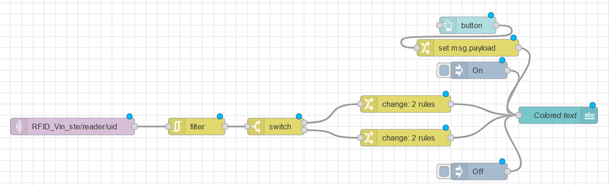
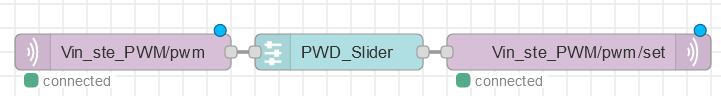
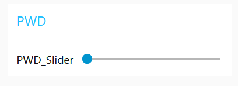

# Day 6

We begin the day with a continue on the nice-to-have feature-list:

The list was as followed:

## Questions
- What will be issues scaling (system size, number of systems, management)
    - Scaling isn't always favourable, because it requires more resources. When you need more resources you need to spend more money. Futhermore if you scale up you also require more bandwith from you network. Scaling up just ask more of your current network and places
- How can we do testing?
    - You could simulate it, when simualting a network and a area, you could get the speficis of requirements. However simulation is not always the best way to test it. another way of testing is to make the network in a exclusive zone, so your own network doesnt have hinder from changing things. You could also do one for one for one for one. 
- What would you like to see for scaling up?
    - What I would like is to scale the network up, currently we have a lot of issues with the way the network is programmend, but that can be resolved if we use good networking equipment. Futhermore I would like to have more Arduino stuff, because right now we have a little bit to little to little. As for the last thing, I would like for everyone to have there own Raspberry PI, not a PI 400, but a Pi 3/4 or 5. 
- What role will play simulator (-component)s, MQTT and stories
    - Simulating the hardware is a good way to test surten things. I simulate Node-Red for example and it's really handy to simulate it, because my laptop has enough power right now to work. So I could simulate other things as well.

So, which features do we want to have in our project. We want to have a better scaling. So If we have code that can be distributed on multiple devices, we already have an IoT scalablity.

Futhermore, we can always use IOTempire to simulate this, so we can set up our own IoTempire.

# System in Folders

Which topic needs to be called with what
to
-  switch on the coffee machine?
    - kitchen/coffee-machine/Switch set on
-  set all lights in living room to blue?
    living_room/switch set blue
- turn the main power off?
    - main/switch set off

- What is the general rule for forming topics
in IoTempower?
    - make them super general, and clear what they mend to do. 
- When does it make sense to change
something in system.conf?
    - if you want more settings or want to change a specific thing. 
- What role does the location of
system.conf play? (What if it would be
one level higher and there is also
yourhouse?)
    - The top folder describes the system, file the folder includes the locations and sub-locations (sub folders) of the nodes networked into the IoT system. This allows to model hierarchical nodes and connected things architecture for having something like ulnos-home-system/living-room/dining-corner/switches. So it cant be higher. 
- what needs to/can go into node.conf
    - node.conf is used to configure individual nodes or devices in your IoTempire project. It can set parameters specific to a particular device or component.
    This file can define environment variables that are unique to a node and may affect how that node interacts with the system.
- How do [optional config.txt,] etc/iotempower.conf, system.conf, and
node.conf influence environment variables for compiling?
Give examples for when to change which.
    - When to Change Which Configuration File:

        - Change config.txt when you want to set project-wide variables that are used consistently across various components in your IoT project.
        - Change etc/iotempower.conf when you need to configure the IoTempower framework-specific settings.
        - Change system.conf when you want to define system-level environment variables or system-wide settings.
        - Change node.conf when you want to configure individual nodes or devices in your IoT project with node-specific settings.

These configuration files help you customize and control the behavior of your IoTempire project at different levels, from project-wide settings down to specific node configurations.

## What are the steps IoTempower executes, when you call deploy in a node-folder (or room or system folder)? What types of deploy are there

The specific steps can vary depending on your project's configuration and the tasks you define. However, the general deployment process includes the following steps:
- Initialization:
    -   IoTempower initializes the deployment process by loading the relevant configuration files for the specific node, room, or system you are deploying.

- Dependency Installation:
    - If your IoT project has dependencies on external libraries or packages, IoTempower may install these dependencies. This ensures that the necessary software and tools are available for your project.

- Compilation:
    - If your IoT project involves compiling code (e.g., for microcontrollers or embedded devices), IoTempower compiles the code to generate the binary files necessary for the deployment.

- Configuration and Parameter Setup:
    - IoTempower sets up configuration parameters based on the deployment context. This may include node-specific configurations, room-specific configurations, or system-wide configurations, depending on where you initiated the deployment.

- Deployment:
    - The deployment process can include activities like flashing firmware to IoT devices, configuring network settings, and initializing devices to start interacting with the system.

- Testing and Validation:
    - IoTempower may perform testing and validation to ensure that the deployment was successful and that the IoT devices are functioning as expected. This could involve running tests, checking sensor readings, and verifying network connectivity.

- Monitoring and Reporting:
    - After deployment, IoTempower may continue to monitor the deployed devices, capture data, and generate reports or logs to provide insights into the system's performance.

Types of Deploy:

The specific types of deployment in IoTempower can vary depending on the use case and project configuration. Some common deployment types include:

- Node-Level Deployment:
    - When you deploy at the node level, it involves deploying and configuring individual IoT nodes or devices. This type of deployment is typically node-specific and focuses on the behavior of a single node.

- Room-Level Deployment:
    - Room-level deployment involves configuring and deploying a group of nodes within a specific room or location. It may involve setting up interactions between nodes within the same room.

- System-Level Deployment:
    - System-level deployment encompasses the entire IoT system. It ensures that all nodes, rooms, and components work together as a cohesive unit. This type of deployment involves coordinating interactions across the entire system.

- Continuous Deployment:
    - In some cases, you may implement continuous deployment strategies, which automatically deploy updates and changes to the IoT system as they are made. This approach is common in IoT projects that require frequent updates.

- Rollback Deployment:
    - If issues are detected after deployment, you might need to perform a rollback deployment to revert to a previous working state. This is crucial for maintaining system reliability.

The specific steps and types of deployment can be highly customized based on the requirements of your IoT project and how you've configured your IoTempower environment.

## Filters

- Common Problem When Measuring in IoTempire:
    - A problem when measuring in IoT projects, is dealing with noisy data. Sensor readings is affected by noise, such as electrical interference, environmental factors, or sensor inaccuracies. Filtering techniques are there to clean the data, making it more reliable.

- Graphs in Node-Red:
    - Node-RED provides a "ui_chart" node for graphing data. To create graphs in Node-RED:
        - Use the "ui_chart" node and connect it to your data source       (e.g., a sensor node).
        Configure the "ui_chart" node to define the appearance and behavior of the graph, including the chart type (line, bar, etc.), axis labels, and update frequency.
        Deploy the Node-RED flow, and you can access the graph in a web dashboard provided by Node-RED.

- Filters in Node-Red and IoTempower:

    - Filters in Node-RED are used to process and manipulate data that flows through the Node-RED. Filters include nodes for tasks as data transformation, data cleaning, and data enrichment. In IoTempower, filters are used to preprocess sensor data. For example, you can use a filter to remove outliers, smooth noisy data. Filters can be used to specific nodes, rooms, or the entire system.

- Offered Filters and Generic Filters in IoTempower:

    - IoTempower offers a range of built-in filters to  IoT data tasks. These  include filters for data averaging, data range checks, and data validation. However, there can also create custom filters in IoTempower to suit your specific needs.Generic filters that are often useful include:
        - Low-Pass Filter
        - High-Pass Filter
        - Median Filter
        - Kalman Filter

- "Fluent" Style:

    - The "fluent" style, in the context of software development and configuration, refers to a coding or configuration style that emphasizes readability and ease of use. It involves structuring code or configuration in a way that reads like natural language, making it more intuitive for developers or users.

    - In the context of IoTempower or Node-RED, a "fluent" style might involve configuring nodes, filters, or workflows in a way that is easy to understand and modify, with clear and  parameter names and options. This style can usability of IoT applications and make them more accessible to a wider range of users.

# Challenges 
## RFID-reader
The first challenge was the challenge we should have done friday, but friday we didn't have the correct sensor. So the challenge is as followed:

- Connect the RFID-RC522 RFID tag reader via SPI to a Wemos D1 Mini, 	adjust its setup.cpp and re-deploy or flash. Evaluate the UID of the tag in Node-RED (check at least two rfid tags). Based 	on the detected UID, turn a new button on the dashboard either red and displaying "Access Denied" or green and displaying "Access Granted". If you press the button, reset its color and make it display "Scan Tag". Use eventually your personal tags if the given ones show no uid.

This challenge revolves around the RFID reader. In IoTempire to use the RFID reader we only need to have 1 line of code:
- mfrc522(reader);

This line makes is possible to use the RFID scanner. Futhermore the wiring of the RFID scanner is also a challenge. It needs to be done in the following way:

    3V3  -  3.3V
     D8  -  sda
     D7  -  MOSI
     D6  -  MISO
     D5  -  SCK
     D0  -  RST
      G  -  GND
    N/C  -  IRQ (IRQ is not connected for use in IoTempower)

After wiring up the RDIF scanner, it will send a "**none**" every 2.5 seconds. 

In our sensor we also got a RFID card and tag. Both of those have a unique ID. The ID's we got were:

- f3351ca6 (tag)
- a3aeacab (card)

So none will be replaced with one of these ID's
Stefan and I made the following Node-Red layout:

     

So the our node-red we make a switch statement to filter which ID we get. If the scanner scanned the card, we send a red message to the dashboard with the text: **access denied**. If the scanner scans the tag, we got a green message with: **Access granted**. 

In the video folder, we have prove that we did this exercise.

## PWM challenge part 1
PWM, or Pulse Width Modulation, is a technique used in electronics to control the intensity or speed of a device, such as an LED or a motor. It works by rapidly switching a signal on and off at a certain frequency, with the ratio of on-time to off-time determining the output level. This allows precise control of the average power delivered to the device, effectively regulating its performance.

The second challenge we are going to do, has to do with PWM. The challenge is as followed:

- Read up on PWM (for example here: Pulse Width Modulation - SparkFun Learn). Hook up a simple LED with a resistor to a GPIO port of a Wemos D1 Mini. Adjust setup.cpp to use PWM on this GPIO port (re-deploy or flash). Use a slider in Node-RED to control the brightness (duty cycle) of the LED. 	

I already know how to use a PWM in Arduino IDE, but not in IOT-empire. So to use it in IOT-empire I needed to do add the following:
- pwm(pwm, 4);

The above command gives a PWM signal to pwm as MQTT topic, and the port its connected to is port 4. The layout is really easy:

and the website:

So the slider decides how bright the LED shines.

As always, in the folder videos there is a video with proof.

## Challenge PWM part 2

The third challenge we are going to do, has to do with PWM. The challenge is as followed:

- Replace the LED (and register) with a Buzzer. Annoy your neighbors moving the slider (add a second slider for the frequency) playing different tones (but not too long).

So the only thing I needed to do was swap the LED for a buzzer. I didn't need to change the code or to change anything in Node-Red. 

The only "difficult" thing I had to deal with, was that one of our buzzer was damaged so we didn't get any sound out of it. But when we switched to the other buzzer we got, it worked direct. So that was the only interesting thing about this challenge.

The Node-red layout and the UI is the same as in the challenge above. So I wouldn't show those pictures again.

But in the videos folder, there is proof that we did this challenge.

## Project 1 group

The final thing we needed to do today was as following:
- Build an access control system (extending tasks from the last lab) using the RFID reader, the RGB led, the buzzer, the display, and the relay with the solenoid drawer lock. Show the access status on the RGB-LEDs (red for access denied and green for access granted). When access is granted, open the lock (make sure it locks again after a short while). When access is denied, play a short nasty sound on the buzzer.

in order to do that, we are using 1 ESP8266 and 3 ESP32.

First wire the three LEDs we have been given to the ESP32, along with the buzzer.

Then we created a new node called "GROUP PROJECT" in IOTempire. There, we modify the setup.cpp file, adding:

- led(green, 32, "on", "off");
- led(red, 27, "on", "off");
- led(yellow, 25, "on", "off");
- pwm(pwm, 4);

We then flashed the ESP32.

On the same time, the other part of the group wired the RFID reader to the ESP8266, and flashed the node "RFID_Vin_ste". The setup.cpp has the lines:

- mfrc522(reader);

After that, we wired the shield to another ESP32. Flashed the node "Vin_ste_N2". The setup.cpp has the lines:

- U8G2_SSD1306_64X48_ER_F_HW_I2C u8g2(U8G2_R0);
- display(oled, u8g2, font_tiny);

To lock it, we wired the relay and solenoid dreawer lock to yet another ESP32 and created a new node called "GROUP PROJECT P2" and modified the setup.cpp, adding:

- output(Lock, D1, "open", "close");

We flashed it to the ESP32.

After all that, we created a node-red flow that reads the topic from the RFID reader, after that, the payload goes to a switch to see whether the card is valid or not.

If the access is granted
How to begin

    Wire components
    Modify setup.cpp
    Flash Wemos D1
    Create node-red flow
    Check if it works

This is the order we did thing in... but it is not all we have done, in the next chapter we discuss the problems we have faced in the project.

Our Node-red code is completely made by myself. I did it from 21:00 to 23:00. The reason why it took so long, was that I used the code from Finn (my teammate), but the node-red flow was really messy, so I took the time to detangle it, and remade but. So the node-red flow is as following:

In this project is made extremely use of the trigger option. The trigger option does the following:

- When triggered, can send a message, and then optionally a second message, unless extended or reset.

So I could send a message, then a send message directly after it. So it made it a lot easier to send 2 messages at one. 

Futhermore this challenge is a combination of all the previous challenges. It requires the RFID, PWM, LEDS and a lock.

The lock is a simple output and takes a simple string as a input.

In the folder videos, we have a video that shows that the whole project works as intended.

### Issues 

This project encountered numerous challenges. The primary issue revolved around PWM functionality not working as expected on the ESP32, and our team was unable to resolve this issue independently. Consequently, we sought assistance from Ulrich, who undertook the task of updating the framework to enable PWM on the ESP32. Surprisingly, this problem turned out to be the easier of the two issues.

The second, more significant issue arose when the ESP8266 became "bricked." This meant that it was rendered unusable and unable to accept any setup. In our initial attempts to resolve the problem, we incorrectly utilized the D0-Ground reflash method. Even after trying the reflash process within the IOT-empire platform, we found that the ESP8266 remained unresponsive. Ultimately, we had no choice but to accept that the ESP8266 could not be used in the project.

However, this presented a new challenge, as the RFID reader was incompatible with the ESP32. so, we were required to use the ESP8266. In the end, we were fortunate to borrow one from the "The Big-Five" group, allowing us to proceed with our project. 

# Feedback and reflection

So after a big day of struggling with various parts I can finally give feedback and reflection.

## Feedback
The challenges we encountered today, despite being labeled as "simple," had a considerable impact on our project. Our final task was, in essence, a synthesis of everything we've learned so far, putting our knowledge and skills to the test.

I'd like to express my gratitude to my team members for their invaluable assistance in setting up our workspace. They  connected the wires, ensuring all components were functioning correctly through thorough testing. Their dedication not only made the workload more manageable but also fostered a collaborative and supportive environment, which I genuinely appreciated.

A particular standout was Finn's proactive approach in creating a test Node-RED flow. This initiative proved to be a pivotal foundation for our final project. Building upon his work, I was able to refine and complete the project successfully. Finn's foresight and contribution were instrumental, and I'm genuinely thankful for his efforts.

Our team worked cohesively, putting in a great deal of effort, collaborating to overcome challenges, and contributing collectively to the success of our project. This experience reinforced my belief that our group functions exceptionally well. I have no further feedback to offer, and I take pride in the collective effort we put into this project. I look forward to more collaborations with this outstanding team in the future.

## Reflection

In retrospect, I had the opportunity to develop the entire project code independently, with the exception of the stepping stone provided by Finn's code. While this allowed me to take full ownership of the project, looking back, I wonder if working on it as a group might have been a more collaborative approach.

I realize that my eagerness to complete the project in a single day may have led me to prioritize my perspective over the collective opinions of my colleagues. In hindsight, it becomes evident that there was no pressing need for such a rushed approach. This situation serves as a valuable lesson in recognizing the importance of open discussion and consensus within the team.

Perhaps I could have engaged in more dialogue with my colleagues to explore their insights and reach a mutually agreeable solution. This collaborative approach may not only have enriched the project but also fostered a stronger sense of teamwork and unity among us.

Recognizing this is an essential step towards personal growth and improving my teamwork and collaboration skills. In future projects, I will aim to strike a balance between individual contributions and group efforts, ensuring that we leverage the collective wisdom and skills of the team for the best possible outcome.
