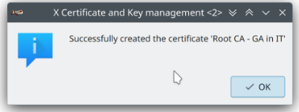

# day 10

Today was the second lecture from Volkner. So the topic was about securing IoT devices and how to make them safe to use.

Today we are gonna talk about the certificates.

# OpenWRT

OpenWrt is an open-source, Linux-based operating system (OS) designed for embedded devices, particularly network routers and other network appliances. It provides a customizable and highly extensible platform that allows users to take control of their network devices, enabling features and functionality that might not be available with the stock firmware provided by the manufacturer.

Here are some key points about OpenWrt:

    Open Source: OpenWrt is released under the GNU General Public License (GPL), which means it's free to use and modify. This open-source nature encourages a community of developers to contribute to its development and create custom builds.

    Extensible and Customizable: OpenWrt allows users to install and configure software packages, turning their router into more than just a basic networking device. You can add features like VPN support, ad-blocking, Quality of Service (QoS) tools, and much more. The package management system, called "opkg," makes it easy to install and update software.

    Stable and Secure: OpenWrt is known for its stability and security. Since it's Linux-based, it benefits from regular security updates and bug fixes. Users have fine-grained control over what software is installed, which can enhance the security of their network.

    Broad Hardware Support: OpenWrt supports a wide range of hardware platforms and chipsets, making it compatible with numerous router models. Users can find community-created builds for many popular devices.

    Performance Optimization: Advanced users can take advantage of OpenWrt to optimize the performance of their network. This might include customizing network settings, adjusting transmit power, or enabling advanced networking protocols.

    Support for IPv6: OpenWrt is one of the leading platforms for implementing IPv6, the next-generation Internet Protocol. This is especially important as IPv6 adoption becomes more widespread.

    Community and Forums: OpenWrt has a strong and active user community. You can find extensive documentation, user forums, and support from other OpenWrt enthusiasts. The community is a valuable resource for troubleshooting, customizing, and expanding the capabilities of your router.

    Firmware Upgrades: OpenWrt can be used to replace the firmware on your router with a more feature-rich and customizable alternative. Be cautious when installing custom firmware, as it may void your device's warranty, and incorrect installations can brick the router.

In summary, OpenWrt is an open-source, highly customizable router firmware that allows users to unlock the full potential of their networking hardware. It's an excellent choice for users who want more control, additional features, and enhanced security on their home or small business networks.

# Exploring the Broker

Yesterday we made a MQTT broker on our router. Today we are going to explore this broker, we need to answer the following questions:

- how to request a full "template" command line for mqttbroker?
    -   mqttbroker --commandline-full
- how to retrief the current 
configuration of mqttbroker?
    - mqttbroker -s
- how to write current configuration to a config file?
    - mqttbroker -w
- how many server instances (services) does the mqttbroker offer?
    -   Sections:
        - local
         Local side of connection for instance 'mqtttlswebview'
        - connection
         Configuration of established connections for instance 'mqtttlswebview'
        - socket
         Configuration of socket behaviour for instance 'mqtttlswebview'
        - server
         Configuration of server socket for instance 'mqtttlswebview'
        - tls  Configuration of SSL/TLS behaviour for instance 'mqtttlswebview'
    
    So 5
- what type of service do the individual instances offer?
    - See last question
- via which protocol are the individual instances accessible?
    - SSL/TLS
- do all server instances offer the same configuration sections (cathegories)?
    - No they don't 
- which section of the instances providing encrypted communication, provides the configuration option for SSL/TLS?
    - MQTTTLSWebview
- what options can be configured for SSL/TLS encryption?
```
### Configuration of SSL/TLS behaviour for instance 'mqtttlswebview'
## Options (persistent)
# Certificate chain file
#mqtttlswebview.tls.cert-chain=""

# Certificate key file
#mqtttlswebview.tls.cert-key=""

# Password for the certificate key file
#mqtttlswebview.tls.cert-key-password=""

# CA-certificate file
#mqtttlswebview.tls.ca-cert-file=""

# CA-certificate directory
#mqtttlswebview.tls.ca-cert-dir=""

# Use default CA-certificate directory
#mqtttlswebview.tls.ca-use-default-cert-dir=false

# Cipher list (openssl syntax)
#mqtttlswebview.tls.cipher-list=""

# OR combined SSL/TLS options (openssl values)
#mqtttlswebview.tls.tls-options=0

# SSL/TLS initialization timeout in seconds
#mqtttlswebview.tls.init-timeout=10

# SSL/TLS shutdown timeout in seconds
#mqtttlswebview.tls.shutdown-timeout=2
```

To see if there are clients connected to my MQTT broker, you can go to the websites:
- http://192.168.12.254:8080/clients


# Installing XCA

For the challenge is using XCA. We did the following:

- Download XCA

- Create a database

- New Certificate

- Create x509 cerfiticate
    
- Fill in the subjects:
    
- Create the new key
    
- Choose private key
- Extensions settings
    - Set type to certification authority
    - select X509v3 subject key identifier
    
- Change settings key usage
    - select certificate sign and CRL sign
    

- Create the cerfticate


- Prove that it works:


- create a new certificate:


- Key management tools:


- create second cerfiticate


- export the keys


- prove that i have 2 keys


- Folder with the keys


And thats how i made the certificates and the keys.


# Using the certificates

Now that we have a certificate, we can use the certifacets.

The first stap is adding the certificate on Firefox, my default browser.

to do that I did the following:

- Go to settings
- Search for certificates
- add the certificate


So now we see that I added the certificate

Now we need to add it to the router.

So I used my WinSCP and added the following:


As you can see on the image I added my key and my certificate

So now I went in to the router with SSH and added the following line:

- **mqttbroker mqtttlswebview tls --cert-chain keys/vincent_key/MQTT_Broker.crt --cert-key keys/vincent_key/End_Entity_-_GA_it_in_IT_-_MQTT_Broker.pem**

So now I see the following thing:


so there are no errors to be found.

Finally we can check if everything works just fine.


So we see that the website is now secured

# Secure tlsin and Node-red

Now we need to secure the TLSIN with the same 3 certificates and keys that we already used:

So to secure the TSLIN i did the following: 

-  mqttbroker tlsin tls --cert-chain keys/vincent_key/End_Entity_-_GA_it_in_IT_-_MQTT_broker.crt --cert-key keys/vincent_key/End_Entity_-_GA_it_in_
IT_-_MQTT_broker.key

If I do this I see the following thing:


So this is also secured.

Now its Node-red its turn. I needed to add the following thing to the previous command:

- mqttbroker tlsin tls --cert-chain keys/vincent_key/End_Entity_-_GA_it_in_IT_-_MQTT_broker.crt --cert-key keys/vincent_key/End_Entity_-_GA_it_in_
IT_-_MQTT_broker.key --ca-cert-file keys/vincent_key/Root_CA_-_GA_in_IT.crt

If I go to my own node red and set the following things:

- Change IP to: 192.168.12.254
- Change port to: 8883
- Check the box: Use TLS
- Upload my private key
- Upload my certificate
- Upload my root certificate 

As you can see on this image I did all the above:


And In this image you can see that MQTT is connected:


And if I check the logs on the router I see the following:


So now we know for sure that Node-Red MQTT is now secured. 

# Feedback and reflection
## Feedback
Today was a difficult day. If you ask me personally I find that the challenges were a bit to hard. The reason for this is that the examples were missing photos and we didn't know for sure what we needed to do. For example in the node-red its wasnt clear were and which keys/certificates we needed to upload. I think for next year, they need more explaination on what we need to do and most importantly how we do it.

## Reflection

So today I knew that is was difficult but it wasn't impossible. Today I asked a little bit more questions then I'm comfortable with. But in the end, I think it was the right decision, because know I understand it completly and if someone ask me to do it all over again, I can do it on my own. So in the end it did work out.

Because I asked so many questions, I was able to help Finn, Judith and Stefan with their troubles and setting up there certificates and uploading them to the router. 
