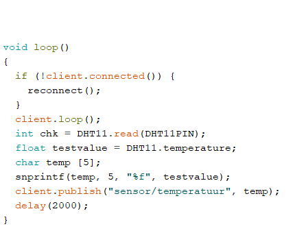

# Day 3

## Exchange Formats

There are a lot of ways IoT can format data. The ways they can is via protocols. The most famous formats are:

- Text
    - Text-based formats like plain text or CSV are generally not very suitable for IoT applications because they lack a standardized structure and are less efficient in terms of data size. IoT applications often involve large volumes of data, and text-based formats can result in excessive data transmission and storage costs. Additionally, parsing and processing text data can be slower compared to more structured formats like XML, JSON, or binary formats.
- XML (Extensible Markup Language)
    - XML is a flexible, human-readable format suitable for IoT in some cases. However, it has a relatively high overhead due to its verbose nature. This can lead to increased data transmission and storage requirements, which might be a concern for resource-constrained IoT devices or applications that require low-latency communication.
- JSON (JavaScript Object Notation)
    - JSON is widely used in IoT applications because of its lightweight and easy-to-parse structure. It strikes a balance between human-readability and efficiency. JSON is well-suited for IoT devices and applications where data interchange needs to be fast and efficient. However, it might not be the best choice for extremely resource-constrained
- Yaml (Yet Another Markup Language)
    - YAML is similar to JSON in terms of structure but is considered more human-readable and has some advantages in terms of configurability. However, like JSON, YAML is a text-based format, and it suffers from the same potential drawbacks in resource-constrained IoT scenarios, as it can be less efficient than binary formats.
- Binary
    - Binary formats are highly efficient in terms of data size and parsing speed. They are suitable for IoT applications where data needs to be transmitted quickly and with minimal overhead. Binary formats are particularly advantageous for resource-constrained IoT devices that have limited processing power, memory, or network bandwidth.

These are the most common ways to format data

### Which one is the best?

Personally i find JSON and Yaml to be the best one. The reasons why i find this is as followed:

- Both are a common standard
- Both are easy to read by humans
- Both are easy to format

**But are they suitable for IoT systems?** 

My answer to that is yes.
JSON has become the standard format for collecting and storing semi-structured data sets that originate from IoT devices, mobile devices and the web. In the not so recent past, semi-structured storage and analysis required specific JSON databases.

**But which one is unsuitable for IoT systems** 

while all data formats can be used in IoT applications depending on the specific requirements, binary formats are generally the most suitable for resource-constrained devices and scenarios that demand high performance and minimal overhead. Text-based formats like plain text, XML, JSON, and YAML are more suitable when human-readability and ease of debugging are important, but they may not be ideal for extremely resource-constrained IoT devices or applications with strict efficiency requirements.

# MQTT

MQTT (Message Queuing Telemetry Transport) is a lightweight and efficient messaging protocol designed for reliable communication between devices in IoT (Internet of Things) and other low-bandwidth, high-latency or unreliable network environments. It operates on a publish-subscribe model, allowing devices to send and receive messages, making it ideal for real-time data exchange and remote monitoring in IoT applications. MQTT minimizes network overhead and is widely used in IoT for its simplicity and scalability.

## MQTT basic commando's 

We watched a video with the basic MQTT commando's, from 

the video I got the following information:

MQTT COMMANDO'S

Check if mosquitto is running
ps ax|grep mosq

if you do mosquitto, you can see what is running

you need the following:

- Host
- Topic
- Name

to do that you do: Mosquitto_sub -t sandbox/test -h 192.168.12.1 (gateway)

mosquitto_pub -t sandbox/test -h 192.168.12.1 (gateway) -m "hello world"

(-m is message)

mosquitto_pub -t sandbox/test -h 192.168.12.1 (gateway) -m "hello world"

Mosquitto_sub -t sandbox/# -h 192.168.12.1 (gateway)
(this (#) means it listens to everything under sandbox)

Mosquitto_sub -t sandbox/test -h 192.168.12.1 (gateway)

Mosquitto_sub -v -t sandbox/test -h 192.168.12.1 (gateway)
(gets also the topic)

## MQTT Basic commando's Part 2

We watched a second video on MQTT, altho we didn't need to take notes, I did it anyway, because I found it really interesting.

My notes were as followed:

- Iot, enters IOT inviroment
- mqtt gives you different options
- mqtt-listen = mosquitto_sub
- mqtt-listen sandbox/test = Mosquitto_sub -t sandbox/# -h 192.168.12.1 (gateway)
- mqtt-send sandbox/test "hello world" = mosquitto_pub -t sandbox/test -h 192.168.12.1 (gateway) -m "hello world"
- when putting a / in front of the theme, it could get problametic, its inhears the previous maps, if you use / in front, it will not do that
- you dont need the  "  " in a message
- MQTT and mosquitto work together 
- mqtt_action, will, as the name says react
- so the command is: mqtt_action sandbox payload on mqtt_send sandbox/switch01 1

## First MQTT exercise
In the first exercise it was the following question:
**In the portfolio, we want to see proof that you had communication with different tools via different participating computers (you have at least two laptops and the gateway at your service) and that you did some examples with wildcards (and explain the meaning with examples of them).**

So we did the following steps:
- SSH to the gateway with: **ssh iot@192.168.12.1** and the password is: **iotempire**
- on the one laptop we did the following command: **mosquitto_sub -t group1/# -h 192.168.12.1**
- on the other laptop we did the following command: **mosquitto_pub -t group1/# -h 192.168.12.1 -m "Hello stefan, how are you today?"**

We got the following result:
- 

So we know that what we done, is succesfull and that we have done the correct steps.

## MQTT Airco Challenge
### Integentor

For this challenge we didn't need hardware, so we needed to simulate the airco, the temperature sensor and the integentor.

We choose for the programming language **Python**, the reason we choose Python is, that we both have experience with Python and it's an easy language, and there is a lot of information to be found about it

We first made the integentor. We did it in the following steps:
1. Connect to the MQTT gateway (like in the previous step)
2. Make the IF statements to send on or off
3. Send test data to see if the MQTT sees it:

in the end we got the following code:

### temperature

Now we needed to make the temperature sensor, its really easy to make a random number generator in Python, thanks to the random library. 

So we did the following steps:

1. Use random to create a number
2. Connect the code to the MQTT server
3. Send data to the MQTT server
4. Test the code 

We created the following code thanks to ChatGTP and with our own knowledge:

### Airco 

The last part of this challenge is to do something with the Integentor. So we made a "airco" that would turn on or off when reaching a specific digit. This was a really easy code as it only required two if statements and a connection to the MQTT server.

We did the following steps:

1. Make the MQTT connection
2. Make the first IF statement with 20 degrees
3. Make the second IF statement with 25 degrees
4. Make a safety feature so it wouldn't die on us

All this combinded we got the following code:

So in the end we got the following result:

## MQTT airco with real hardware  

Now we have completed the previous challenge we needed to do it with real hardware. We have one DHT11 sensor in our box so we used that one. After that we did the following things:

1. Get the correct libraries
    - Because the DHT11 doesn't come installed with Arduino IDE, we needed to find the ZIP with the correct libraries, but Google is you're friend 
    - The second library we needed was to use MQTT, because this also doesn't come pre-installed, but once again Google is your friend
2. Test the DHT11
    - Before we did MQTT we wanted to know if the sensor even worked, so we googled the DHT11 test code and got the following code for it:
    '
    
        This code and we got the temperature in the classroom (which was between 25 and 26 degrees)
3. MQTT connection
    - After checking that the sensor worked we made the connection part of the C++. SO we could connect to the MQTT server via the ESP32. The code is as follwed:
    
4. Combine the codes
    - Now we see that we have 2 working parts so, the only thing left to do is combine them so we change the DHT11 code to the following:
    
5. Test the code
    - After that we tested the whole code
    and we saw the following thing:
    

        so we now know that our code worked and the challenge is completed

# Feedback/reflection

So now that we are done with this challenge I want to give my personal feedback on myself and the teachers.

This day was **WAY** better then the previous two days, the reason for this is that they started at square 1, so this time we waren't thrown in the deep. The lesson was clear and we know what to do. Futhermore the teacher helped us good with the questions that we have. 

For feedback on myself, I think i did fine today, maybe the only thing I need to do is work more in pairs, because I feel like I forced myself to do everything myself, so tomorrow I let Stefan do more. 

Because I knew some bits of MQTT, Today I didn't need to get more information about the subject, so that is also not a part of my feedback. 
