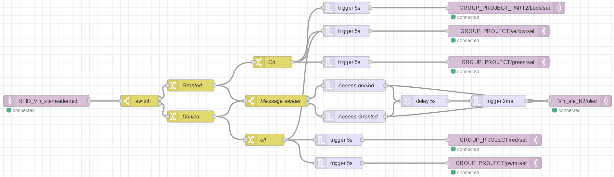

# Day 11

Altho this isnt a school day, I still wanted to make a entry talking about the final project. So consider day 11 the "Final project" day. 

Our project is an extantion on the project we did on day six [day six](../Days/Sixthday.md). So we are using the following equimnent:

This project will be worked on by 4 people:

- Finn 
- Judith
- Stefan
- Vincent (myself)

The final project we are to do is as following:
Build an access control system using the RFID reader, the RGB led, the buzzer, the display, and two M5sticks. Where one of the sticks will act as an gyroscope and one as a "Smartwatch". the RGB-Led will show the access status on the RGB-LEDs (red for access denied and green for access granted and yellow/orange for waiting for an ID). When access is granted, the M5stick (smartwatch), will go off and say that there is an incoming call. When access is denied, play a short nasty sound on the buzzer. The last M5 stick will act as a gyroscope, so that we can mimic sign langauge, so when someone makes a movement, that something will happen. In this case, its a LED that will turn on and off. 

in order to do that, we are using 1 ESP8266 and 3 ESP32.

First wire the RGB LED we have been given to the ESP32, along with the buzzer.

Instead of using IOTempire, Finn and I decided to use an IDE for the following IoT devices:

- M5Stick (Gyroscope)
- M5Stick (Smartwatch)
- RGB LED
- Buzzer
- ESP8266 1x
- ESP32 3x

The reason for our decision to NOT use IoTempire, is that we have more flexability without IoTempire, so we decided to not use IoTempire. The only reason we are using IotEmpire is that **IF** its way easier to set the sensor up. Like the display and the RFID scanner. Which are the only two components that we are using that uses IoTempire

The first thing we did was flashing the all the ESP32 and the ESP8266

On the same time, we wired the RFID reader to the ESP8266, and flashed the node "RFID_Vin_ste". The setup.cpp has the lines:

- mfrc522(reader);

After that, we wired the OLED to another ESP32. Flashed the node "Vin_ste_N2". The setup.cpp has the lines:

- U8G2_SSD1306_64X48_ER_F_HW_I2C u8g2(U8G2_R0);
- display(oled, u8g2, font_tiny);

After all that, we created a node-red flow that reads the topic from the RFID reader, after that, the payload goes to a switch to see whether the card is valid or not.

If the access is granted
How to begin

    Wire components
    Modify setup.cpp
    Flash Wemos D1
    Create node-red flow
    Check if it works

This is the order we did thing in... but it is not all we have done, Because will needed to create a dashboard on Node-red and rework the Node-

Our Node-red code is completely made by myself. I did use the same Node-red code from day 6 and only changed a slighty few things.

In this project is made extremely use of the trigger option. The trigger option does the following:

- When triggered, can send a message, and then optionally a second message, unless extended or reset.

So I could send a message, then a send message directly after it. So it made it a lot easier to send 2 messages at one. 

Futhermore this challenge is a combination of all the previous challenges. It requires the RFID, PWM, LEDS, OLED display, M5 sticks, but not the lock. The reason why We didn't use the lock, is because I personally found it to finicy. So we removed it.

