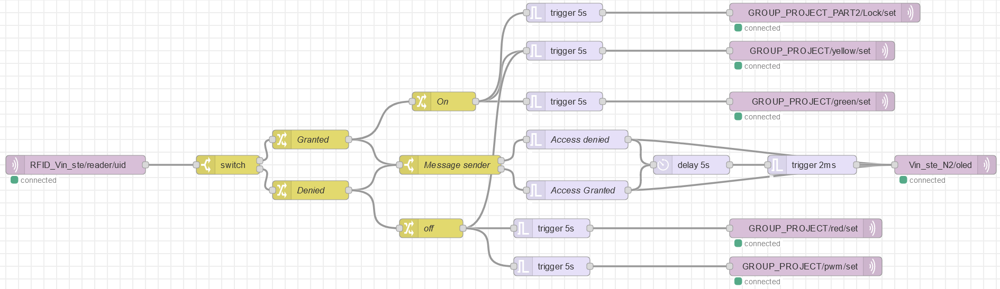

# Day 12

Day 12 is a the same as yesterday, only with more information and the definitive user story

Our project is an extantion on the project we did on day six [day six](../Days/Sixthday.md). So we are using the following equimnent:

This project will be worked on by 4 people:

- Finn 
- Judith
- Stefan
- Vincent (myself)

The final project we are to do is as following:
Build an access control system using the RFID reader, the RGB led, the buzzer, the display, and two M5sticks. Where one of the sticks will act as an gyroscope and one as a "Smartwatch". the RGB-Led will show the access status on the RGB-LEDs (red for access denied and green for access granted and yellow/orange for waiting for an ID). When access is granted, the M5stick (smartwatch), will go off and say that there is an incoming call. When access is denied, play a short nasty sound on the buzzer. The last M5 stick will act as a gyroscope, so that we can mimic sign langauge, so when someone makes a movement, there will be an MQTT message send to the the smartwatch that someone wants to have a meeting. 

The user story in this whole scenario is as followed:

"
**User Scenario: Improving Communication in the Office**

Characters:
-	Hans: A man working in an office.
-	Deaf Colleague: Hans's colleague who is deaf.

IOT devices: 
-	RFID Scanner: An office entry system with an RFID scanner.
-	OLED display: Indicates if the ID is good or not
-	M5 Smartwatch: A smartwatch worn by Hans.
-	M5 Gyroscope: A gesture-controlled device used by the Deaf 
Colleague.
-	Laptop: Hans's portable computer.
-	RGB Led: Give a light to see the status of the RFID scanner
-	Buzzer: Gives an alarm to warn people that a wrong ID is used

Scenario:
Hans arrives at his office one morning, preparing for a productive day of work. He knows he has an important meeting scheduled with his Deaf Colleague later in the day. However, he needs to complete some tasks before that.
1.	Hans makes his way to the entrance of the office building. He reaches into his pocket, takes out his ID card, and holds it in front of the RFID scanner. As he scans it, he notices that the blue LED on the scanner immediately turns red, and a buzzer starts to sound loudly, alerting everyone around. He sees that the display displays: “Access denied”. After 5 seconds, the LED turns blue again, and the buzzer goes off, And the display says “waiting for card”, signifying that something is not right.
2.	Realizing his mistake, Hans realizes that he had used the wrong ID card. He pulls out another ID card from his wallet and scans it, praying that it's the correct one this time. The LED on the scanner turns green, and the display shows: “Access granted” indicating that he is allowed access to the office.
3.	Hans enters the office building and proceeds to his own office, where he keeps his M5 smartwatch. He knows that the M5 smartwatch is an essential tool for communication with his Deaf Colleague.
4.	Meanwhile, in his own office, the Deaf Colleague notices an issue with a project currently in production. Realizing that immediate communication is essential, he grabs his M5 gyroscope, a gesture-controlled device designed for non-verbal communication.
5.	As Hans reaches his office and picks up his M5 smartwatch, he feels a slight vibration and see that his screen is flashing, indicating that he has a notification. He checks his smartwatch's display and understands that his Deaf Colleague wants to have a meeting with him. Knowing the importance of the situation, Hans immediately responds to the request.
6.	Hans heads over to the office of his Deaf Colleague. He grabs his laptop and opens the website that can translate speech into sign language, ensuring that effective communication can take place. He starts a video meeting with his Deaf Colleague.
7.	During the video meeting, the Deaf Colleague uses his M5 gyroscope to make gestures that convey the issues he has noticed in production. With the help of the speech-to-sign language translation website, they discuss and address the problem efficiently.
In this user scenario, technology, including the RFID scanner, smartwatch, gyroscope, and online translation tools, plays a crucial role in enabling effective communication between Hans and his Deaf Colleague, demonstrating the importance of inclusive communication in the workplace.

"

in order to do that, we are using 1 ESP8266 and 3 ESP32.

First wire the RGB LED we have been given to the ESP32, along with the buzzer.

Instead of using IOTempire, Finn and I decided to use an IDE for the following IoT devices:

- M5Stick (Gyroscope)
- M5Stick (Smartwatch)
- RGB LED
- Buzzer
- ESP8266 1x
- ESP32 3x

The reason for our decision to NOT use IoTempire, is that we have more flexability without IoTempire, so we decided to not use IoTempire. The only reason we are using IotEmpire is that **IF** its way easier to set the sensor up. Like the display and the RFID scanner. Which are the only two components that we are using that uses IoTempire

The first thing I did was flashing the all the ESP32 and the ESP8266

On the same time, I wired the RFID reader to the ESP8266, and flashed the node "RFID_Vin_ste". The setup.cpp has the lines:

- mfrc522(reader);

After that, I wired the OLED to another ESP32. Flashed the node "Vin_ste_N2". The setup.cpp has the lines:

- U8G2_SSD1306_64X48_ER_F_HW_I2C u8g2(U8G2_R0);
- display(oled, u8g2, font_tiny);

After all that, I created a node-red flow that reads the topic from the RFID reader, after that, the payload goes to a switch to see whether the card is valid or not.

If the access is granted, the LED turns green, and there will be NO buzzer sound. The OLED display displays that access is granted. 

If the Access is denied, the LED turns red and there will be a buzzer sound. The Oled display displays that access is denied. 

This is the order I did thing in... but it is not all we have done, Because will needed to create a dashboard on Node-red and rework the Node-red code.

Our Node-red code is completely made by myself. I did use the same Node-red code from day 6 and only changed a slighty few things.

Old code: 

New code:

The last thing I did was added the gyroscope, so when a gesture is made, the "smartwatch", made by Judith and Stefan turns on and makes a sound. 

In this project is made extremely use of the trigger option. The trigger option does the following:

- When triggered, can send a message, and then optionally a second message, unless extended or reset.

So I could send a message, then a send message directly after it. So it made it a lot easier to send 2 messages at one. 

Futhermore this challenge is a combination of all the previous challenges. It requires the RFID, PWM, LEDS, OLED display, M5 sticks, but not the lock. The reason why We didn't use the lock, is because I personally found it to finicy. So we removed it.