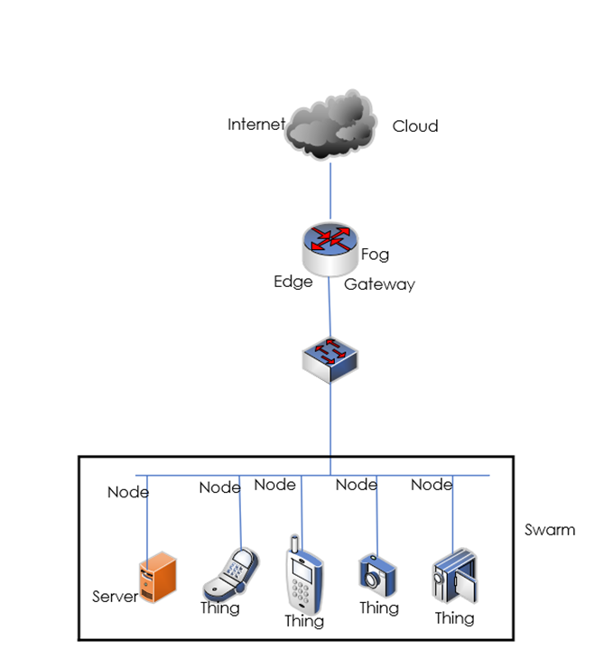

# User Story
For the second day we need to make a user story for our own project. Stefan and I made the following story:

Fred Watson comes back from a jog in the woods. He walks up to his front door of his new house. Because his new house is in Austria, it has a lot of IoT potential, he has made his life easier, he added things to make his life a lot easier. Since Fred Watson is born deaf, he wanted to use sign language to interact with his house. He walks to the front door of his house and makes the sign for “open” in front of his doorbell camera, and just like that the front door opens. 
Walking through the door he makes the sign for “close” in front of the camera in the hall and then the door closes behind him. Fred walks to his living room with the intention to go sit on the couch. He makes the sign for “light” in front of his camera, that has night vision, and then the light turns on in the living room and the night vision mode on the camera deactivates. He lies down on the couch tired from the jog and decides to turn on the TV. Fred makes the sign for “TV”, in front of his camera on the couch and then it turns on.
After cooking his dinner, Fred wants to go to bed, so he makes the sign for “TV” again at the same camera, and the tv power off. When walking upstairs, he want to put his house on the security system, so he makes the sign for “Alarm”, and the security system of his home turns on. Then makes the sign language for “Lights” in front of his bedroom camera, but in reverse and the lights inside his home turn off.
Fred looks at his monitor, that’s is always on, and see that the led strips are all red, so his TV is off, the door is closed and the alarm is on and the lights are off, so he lays in his bed and falls asleep. 

This story implies the use of IoT within the deaf community. 

## challenges
There are a few challenges that we are going to face will trying to introduce this technic. The challenges we face and have to think about is as followed:

- Make the signs easy to recognize
- Reverse sign can be difficult
- What about the ethics of this 

## Possibiilities 
There are also a few possibilities within this project. The possibilities we face and we have to think about it is as followed:
- Make it reprogrammable
- Make it personalized 
- Make it unique and destinquestich 

# Architecture and Terminology of IoT

**Internet**
Is a big network that connects networks with each other that can be accessed online

**Server**
A device that hosts a specific service 

**Things**
Can be anything, from a fridge to a flowerpot, to not physical things. As long as it has some interface and can be connected to the internet

**Swarm**
A collection of nodes and things

**Nodes**
IoT nodes are the physical elements within an IoT environment that enable the connection of the physical world to the Internet.

**Cloud**
A workspace or area that is just on the internet

**Gateway**
Way to the internet

**Edge computing** 
helps devices to get faster results by processing the data simultaneously received from the devices. Fog computing helps in filtering important information from the massive amount of data collected from the device and saves it in the cloud by sending the filtered data

Together they make the following map:

# Challenge pre challenge 3

Before we could make the challenge as describe in page 3, we needed to make our own network. 
Because of my expierence with infrastructure i led my other teammates do the work.
To complete this challenge the following things needed to be done:
- Open the Pi 400
- Flash the SD card
- put the image, with etcher on the SD
- Change the wifi.txt
  - in the wifi.txt you can change the SSID and the password in our case we used the following SSID
  - 
- Put the SD in the Pi 400
- Power on the Pi 400

This were the steps we as group did, to get the correct result.

# challenge 3
## First challenge 

the code is the following: 

#include <ESP8266WiFi.h>
#include <WiFiClient.h>
#include <ESP8266WebServer.h>

const char MAIN_page[] PROGMEM = R"=====(
<!DOCTYPE html>
<html>
<body>

<h1>WiFi LED on off demo: 1</h1> 
Ciclk to turn <a href="ledOn">LED ON</a> 
Ciclk to turn <a href="ledOff">LED OFF</a> 

</body>
</html>
)=====";

#define LED 2  

const char* ssid = "iotempire-magnusperfectus";
const char* password = "iotempire";

//Declare a global object variable from the ESP8266WebServer class.
ESP8266WebServer server(80); //Server on port 80

//===============================================================
// This routine is executed when you open its IP in browser
//===============================================================
void handleRoot() {
 Serial.println("You called root page");
 String s = MAIN_page; //Read HTML contents
 server.send(200, "text/html", s); //Send web page
}

void handleLEDon() { 
 Serial.println("LED on page");
 digitalWrite(LED,LOW); //LED is connected in reverse
 server.send(200, "text/html", "LED is ON"); //Send ADC value only to client ajax request
}

void handleLEDoff() { 
 Serial.println("LED off page");
 digitalWrite(LED,HIGH); //LED off
 server.send(200, "text/html", "LED is OFF"); //Send ADC value only to client ajax request
}
//==============================================================
//                  SETUP
//==============================================================
void setup(void){
  Serial.begin(115200);
  
  WiFi.begin(ssid, password);     //Connect to your WiFi router
  Serial.println("");

  //Onboard LED port Direction output
  pinMode(LED,OUTPUT); 
  //Power on LED state off
  digitalWrite(LED,HIGH);
  
  // Wait for connection
  while (WiFi.status() != WL_CONNECTED) {
    delay(500);
    Serial.print(".");
  }

  //If connection successful show IP address in serial monitor
  Serial.println("");
  Serial.print("Connected to ");
  Serial.println(ssid);
  Serial.print("IP address: ");
  Serial.println(WiFi.localIP());  //IP address assigned to your ESP
 
  server.on("/", handleRoot);      //Which routine to handle at root location. This is display page
  server.on("/ledOn", handleLEDon); //as Per  <a href="ledOn">, Subroutine to be called
  server.on("/ledOff", handleLEDoff);

  server.begin();                  //Start server
  Serial.println("HTTP server started");
}
//==============================================================
//                     LOOP
//==============================================================
void loop(void){
  server.handleClient();          //Handle client requests
}

When the code is run, and we go to the webpage (in our case it was: **192.168.12.8**) we see the following webpage:

## Second challenge

**The code for the reciever is:**

#include <WiFi.h>
#include <WiFiClient.h>
#include <WebServer.h>
#include <ESPmDNS.h>

const char* ssid = "iotempire-magnusperfectus";
const char* password = "iotempire";

WebServer server(80);

const int led = 2;

void handleRoot() {
  digitalWrite(led, 1);
  server.send(200, "text/plain", "hello from esp32!");
  digitalWrite(led, 0);
}

void handleNotFound() {
  digitalWrite(led, 1);
  String message = "File Not Found\n\n";
  message += "URI: ";
  message += server.uri();
  message += "\nMethod: ";
  message += (server.method() == HTTP_GET) ? "GET" : "POST";
  message += "\nArguments: ";
  message += server.args();
  message += "\n";
  for (uint8_t i = 0; i < server.args(); i++) {
    message += " " + server.argName(i) + ": " + server.arg(i) + "\n";
  }
  server.send(404, "text/plain", message);
  digitalWrite(led, 0);
}

void setup(void) {
  pinMode(led, OUTPUT);
  digitalWrite(led, 0);
  Serial.begin(115200);
  WiFi.mode(WIFI_STA);
  WiFi.begin(ssid, password);
  Serial.println("");

  // Wait for connection
  while (WiFi.status() != WL_CONNECTED) {
    delay(500);
    Serial.print(".");
  }
  Serial.println("");
  Serial.print("Connected to ");
  Serial.println(ssid);
  Serial.print("IP address: ");
  Serial.println(WiFi.localIP());

  if (MDNS.begin("esp32")) {
    Serial.println("MDNS responder started");
  }

  server.on("/", handleRoot);

  server.on("/on", {
    digitalWrite(led, HIGH);
    server.send(200, "text/plain", "LED ON");
  });

  server.on("/off", {
    digitalWrite(led, LOW);
    server.send(200, "text/plain", "LED OFF");
  });

  server.on("/inline",  {
    server.send(200, "text/plain", "this works as well");
  });

  server.onNotFound(handleNotFound);

  server.begin();
  Serial.println("HTTP server started");
}

void loop(void) {
  server.handleClient();
  delay(2);//allow the cpu to switch to other tasks
}

**The code for the sender is:**

/**
   BasicHTTPClient.ino

    Created on: 24.05.2015

*/

#include <Arduino.h>
#include <String.h>
#include <WiFi.h>
#include <WiFiMulti.h>

#include <HTTPClient.h>

#define USE_SERIAL Serial
#define LED 2
WiFiMulti wifiMulti;

/*
  const char* ca = \
  "-----BEGIN CERTIFICATE-----\n" \
  "MIIEkjCCA3qgAwIBAgIQCgFBQgAAAVOFc2oLheynCDANBgkqhkiG9w0BAQsFADA/\n" \
  "MSQwIgYDVQQKExtEaWdpdGFsIFNpZ25hdHVyZSBUcnVzdCBDby4xFzAVBgNVBAMT\n" \
  "DkRTVCBSb290IENBIFgzMB4XDTE2MDMxNzE2NDA0NloXDTIxMDMxNzE2NDA0Nlow\n" \
  "SjELMAkGA1UEBhMCVVMxFjAUBgNVBAoTDUxldCdzIEVuY3J5cHQxIzAhBgNVBAMT\n" \
  "GkxldCdzIEVuY3J5cHQgQXV0aG9yaXR5IFgzMIIBIjANBgkqhkiG9w0BAQEFAAOC\n" \
  "AQ8AMIIBCgKCAQEAnNMM8FrlLke3cl03g7NoYzDq1zUmGSXhvb418XCSL7e4S0EF\n" \
  "q6meNQhY7LEqxGiHC6PjdeTm86dicbp5gWAf15Gan/PQeGdxyGkOlZHP/uaZ6WA8\n" \
  "SMx+yk13EiSdRxta67nsHjcAHJyse6cF6s5K671B5TaYucv9bTyWaN8jKkKQDIZ0\n" \
  "Z8h/pZq4UmEUEz9l6YKHy9v6Dlb2honzhT+Xhq+w3Brvaw2VFn3EK6BlspkENnWA\n" \
  "a6xK8xuQSXgvopZPKiAlKQTGdMDQMc2PMTiVFrqoM7hD8bEfwzB/onkxEz0tNvjj\n" \
  "/PIzark5McWvxI0NHWQWM6r6hCm21AvA2H3DkwIDAQABo4IBfTCCAXkwEgYDVR0T\n" \
  "AQH/BAgwBgEB/wIBADAOBgNVHQ8BAf8EBAMCAYYwfwYIKwYBBQUHAQEEczBxMDIG\n" \
  "CCsGAQUFBzABhiZodHRwOi8vaXNyZy50cnVzdGlkLm9jc3AuaWRlbnRydXN0LmNv\n" \
  "bTA7BggrBgEFBQcwAoYvaHR0cDovL2FwcHMuaWRlbnRydXN0LmNvbS9yb290cy9k\n" \
  "c3Ryb290Y2F4My5wN2MwHwYDVR0jBBgwFoAUxKexpHsscfrb4UuQdf/EFWCFiRAw\n" \
  "VAYDVR0gBE0wSzAIBgZngQwBAgEwPwYLKwYBBAGC3xMBAQEwMDAuBggrBgEFBQcC\n" \
  "ARYiaHR0cDovL2Nwcy5yb290LXgxLmxldHNlbmNyeXB0Lm9yZzA8BgNVHR8ENTAz\n" \
  "MDGgL6AthitodHRwOi8vY3JsLmlkZW50cnVzdC5jb20vRFNUUk9PVENBWDNDUkwu\n" \
  "Y3JsMB0GA1UdDgQWBBSoSmpjBH3duubRObemRWXv86jsoTANBgkqhkiG9w0BAQsF\n" \
  "AAOCAQEA3TPXEfNjWDjdGBX7CVW+dla5cEilaUcne8IkCJLxWh9KEik3JHRRHGJo\n" \
  "uM2VcGfl96S8TihRzZvoroed6ti6WqEBmtzw3Wodatg+VyOeph4EYpr/1wXKtx8/\n" \
  "wApIvJSwtmVi4MFU5aMqrSDE6ea73Mj2tcMyo5jMd6jmeWUHK8so/joWUoHOUgwu\n" \
  "X4Po1QYz+3dszkDqMp4fklxBwXRsW10KXzPMTZ+sOPAveyxindmjkW8lGy+QsRlG\n" \
  "PfZ+G6Z6h7mjem0Y+iWlkYcV4PIWL1iwBi8saCbGS5jN2p8M+X+Q7UNKEkROb3N6\n" \
  "KOqkqm57TH2H3eDJAkSnh6/DNFu0Qg==\n" \
  "-----END CERTIFICATE-----\n";
*/

void setup() {

  USE_SERIAL.begin(115200);
  pinMode(LED, OUTPUT);
  USE_SERIAL.println();
  USE_SERIAL.println();
  USE_SERIAL.println();

  for (uint8_t t = 4; t > 0; t--) {
    USE_SERIAL.printf("[SETUP] WAIT %d...\n", t);
    USE_SERIAL.flush();
    delay(1000);
  }

  wifiMulti.addAP("iotempire-magnusperfectus", "iotempire");

}

void loop() {
  // wait for WiFi connection
  if ((wifiMulti.run() == WL_CONNECTED)) {
    HTTPClient http;

    USE_SERIAL.print("[HTTP] begin...\n");
    // configure traged server and url
    //http.begin("https://www.howsmyssl.com/a/check", ca); //HTTPS
    http.begin("http://192.168.12.8/on"); //HTTP

    USE_SERIAL.print("[HTTP] GET...\n");
    // start connection and send HTTP header
    int httpCode = http.GET();

    // httpCode will be negative on error
    if (httpCode > 0) {
      // HTTP header has been send and Server response header has been handled
      USE_SERIAL.printf("[HTTP] GET... code: %d\n", httpCode);

      // file found at server
      if (httpCode == HTTP_CODE_OK) {
        String payload = http.getString();
        USE_SERIAL.println(payload);
        if (payload == "LED ON")
        {
          Serial.println("YES ON LED NICE");
          digitalWrite(LED, HIGH);
        }
        else {
          Serial.println("NOT FOUND");
        }
      }
    } else {
      USE_SERIAL.printf("[HTTP] GET... failed, error: %s\n", http.errorToString(httpCode).c_str());
    }
    http.end();
    delay(1000);

  USE_SERIAL.print("[HTTP] begin...\n");
  // configure traged server and url
  //http.begin("https://www.howsmyssl.com/a/check", ca); //HTTPS
  http.begin("http://192.168.12.8/off"); //HTTP

  USE_SERIAL.print("[HTTP] GET...\n");
  // start connection and send HTTP header
  httpCode = http.GET();

  // httpCode will be negative on error
  if (httpCode > 0) {
    // HTTP header has been send and Server response header has been handled
    USE_SERIAL.printf("[HTTP] GET... code: %d\n", httpCode);

    // file found at server
    if (httpCode == HTTP_CODE_OK) {
      String payload = http.getString();
      USE_SERIAL.println(payload);
      if (payload == "LED OFF")
      {
        Serial.println("YES OFF LED NICE");
        digitalWrite(LED, LOW);
      }
      else {
        Serial.println("NOT FOUND");
      }
    }
  } else {
    USE_SERIAL.printf("[HTTP] GET... failed, error: %s\n", http.errorToString(httpCode).c_str());
  }
  http.end();
  }

  delay(1000);
}

## Challenge 3.0 with the button

In the second challenge all we needed to do was toggle the LED with a button on the sender. The code is really easy to change, so the code is as followed:

#include <Arduino.h>
#include <WiFi.h>
#include <WiFiMulti.h>
#include <HTTPClient.h>

#define USE_SERIAL Serial
 
#define BUTTON_PIN 4

WiFiMulti wifiMulti;
bool ledState = LOW;
bool buttonState = LOW;
bool lastButtonState = LOW;
unsigned long lastDebounceTime = 0;
unsigned long debounceDelay = 50;

void setup() {
  USE_SERIAL.begin(115200);
  pinMode(BUTTON_PIN, INPUT_PULLUP);

  wifiMulti.addAP("RipForFire", "Welkom01!#");
}

void loop() {
  if (wifiMulti.run() == WL_CONNECTED) {
    // Read the state of the button with debouncing
    int reading = digitalRead(BUTTON_PIN);
    if (reading != lastButtonState) {
      lastDebounceTime = millis();
    }
    if ((millis() - lastDebounceTime) > debounceDelay) {
      if (reading != buttonState) {
        buttonState = reading;
        if (buttonState == LOW) {
          // Toggle the LED state and send an HTTP request
          ledState = !ledState;
          controlLED(ledState);
        }
      }
    }
    lastButtonState = reading;
  }
  delay(1000); // Adjust the delay as needed
}

void controlLED(bool newState) {
  HTTPClient http;
  USE_SERIAL.print("[HTTP] begin...\n");
  if (newState == HIGH) {
    http.begin("http://192.168.68.124/on"); // HTTP
    USE_SERIAL.print("[HTTP] Turning LED ON...\n");
  } else {
    http.begin("http://192.168.68.124/off"); // HTTP
    USE_SERIAL.print("[HTTP] Turning LED OFF...\n");
  }

  int httpCode = http.GET();
  if (httpCode == HTTP_CODE_OK) {
    String payload = http.getString();
    USE_SERIAL.println(payload);
    if (payload == "LED ON" && newState == HIGH) {
      USE_SERIAL.println("LED is ON");
    } else if (payload == "LED OFF" && newState == LOW) {
      USE_SERIAL.println("LED is OFF");
    } else {
      USE_SERIAL.println("Unknown response");
    }
  } else {
    USE_SERIAL.printf("[HTTP] GET... failed, error: %s\n", http.errorToString(httpCode).c_str());
  }
  http.end();
}

To prove that this is indeed working as intented and that we do not fake it the pictures give enough prove:

- 
- 
- 

This challenge was really difficult, because it wasnt clear what we were seposed to do, but in the end, with the help of another group we made it.
There is only one difference between this code and the previous code, the button is added... there isn't any more to it.

# Feedback

Today i helped my group with setting up our own wifi network. I just helped because i knew already how to do it, thanks to my study. My Teammate did a lot of the resource for our code, to help us to get the correct data. 

My groupsmates did find it good that I didn't make the router, but they found it helpfull that I helped them when they asked. 

Still, to my personal opinion I think the lessons are still to much for us, the reason for this is that the teachers expect much from us. And I'm not sure if I/we can provide all that. So my recommondation is to go a little slower and explain a bit more instead of leaving us hanging. Without good examples and good building stones, its gonna be a mess. 

